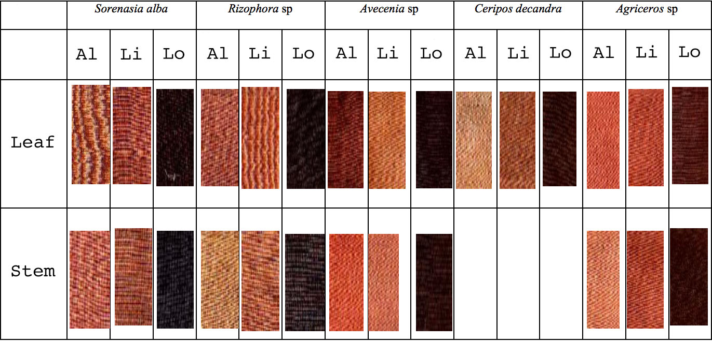

# biofabrication

### natural vs synthetic

the natural/synthetic debate has shifted significantly from being a binary, either/or debate to a comprehensive blurring of boundaries. what we now find is that it is through synthesizing our materials that we come to understand their nature and our own, and that there is a certain liberation in accepting and even embracing what may repel us. we are not wrapping and encasing any more, there is no suitable container or adequate containment. the only thing left to do is experiment. 

## community of practice

### 

### the dyeing process

#### mordanting 

mordanting is a process that sets a dye to a textile surface. mordanting can be done prior to dyeing, after dyeing or both. natural dyers often employ materials such as alum, iron and other heavy metals to achieve the correct shade and fix their natural dyes to the textile. _symplocos cochinchinensis_ is a tree native to south east asia which is naturally high in alum.  

> The fallen leaves are rich in alum and are gathered from endangered forests to support a sustainable crop rather than felling trees for their lumber. .. symplocos offers an exciting alternative to mined mineral mordants
>
> source: [http://plantmordant.org/symplocos/](http://plantmordant.org/symplocos/)

  
image source: [http://biotik.org/laos/species/s/symco/symco\_10\_en.html](http://biotik.org/laos/species/s/symco/symco_10_en.html)

#### mordanting process

1. clean the silk ****

* Determine the dry weight of the fiber. This is WOF.
* Soak the silk in a weak, warm soap solution \(such as Marseille soap, olive oil soap, Orvus paste, etc.\) at 60ºC/140ºF for 1 hour.
* Rinse well in warm water.

2. mordanting with symplocos

* weigh dry symplocos equal to half the weight of the fiber \(WOF\)
* boil the symplocos in soft water for 30 minutes, until the symplocos sinks to the bottom of the pot.
* filter this liquid if you are using yarn. If you are mordanting cloth, it is not necessary to filter, since it is easy to remove the Symplocos particles from the cloth later, by rinsing.
* Soak the silk in the Symplocos liquid for at least 30 minutes at 80ºC \(176ºF\).
* Rinse the silk in warm water. When rinsed, your fiber will be a pale shade of yellow. This yellow color tells you that the fiber has been successfully mordanted by the Symplocos. The yellow will disappear after dyeing and will not influence the final color.
* At this point, you can dry and store the fiber for dyeing later, or you can proceed to dyeing the fiber.

**Dyeing**

  
image source: [http://www.efloras.org/object\_page.aspx?object\_id=94398&flora\_id=2](http://www.efloras.org/object_page.aspx?object_id=94398&flora_id=2)

#### ceriops \(pron. cherry-ops 🍒\)

ceriops tagal is a mangrove species native to tropical south east asia. it is on the iucn red list. this plant can be found in the mangrove forest in the coastal district of cần giờ, a 30 minute drive from hcmc by car. 

> The bark of _Ceriops tagal_ is very rich in tannin, although the concentration can vary enormously – from 13% to over 40% \(Manudu and Bandeira 2005, 54\). Dyers prefer the bark of older trees because tannin content increases with age \(Manudu and Bandeira 2005, 55\). The bark is peeled off by hand in strips and can be used immediately. It is simply pounded, soaked in water and then squeezed to release the dye. Mostly the mixture is boiled. Sometimes the _Ceriops_ bark is mixed with barks from other mangrove species. The leaves contain roughly 15% tannin and can also be used as a dye.
>
> source: [http://www.asiantextilestudies.com/brown.html\#c](http://www.asiantextilestudies.com/brown.html#c)

ceriops tagal is a tannin dye, it will only be taken up by protein fibres, or by fibres that have had protein added to them. for this reason, ceriops is often used to dye silk. dyeing cotton requires scouring and soaking in protein dense nut oil for several weeks prior to dyeing. 

  

**Dyeing process**

* With dried dye materials use 100% WOF.
* Soak the dyestuff for 30 minutes in warm water at 30ºC 
* Add the fiber to the dye bath.
* Raise the temperature slowly, over the course of 1 hour, to 85ºC
* Maintain the temperature at 85ºC for 30 – 60 minutes in order to develop the color completely. Do not boil.
* Let the fiber cool in the dye bath.
* Rinse in warm water.


all recipes c/o the natural dyeing team at [threads of life](http://threadsoflife.com/) 


#### LINKS



[http://threadsoflife.com/](http://threadsoflife.com/)

