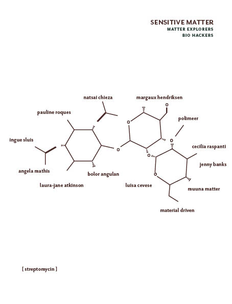

# biofabrication

### natural vs synthetic

the natural/synthetic debate has shifted significantly from being a binary, either/or debate to a comprehensive blurring of boundaries. what we now find is that it is through synthesizing our materials that we come to understand their nature and our own, and that there is a certain liberation in accepting and even embracing what may repel us. we are not so much preoccupied in wrapping and encasing as there is no suitable container or adequate containment. in a permanently polluted world, perhaps the only thing left to do is experiment. 

## community of practice

### 

  
there is much interest in excavating traditions from the past, looking back to making conditions prior to the use of coal, oil and its derivatives to radically accelerate textile and garment production. the invention of mauveine and similar compounds which followed revolutionised textile dyeing as a practice and with it people's personal relationship to colour. it also brought rampant, often irreversible damage to waterways, ground water, sediment and soil, impacting significantly on the people who live downstream. 

> “Sometimes my head is spinning,” one student said of the smell. “Sometimes we feel like we need to vomit,” another said.
>
> source: [https://www.nytimes.com/2013/07/15/world/asia/bangladesh-pollution-told-in-colors-and-smells.html](https://www.nytimes.com/2013/07/15/world/asia/bangladesh-pollution-told-in-colors-and-smells.html)

chemicals employed in the preparation, dyeing and finishing of textiles are often known environmental and health hazards, containing among other toxins:

> • Alkylphenolethoxylates \(APEOs\)  
> • Pentachlorophenols \(PCP\)  
> • Toluene and other aromatic amines  
> • Dichloromethane \(DCM\)  
> • Formaldehyde  
> • Phthalates  
> • Polybrominated diphenyl ethers \( PBDE’s\)  
> • Perfluorooctane sulfonates \(PFOS\)  
> • Heavy metals – copper, cadmium, lead, antimony, mercury among others
>
> source: [https://oecotextiles.wordpress.com/2013/01/10/chemicals-used-in-textile-processing/](https://oecotextiles.wordpress.com/2013/01/10/chemicals-used-in-textile-processing/)

most of these chemicals are part of cradle to cradle's list of banned chemical, included for their irreversible, negative health impacts. their [list](https://s3.amazonaws.com/c2c-website/resources/certification/standard/C2CCertified_Banned_Lists_V3_121113.pdf) includes many chemicals commonly present in commercially manufactured textiles. 

practitioners engaging with research into alternative textile coloration fall on a spectrum spanning the conservative adoption of folk tradition to radical experimentation in laboratories filled with unique biomaterials, and various shades in between. experimentation may present more questions than answers to the industry's problems, however it does throw up intriguing alternatives to consider.

## exploring a local natural dye process

#### mordanting 

mordanting is a process that sets a dye to a fibre. mordanting can be done prior to dyeing, after dyeing or both. natural dyers often employ materials such as alum, iron and other heavy metals to achieve the correct shade and fix their natural dyes to the textile. _symplocos cochinchinensis_ is a tree native to south east asia which is naturally high in alum. through the activities of "the plant mordant project" we come to understand that:  

> ..the fallen leaves are rich in alum and are gathered from endangered forests to support a sustainable crop rather than felling trees for their lumber. .. symplocos offers an exciting alternative to mined mineral mordants.
>
> source: [http://plantmordant.org/symplocos/](http://plantmordant.org/symplocos/)

  
image source: [http://biotik.org/laos/species/s/symco/symco\_10\_en.html](http://biotik.org/laos/species/s/symco/symco_10_en.html)

the plant mordant project supplies powdered symplocos to textile dyers, i will be using some of the quantity i purchased from indonesia. 

#### mordanting process

1. clean the silk ****

* Determine the dry weight of the fiber. This is WOF.
* Soak the silk in a weak, warm soap solution \(such as Marseille soap, olive oil soap, Orvus paste, etc.\) at 60ºC/140ºF for 1 hour.
* Rinse well in warm water.

2. mordanting with symplocos

* weigh dry symplocos equal to half the weight of the fiber \(WOF\)
* boil the symplocos in soft water for 30 minutes, until the symplocos sinks to the bottom of the pot.
* filter this liquid if you are using yarn. If you are mordanting cloth, it is not necessary to filter, since it is easy to remove the Symplocos particles from the cloth later, by rinsing.
* Soak the silk in the Symplocos liquid for at least 30 minutes at 80ºC \(176ºF\).
* Rinse the silk in warm water. When rinsed, your fiber will be a pale shade of yellow. This yellow color tells you that the fiber has been successfully mordanted by the Symplocos. The yellow will disappear after dyeing and will not influence the final color.
* At this point, you can dry and store the fiber for dyeing later, or you can proceed to dye the fiber.

### **Dyeing**

  
image source: [http://www.efloras.org/object\_page.aspx?object\_id=94398&flora\_id=2](http://www.efloras.org/object_page.aspx?object_id=94398&flora_id=2)

### ceriops \(pron. cherry-ops 🍒\)

ceriops tagal is a mangrove species native to tropical south east asia. it is on the iucn [red list](https://www.iucnredlist.org/species/178822/7617531). this plant can be found in the mangrove forest in the coastal district of cần giờ, a 30 minute drive from hcmc by car. 

> The bark of _Ceriops tagal_ is very rich in tannin, although the concentration can vary enormously – from 13% to over 40% \(Manudu and Bandeira 2005, 54\). Dyers prefer the bark of older trees because tannin content increases with age \(Manudu and Bandeira 2005, 55\). The bark is peeled off by hand in strips and can be used immediately. It is simply pounded, soaked in water and then squeezed to release the dye. Mostly the mixture is boiled. Sometimes the _Ceriops_ bark is mixed with barks from other mangrove species. The leaves contain roughly 15% tannin and can also be used as a dye.
>
> source: [http://www.asiantextilestudies.com/brown.html\#c](http://www.asiantextilestudies.com/brown.html#c)

### ceriops in southern vietnam

ceriops bark can be removed from the roots of the ceriops mangrove without damaging the central root system. cutting the outer layer of bark reveals the bright red, tannin rich [phloem](https://www.arborday.org/trees/treeGuide/anatomy.cfm) or innerbark, which looks like vein-tesselated, exposed tissue. the bark can be used immediately or can be dried and used at a later stage. prior to dyeing textiles the bark must be steeped in warm water for at least half an hour. the surrounding liquid should begin to become a red liquor. 

### dyeing fibres with ceriops

ceriops tagal is a tannin dye, it will only be taken up by protein fibres, or by fibres that have had protein added to them. for this reason, ceriops is often used to dye silk. dyeing cotton requires scouring and soaking in protein dense nut oil for several weeks prior to dyeing. 

### preparing cellulose fibres

the process of adding protein to cellulose fibre is called oiling. one way of adding protein to cotton is by crushing candle nut [\(aleurites moluccanus\)](https://en.wikipedia.org/wiki/Aleurites_moluccanus), massaging it into the fibres, and leaving the oil to penetrate the fibre over the course of several weeks. after 3 weeks the threads are ready to be dyed. the oiled threads can keep for several months.  

## **Dyeing process**

* With dried dye materials use 100% WOF.
* Soak the dyestuff for 30 minutes in warm water at 30ºC 
* Add the fiber to the dye bath.
* Raise the temperature slowly, over the course of 1 hour, to 85ºC
* Maintain the temperature at 85ºC for 30 – 60 minutes in order to develop the color completely. Do not boil.
* Let the fiber cool in the dye bath.
* Rinse in warm water.


all recipes c/o the natural dyeing team at [threads of life](http://threadsoflife.com/) 


#### LINKS



[http://threadsoflife.com/](http://threadsoflife.com/)

