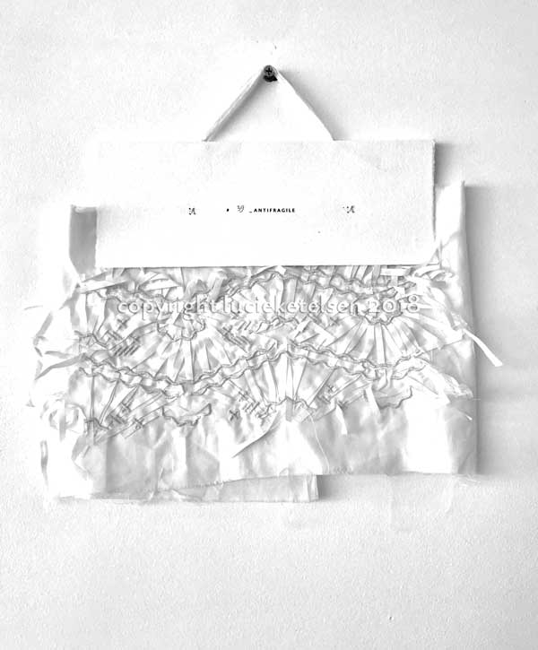
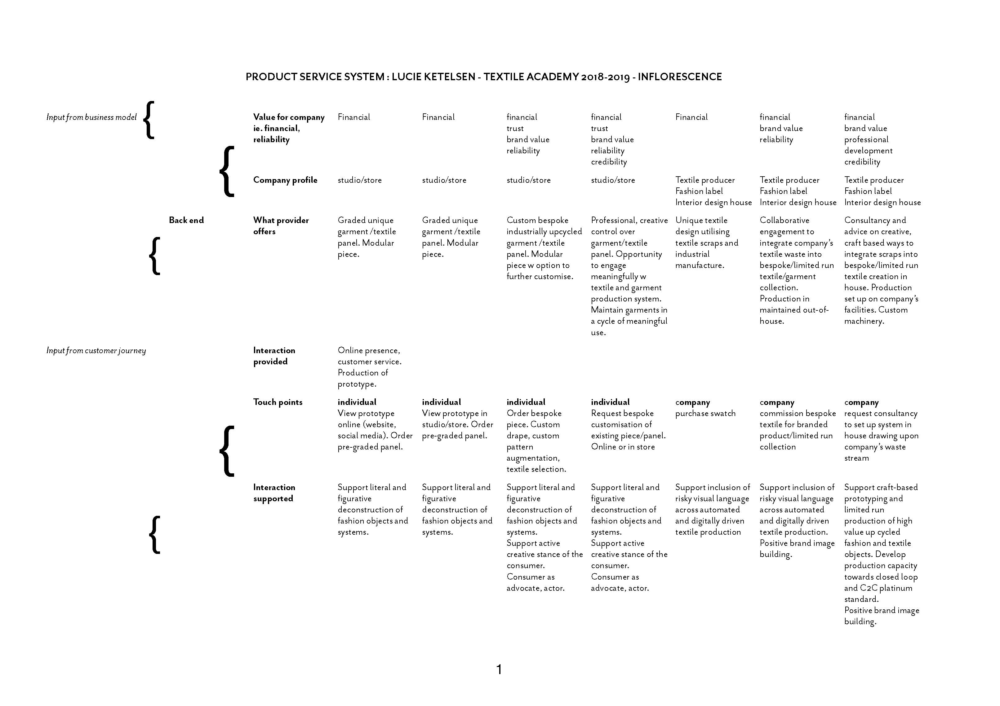
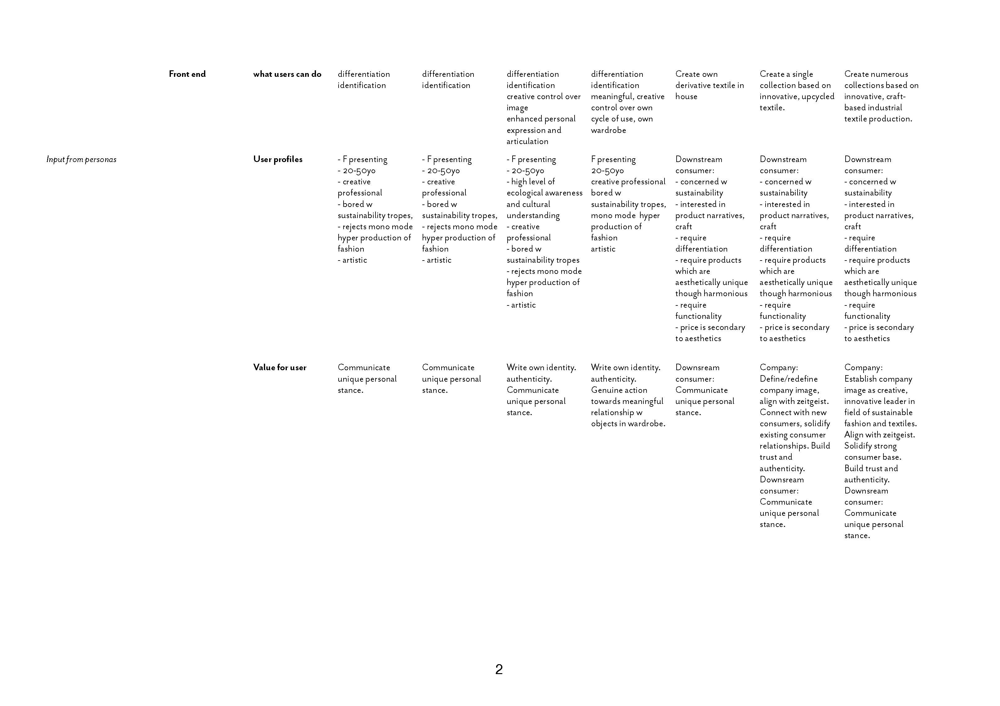

# final project

## introduction

this project traces the prototyping activities involved in creating bespoke upcycled, embellished textiles. the proposed product-service system synthesises computational surface design with a crafted control   approach in the creation of decorative sustainable textiles.  

the project seeks to challenge a dominant conception of sustainable textiles, commonly referred to as sustainable beige, whereby 'nature' is a simple pastoral ideal and simulation is a demon released from pandora's box with the industrial revolution.  this conception of fashion confuses the commercial industry of fashion with the applied, decorative arts of textiles and garment construction, seeking to apply external rules and auditing processes to creatively driven processes. 

computational surface design for the project will involve drawing upon l-systems coding to simulate and allude to natural plant growth in the context of embroidered and embellished surface design. 

crafted control will entail sensing the location of upcycled textile remnants on a ground surface and locking these elements according to a predefined, coded behaviour. 

in addition, the project seeks to subvert the tendency to pursue 'techno-wow' effects through e-textiles, or by increasing surveillance on our already ultra-scrutinised, poisoned and augmented bodies. the project instead takes up the old imperative of the craft of textile design - acting as an intermediary between textile house, fashion designer and consumer, translating an element of the zeitgeist in a form that aspires to bridge the divide between function and critical reflection. 

### product service system 

  

### 2D component - surface design



surface design based on l-systems modelling for plants, in particular based on the work of [aristid lindenmayer](http://algorithmicbotany.org/papers/abop/abop.pdf), [allen pike](https://allenpike.com/modeling-plants-with-l-systems/),  [kevin roast](http://www.kevs3d.co.uk/dev/lsystems/) and [sher minn chong](http://piratefsh.github.io/p5js-art/public/lsystems/).  

l-systems can be modellled in grasshopper using [rabbit](https://morphocode.com/rabbit/)

## industrial bespoke





  

## crafted control

  

#### LINKS









#### SUPPLIES

PC components:

to control the drivers and embroidery head - [this](https://hshop.vn/products/mach-cnc-bob-mach3-usb-v2) cnc circuit board 

#### CITATIONS

