# implications and applications

this project traces the prototyping activities involved in creating bespoke upcycled, embellished textiles. the proposed product-service system synthesises computational surface design with a crafted control   approach in the creation of decorative sustainable textiles.  

the project seeks to challenge a dominant conception of sustainable textiles in which 'nature' is a fantas simple pastoral ideal and simulation is a demon released from pandora's box with the industrial revolution.  this conception of fashion confuses the commercial industry of fashion with the applied, decorative arts of textiles and garment construction, seeking to apply external rules and auditing processes to creatively driven processes. 

computational surface design for the project will involve drawing upon l-systems coding to simulate and allude to natural plant growth in the context of embroidered and embellished surface design. 

crafted control will be achieved in part by sensing the location of upcycled textile remnants on a ground surface and locking these elements according to a predefined, coded behaviour. 

in addition, the project seeks to subvert the tendency to pursue 'techno-wow' effects through e-textiles, or by increasing surveillance on our already ultra-scrutinised, poisoned and augmented bodies. the project instead takes up the old imperative of the craft of textile design - acting as an intermediary between textile house, fashion designer and consumer, translating an element of the zeitgeist in a form that aspires to bridge the divide between function and critical reflection. 

### product service system 

the project will prototype a micro-system for upcycling textile remnants through a bespoke industrial making process which synthesises hand and machine, predictable simulation and natural errrancy.

the prototype will involve both process and artefact. 

the process will involve a hacked embroidery machine. an old machine will be added to cnc axes and coupled with a camera sensor which will add the capability to control where the embroidery head will embroid. this will allow for an element of randomness and greater crafted control to be introduced into automated decorative textile embellishment. the process will open up interesting possibilities for the upcycling of textile remnants, where scraps are seen as precious and ineffable craft values are actively cultivated in an atmosphere generally devoid of creative risk.

in addition, the design process will blur the boundary between 2 and 3 dimensional design, bringing the garment block into the space of surface design, and likewise translating 2d surface elements into 3d embellishments and functional, structural details. 

the artefacts proposed through this process will fall on varying points on a spectrum between pure, traditional textile design, and more contemporary deconstructed/modular garment panels as much aesthetic statement as functional wardrobe piece.   

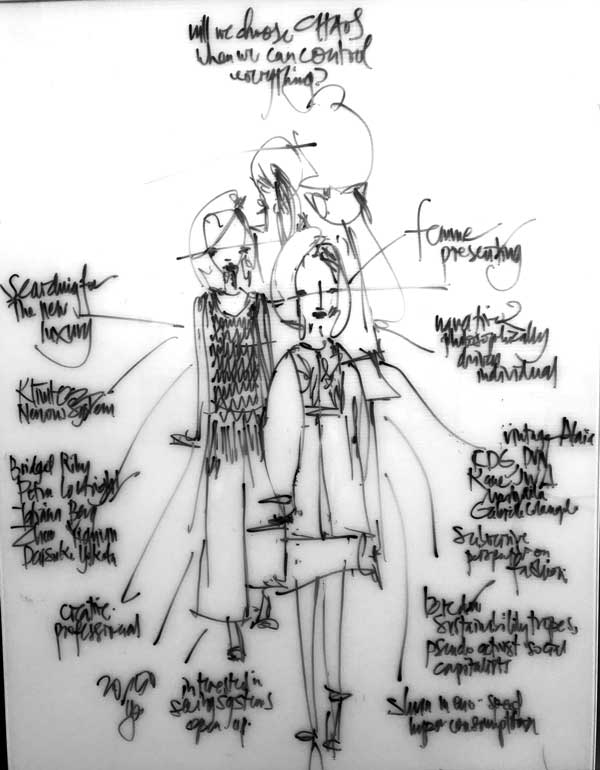

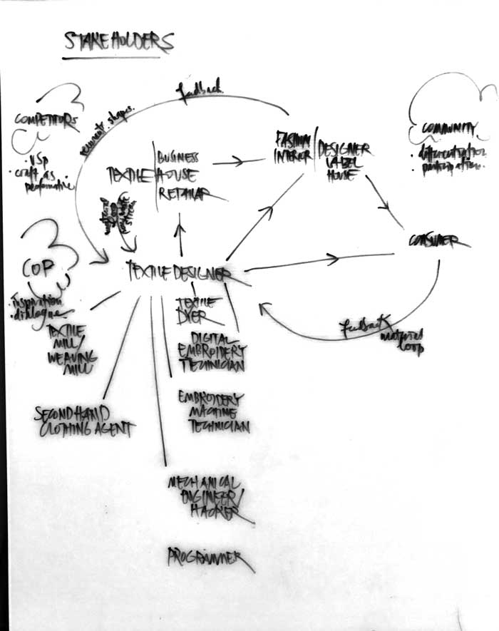

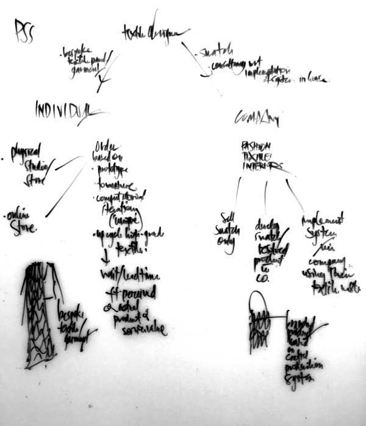

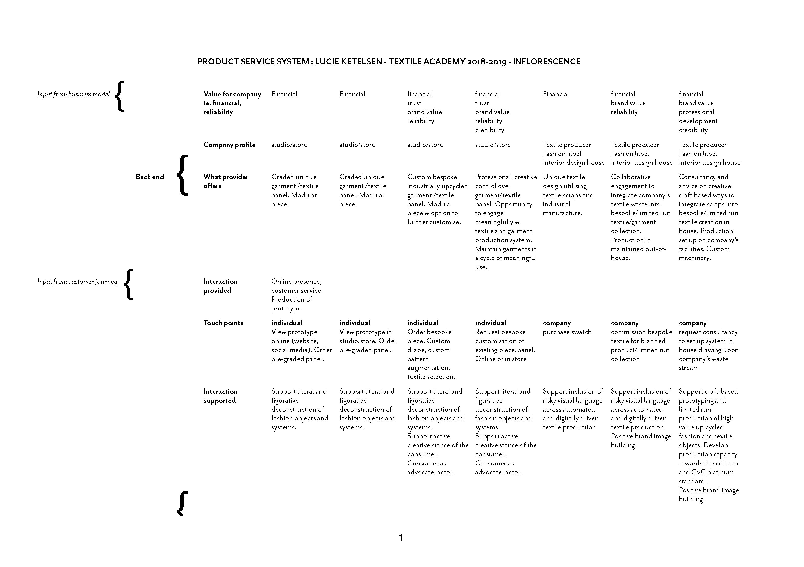

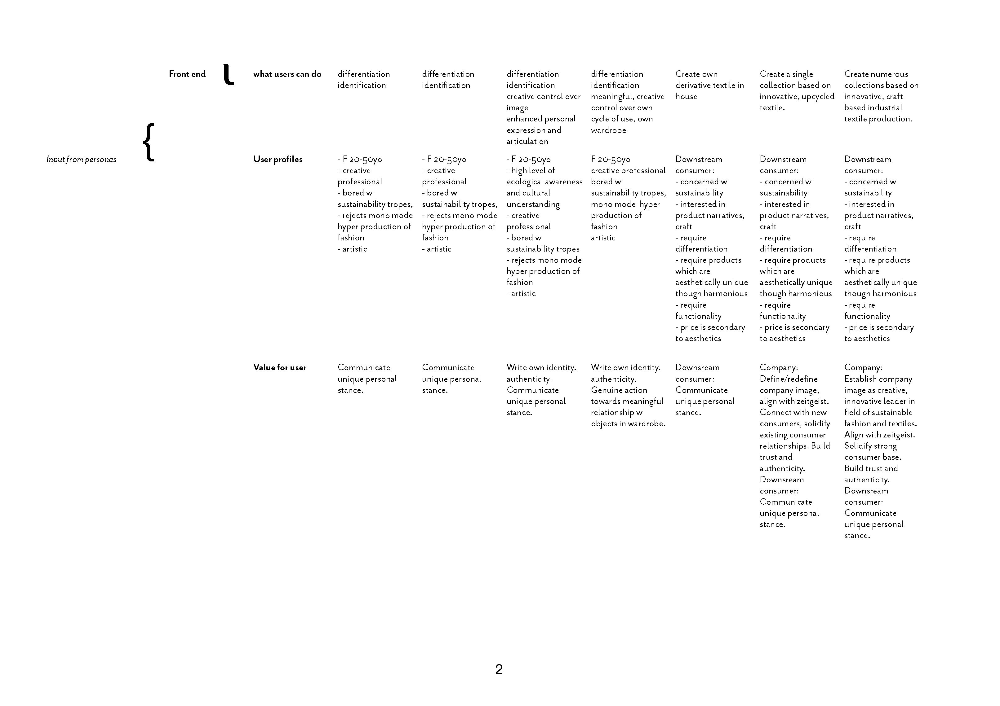

### 2D component - surface design



surface design based on l-systems modelling for plants, in particular based on the work of [aristid lindenmayer](http://algorithmicbotany.org/papers/abop/abop.pdf), [allen pike](https://allenpike.com/modeling-plants-with-l-systems/),  [kevin roast](http://www.kevs3d.co.uk/dev/lsystems/) and [sher minn chong](http://piratefsh.github.io/p5js-art/public/lsystems/).  

l-systems can be modellled in grasshopper using [rabbit](https://morphocode.com/rabbit/)

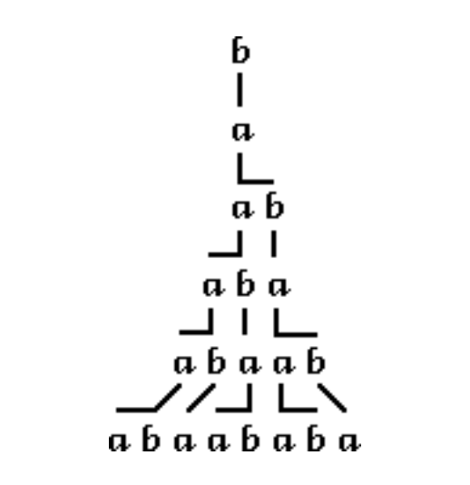

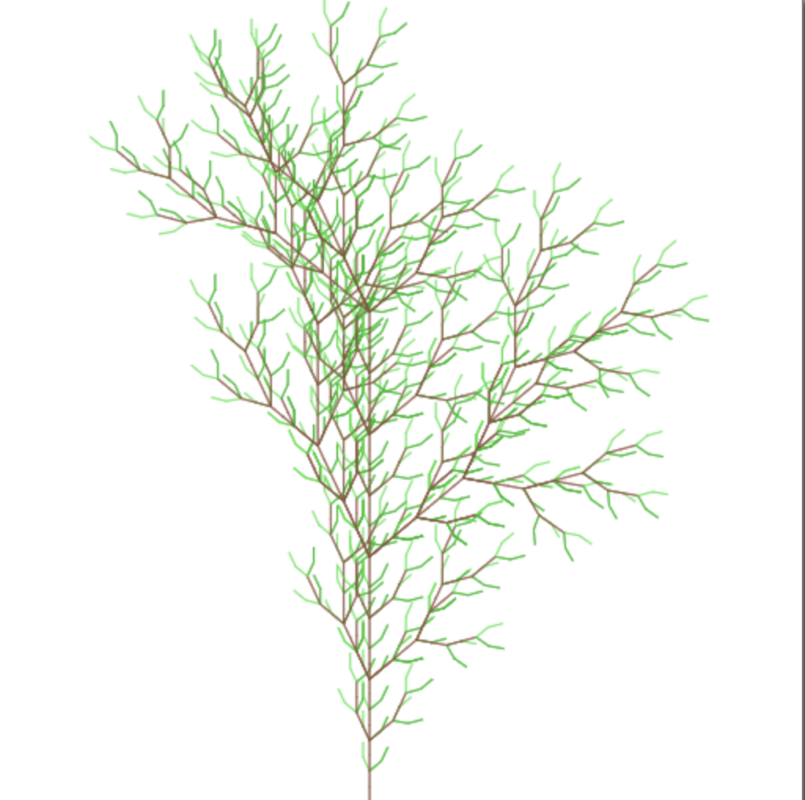

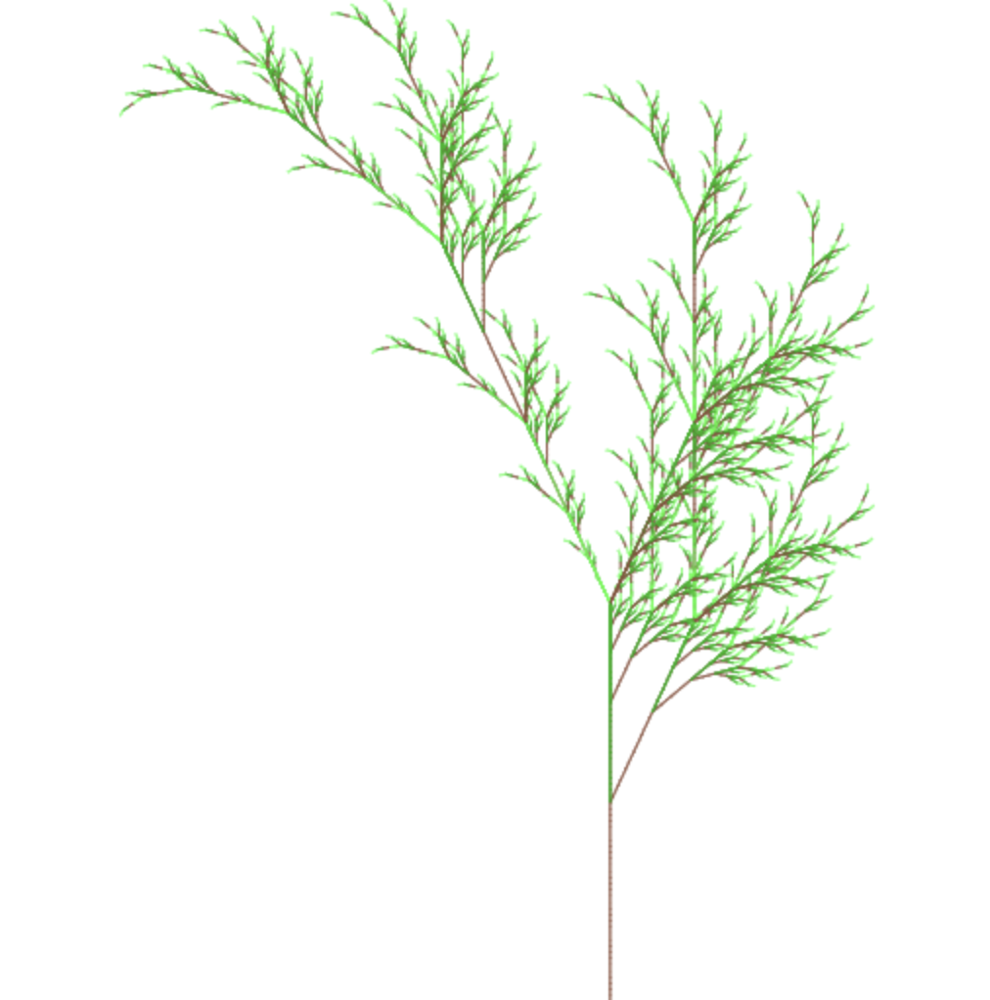

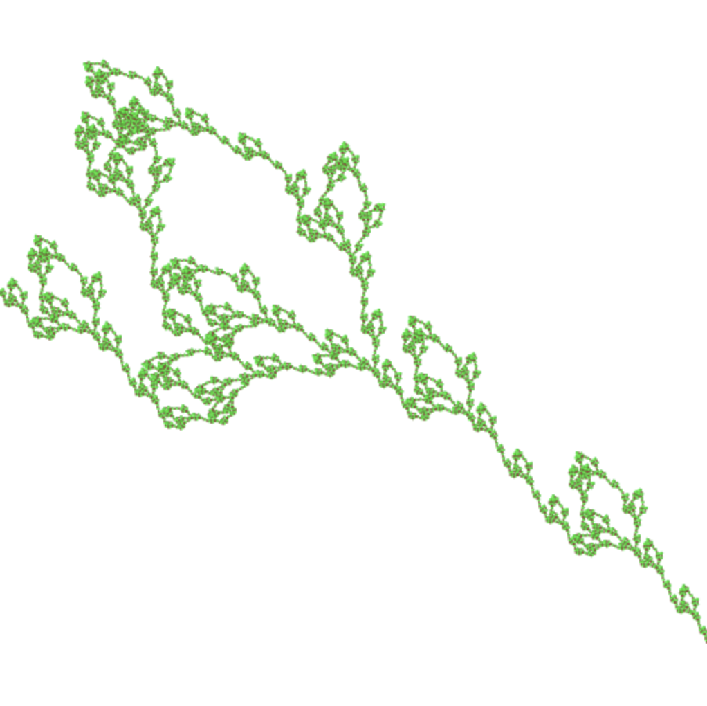

## industrial bespoke





a digital embroidery machine head will be mounted on 3 axes, as per a cnc machine. a camera sensor will be mounted to the left of the needle. the machine will be controlled by a cnc board and a pc with open source machine embroidery platform [inkstitch](https://inkstitch.org/) installed. the pc will be connected to a small monitor. the machine will thus have the capacity to embroid a set of basic stitches, mediated by the sensor which will be programmed to only embroid where, for example, red chalk is visible.   

## crafted control

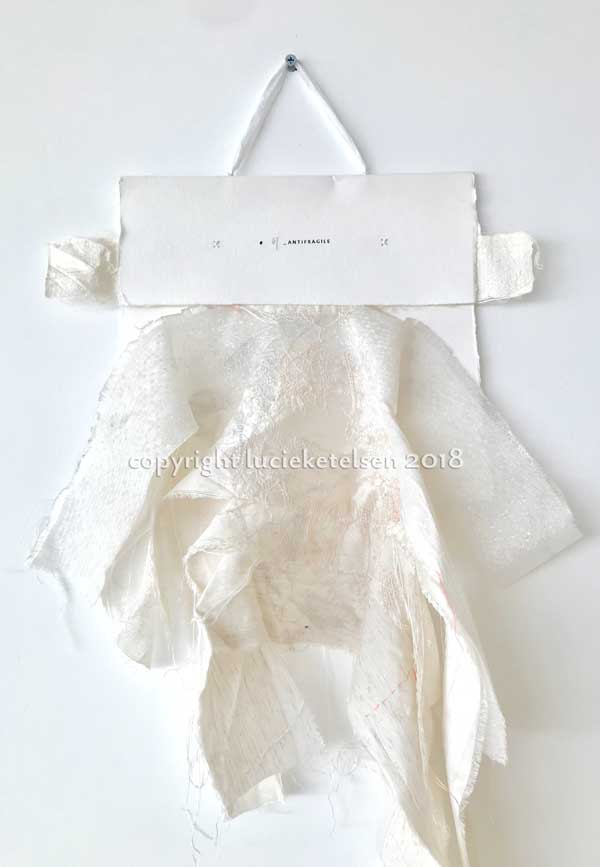

how to preserve an element of randomness, of undecidability, of errancy as every single facet of our lives is mapped and controlled by pre-defined algorithms? is there any space in this context for the chaotic? what is poetic, in such a mechanised, automated space?

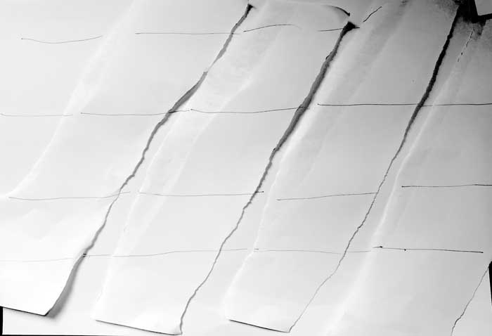

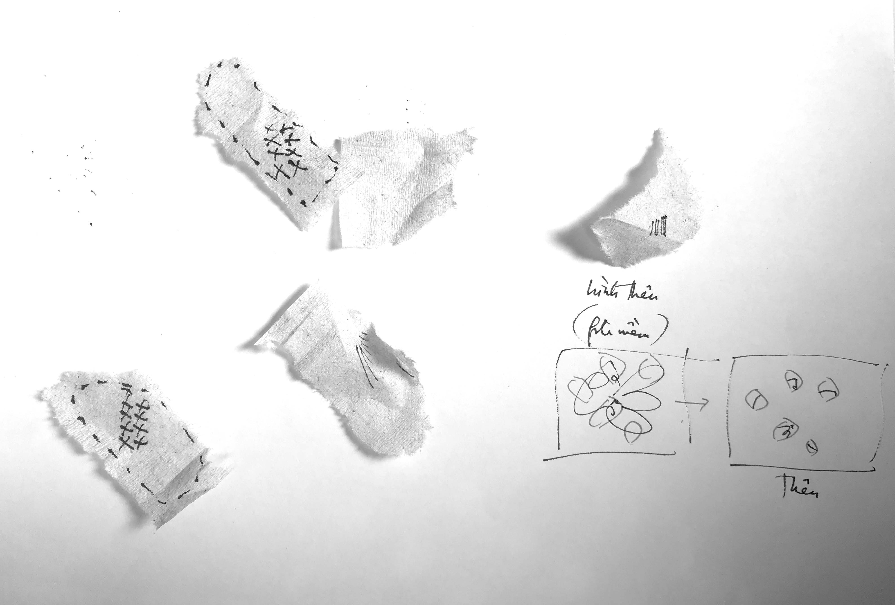

my proposition is to actively create space for random acts of sponteneity and frivolity amidst sped up production to known outcomes. to make space for the a-systematic, that which has fallen out of use, that has no place.  i want to place, scatter and arrange textile remnants and scraps and use the machine to lock a material narrative in place.

process

* choose a substrate
* choose elements to float on this surface
* set up on embroidery frame, baste floating elements to substrate \(either freehand, by sewing machine with stitch length maximised, or by affixing to stabiliser\)
* drape form, digitise for 2d, bring into digital surface design space
* put together 2d and 3d surface design elements 
* apply computational design to the 2d area
* upload the file, set parameters according to design \(ie. if blue then run, else do not run etc\)
* run the file
* clean up, remove loose threads, embellish with 3d embellishment elements

#### LINKS









#### SUPPLIES

* drivers x 3
* motors x 3
* [this](https://hshop.vn/products/mach-cnc-bob-mach3-usb-v2) cnc circuit board
* cheap PC
* camera, like [this ](https://hshop.vn/products/cam-bien-mau-tcs3200-kem-ong-kinh)
* aluminium axes \(x, y, z\), cnc milled
* ball bearing wheels
* lpt cables

#### CITATIONS

