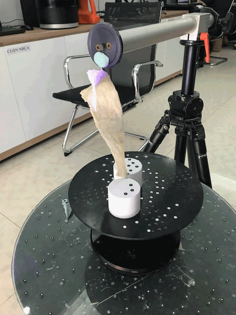
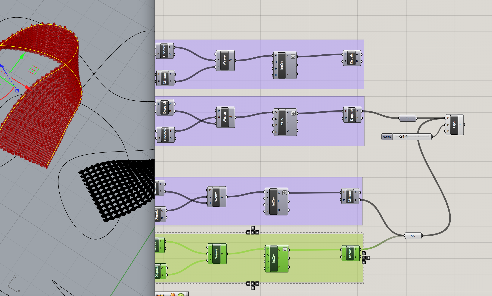

# computational couture

## post-cartesian world

rapid and sweeping changes to how we see ourselves in our world are destabilising the traditional role of the designer. in the face of extreme pollution, designers are responding to the complete commingling of agency in complex networks of human and non-human actors, consequently the organic and synthetic have merged in the making practices of many designers. similarly, big data and AI have disrupted and rearranged our ideas around systems design, community and what it means to construct and claim an identity. contending with new technological advances has positioned designers to redefine what is meant when we speak about design. rather than seeking  stable ground in empiricism, designers are continually redefining an unstable epistêmê through a new technê that finds itself only in relationship to the systems within which we are enmeshed. how we can design from this place of uncertainty?

### computation driven design

allowing algorithms to inform design processes is a means many have adopted as a way to bring the organic in direct relationship to technologies of simulation. this methodology allows for an emergent aesthetic derived from abstracted, measurable behaviours thus making space for a certain ambivalence around design decisions. by embracing the techniques of simulacra designers have been able to create and apply visual and material languages previously only found in medical slides, traffic data or leaf veination to speak about highly-technologically mediated experiences deeply embedded in biological systems.

## making a model

model was scanned using the thor 3d scanner with reconstruction sensitivity set to 5, texture brightness set to 6.   
[http://thor3dscanner.com/thor3d](http://thor3dscanner.com/thor3d)

##  parametric weave

i began by following the parametric weave [tutorial](https://vimeo.com/24138876) of b.james

connect centre point to a plane \(plane normal\) component, then connect this plane to an amp component so the weave height can be set and adjusted. 

raise the outer branches, set an origin point for raised plane, set a center point for the array by multiplying the x & y by 0.5, set the output as x & y coordinates to create a point object

reorient the branches by adding a flip matrix component so that point indices which were arranged by column will instead be arranged by rows. connect the flip component to the branch output. for the outer branches, connect flip to move.

connect branch output to a rotate 3D component to rotate outer branches. take centre point from the grid \(following from the multiply &gt; construct pt &gt; plane components\) as the point of rotation




this definition did not work when applied to a 3d form. i created a 3d surface based on 2 curves and linked these curves into this parametric weave definition by substituting out the grid. unsure how to rectify this error, i began a new definition. 


###  applying weave definitions over an approximation of the model surface

divide the surface with a rectangular grid of control points. for a 3d surface, rather than having x, y, z coordinates, points can be expressed in u & v coordinates. u & v sliders control the number of points expressed across the surface. dispatch turns these points into boolean controlled points - T or F. these points are brought into a weave, then a curve can be interpolated from these points.

dispatch works in a similar way to how cull works in the previous definition

  
the second definition was not a real weave at this point, but it flowed over the 3d surface in a way that the previous definition did not. i am still learning from b.james' definition, though it seems there is a simpler way to create a parametric weave. 

###  recreating the model as a surface



bake. export selection to .stl. 

the file is ready in 31 hours... 




there are other ways to create weave definitions in grasshopper, i have briefly explored 2 means. i am discovering more and hope to apply these in future projects.  


#### LINKS



















