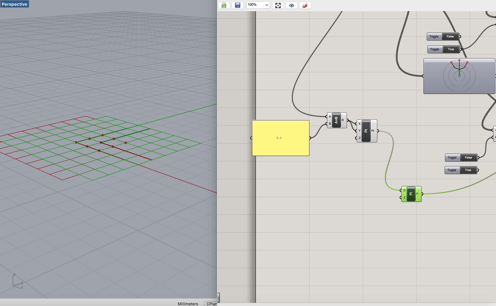
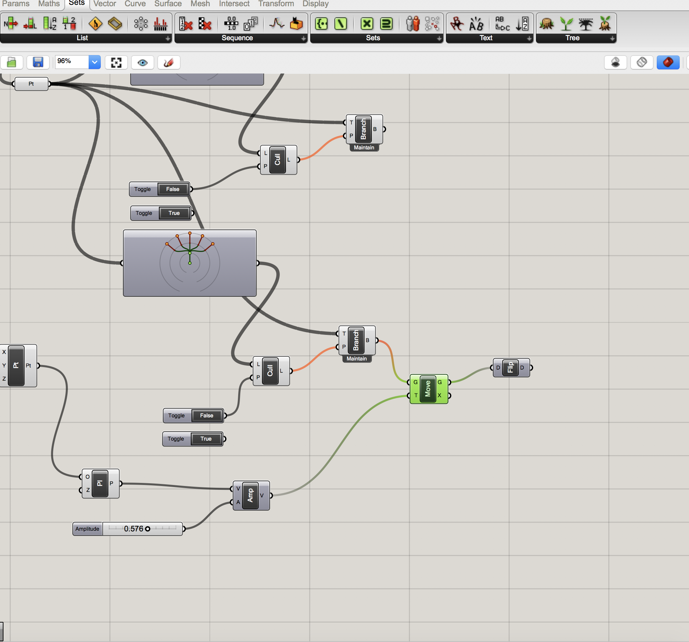

# computational couture

## post-cartesian world

rapid and sweeping changes to how we see ourselves in our world are destabilising the traditional role of the designer. in the face of extreme pollution, designers are responding to the complete commingling of agency in complex networks of human and non-human actors, consequently the organic and synthetic have merged in the making practices of many designers. similarly, big data and AI have disrupted and rearranged our ideas around systems design, community and what it means to construct and claim an identity. contending with new technological advances has positioned designers to redefine what is meant when we speak about design. rather than seeking  stable ground in empiricism, designers are continually redefining an unstable epistêmê through a new technê that finds itself only in relationship to the systems within which we are enmeshed. how we can design from this place of uncertainty?

### computation driven design

allowing algorithms to inform design processes is a means many have adopted as a way to bring the organic in direct relationship to technologies of simulation. this methodology allows for an emergent aesthetic derived from abstracted, measurable behaviours thus making space for a certain ambivalence around design decisions. by embracing the techniques of simulacra designers have been able to create and apply visual and material languages previously only found in medical slides, traffic data or leaf veination to speak about a highly-technologically mediated experiences deeply embedded in biological systems.

## making a model

##  parametric weave

#### LINKS











