# e-textiles

* Build at least one digital and one analog soft sensor, using different materials and techniques.
* Document the sensor project and include a step by step making of as well as the readings you get using the AnalogRead of arduino
* Intergate your two soft sensors into two swatches, textile using hard soft connection solutions
* Document your swatches on your webpage
* Upload a small video of your swatches functioning

### making things soft

increasingly, non-linear craft based textile design methodologies are being employed by designers to augment the typically positivist processes of wearable computing design. user-centric approaches that combine embodied materials thinking with outcome focussed electrical engineering have resulted in artefacts and processes that both literally and figuratively softer than their wearable tech predecessors.

making sensors soft invovles exploring a new genre of conductive/resistive materials that have a set of properties in relation to electrical circuits, and an additional set of material, aesthetic properties that arguably have equal bearing on user experience outside of direct electrical functionality. moving beyond techno-wow and borg-aesthetics, designers are increasingly interested in embedding technology such that it is unobtrusive, subtle, integrated and connected to the 'everyday'. 

kobakant's [site](http://www.kobakant.at/DIY/) "how to get what you want" is an excellent resource proposing practical applications of wearable tech in textiles, exploring and proposing a nuanced craft of discreetly embedding special functions in quotidien objects. similarly, sarah kettley's "designing with smart textiles" considers strategies for preserving authenticity within wearable tech artefacts grounded in craft theory and reflective, practice based research.  finally, leah buechley's research, presented on [the site ](http://highlowtech.org/)hi low tech, is a platform for projects that usurp usual coding and tech applications by embedding existing technologies in new materials, thereby imagining novel, alternative uses. 

  


### circuit design

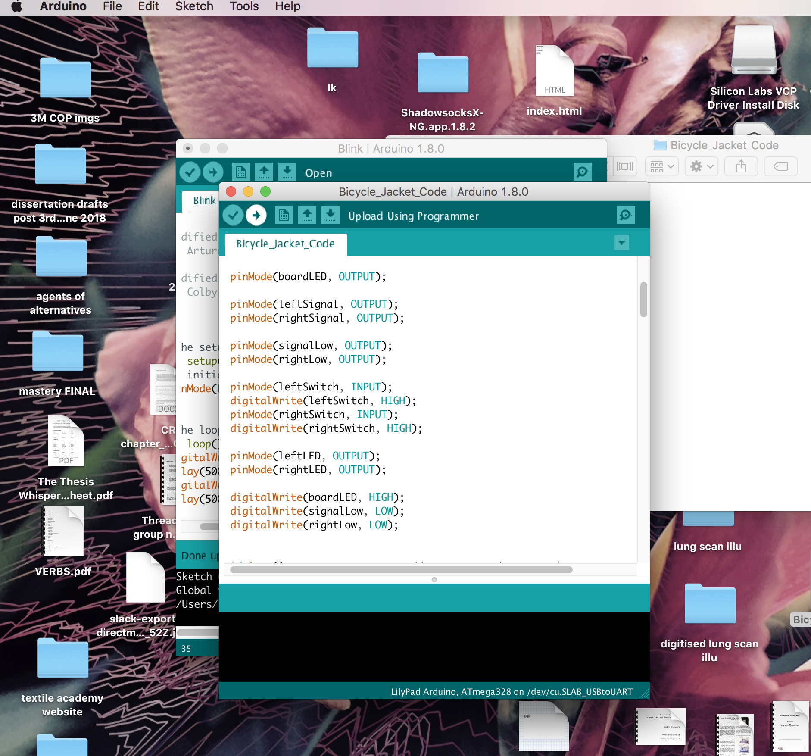

  
i began by looking at leah buechley's turning jacket code. 

i copied and rewrote the code, adapting it to the breadboard and soft circuit components i had in front of me, for the jacket i had chosen to upcycle. there were still some elements of the code i was unsure about, for example the debounce function. when i uploaded the code to the arduino the behaviour of the code was not as predicted. the button must be pressed 4 times in order to light the LEDs, which was not the behaviour i wanted for my jacket. i had one day in shanghai to complete the coding on the circuit - i will need to allow more time to consider buechley's turning jacket code and elements like millis and debounce. 


i decided to create my own composite sketch by adapting 2 existing arduino sketches. 

i began with the switch example.   


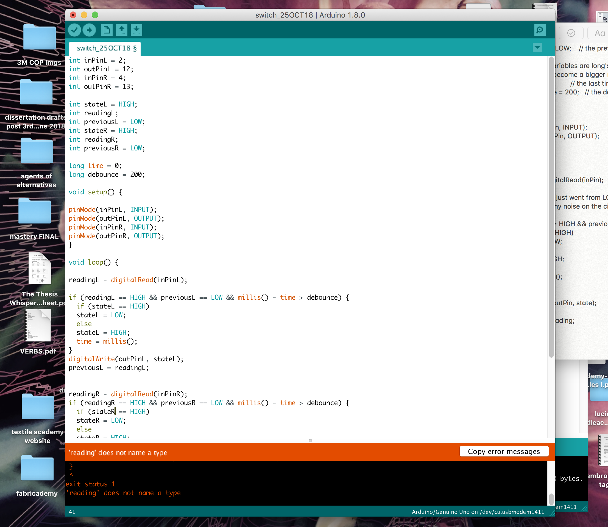

  
i compared the switch sketch to buechley's turning jacket sketch to see which elements might be brought across. 

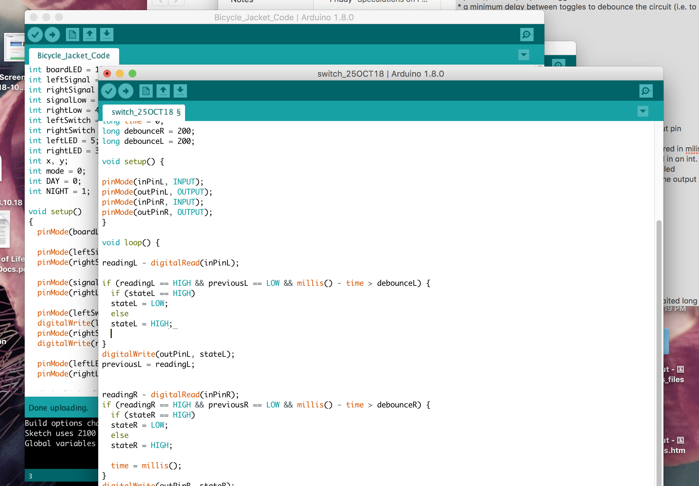


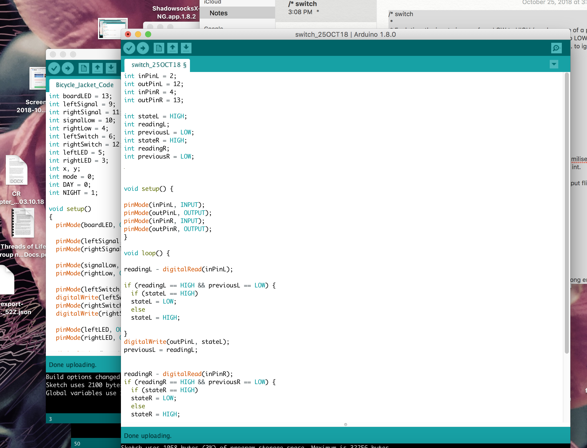

  


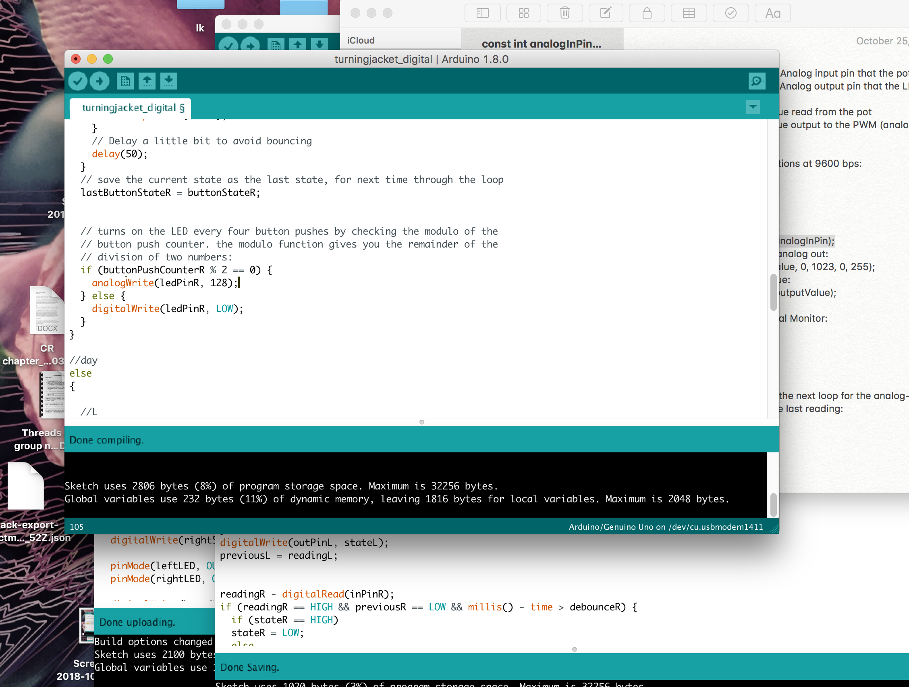

  


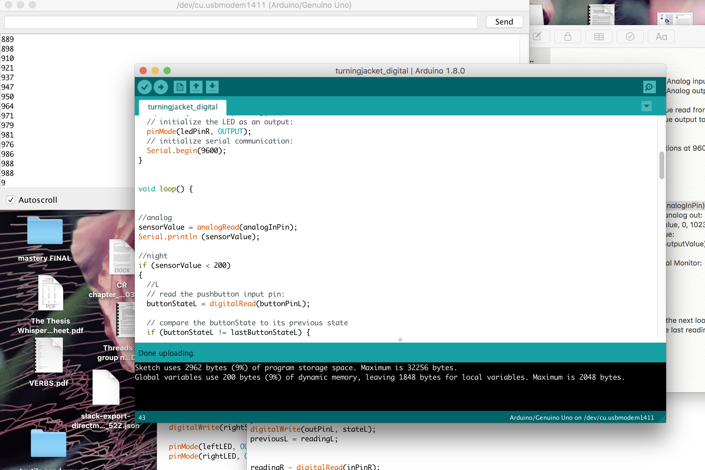

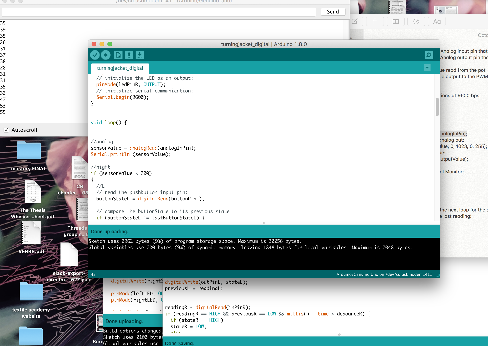

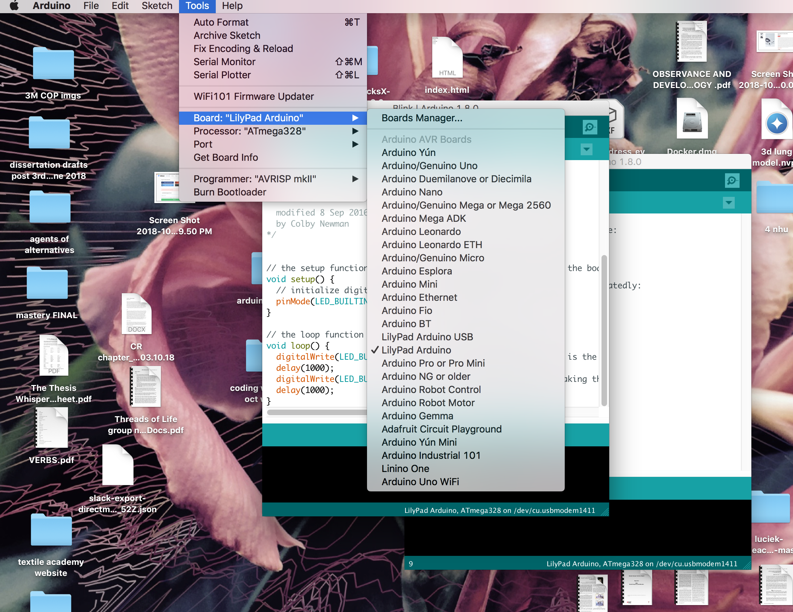

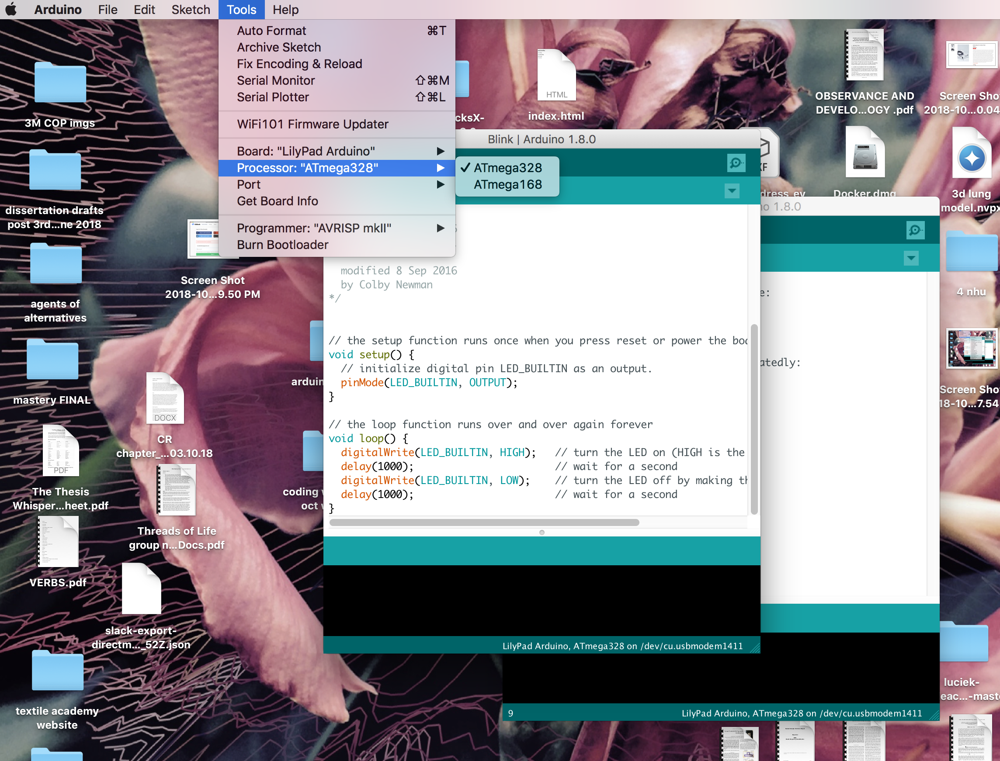

```text
//L
const int  buttonPinL = 2;    // the pin that the pushbutton is attached to
const int ledPinL = 11;       // the pin that the LED is attached to

int buttonPushCounterL = 0;   // counter for the number of button presses
int buttonStateL = 0;         // current state of the button
int lastButtonStateL = 0;     // previous state of the button

//R
const int  buttonPinR = 4;    // the pin that the pushbutton is attached to
const int ledPinR = 10;       // the pin that the LED is attached to

int buttonPushCounterR = 0;   // counter for the number of button presses
int buttonStateR = 0;         // current state of the button
int lastButtonStateR = 0;     // previous state of the button

//analog
const int analogInPin = A0;
int sensorValue = 0;

void setup() {
  // initialize the button pin as a input:
  //L
  pinMode(buttonPinL, INPUT);
  // initialize the LED as an output:
  pinMode(ledPinL, OUTPUT);
  // initialize serial communication:
  //R
    pinMode(buttonPinR, INPUT);
  // initialize the LED as an output:
  pinMode(ledPinR, OUTPUT);
  // initialize serial communication:
  Serial.begin(9600);
}


void loop() {


//analog
sensorValue = analogRead(analogInPin);
Serial.println (sensorValue);

//night
if (sensorValue > 200) 
{
  //L
  // read the pushbutton input pin:
  buttonStateL = digitalRead(buttonPinL);

  // compare the buttonState to its previous state
  if (buttonStateL != lastButtonStateL) {
    // if the state has changed, increment the counter
    if (buttonStateL == HIGH) {
      // if the current state is HIGH then the button went from off to on:
      buttonPushCounterL++;
//      Serial.println("on");
//      Serial.print("number of button pushes: ");
//      Serial.println(buttonPushCounterL);
    } else {
      // if the current state is LOW then the button went from on to off:
//      Serial.println("off");
    }
    // Delay a little bit to avoid bouncing
    delay(50);
  }
  // save the current state as the last state, for next time through the loop
  lastButtonStateL = buttonStateL;


  // turns on the LED every four button pushes by checking the modulo of the
  // button push counter. the modulo function gives you the remainder of the
  // division of two numbers:
  if (buttonPushCounterL % 2 == 0) {
    analogWrite(ledPinL, 50);
  } else {
    digitalWrite(ledPinL, LOW);
  }
//R
buttonStateR = digitalRead(buttonPinR);

  // compare the buttonState to its previous state
  if (buttonStateR != lastButtonStateR) {
    // if the state has changed, increment the counter
    if (buttonStateR == HIGH) {
      // if the current state is HIGH then the button went from off to on:
      buttonPushCounterR++;
//      Serial.println("on");
//      Serial.print("number of button pushes: ");
//      Serial.println(buttonPushCounterR);
    } else {
      // if the current state is LOW then the button went from on to off:
//      Serial.println("off");
    }
    // Delay a little bit to avoid bouncing
    delay(50);
  }
  // save the current state as the last state, for next time through the loop
  lastButtonStateR = buttonStateR;


  // turns on the LED every four button pushes by checking the modulo of the
  // button push counter. the modulo function gives you the remainder of the
  // division of two numbers:
  if (buttonPushCounterR % 2 == 0) {
    analogWrite(ledPinR, 50);
  } else {
    digitalWrite(ledPinR, LOW);
  }
}
  
//day
else 
{
  
  //L
  // read the pushbutton input pin:
  buttonStateL = digitalRead(buttonPinL);

  // compare the buttonState to its previous state
  if (buttonStateL != lastButtonStateL) {
    // if the state has changed, increment the counter
    if (buttonStateL == HIGH) {
      // if the current state is HIGH then the button went from off to on:
      buttonPushCounterL++;
//      Serial.println("on");
//      Serial.print("number of button pushes: ");
//      Serial.println(buttonPushCounterL);
    } else {
      // if the current state is LOW then the button went from on to off:
//      Serial.println("off");
    }
    // Delay a little bit to avoid bouncing
    delay(50);
  }
  // save the current state as the last state, for next time through the loop
  lastButtonStateL = buttonStateL;


  // turns on the LED every four button pushes by checking the modulo of the
  // button push counter. the modulo function gives you the remainder of the
  // division of two numbers:
  if (buttonPushCounterL % 2 == 0) {
    digitalWrite(ledPinL, HIGH);
  } else {
    digitalWrite(ledPinL, LOW);
  }
//R
buttonStateR = digitalRead(buttonPinR);

  // compare the buttonState to its previous state
  if (buttonStateR != lastButtonStateR) {
    // if the state has changed, increment the counter
    if (buttonStateR == HIGH) {
      // if the current state is HIGH then the button went from off to on:
      buttonPushCounterR++;
//      Serial.println("on");
//      Serial.print("number of button pushes: ");
//      Serial.println(buttonPushCounterR);
    } else {
      // if the current state is LOW then the button went from on to off:
//      Serial.println("off");
    }
    // Delay a little bit to avoid bouncing
    delay(50);
  }
  // save the current state as the last state, for next time through the loop
  lastButtonStateR = buttonStateR;


  // turns on the LED every four button pushes by checking the modulo of the
  // button push counter. the modulo function gives you the remainder of the
  // division of two numbers:
  if (buttonPushCounterR % 2 == 0) {
    digitalWrite(ledPinR, HIGH);
  } else {
    digitalWrite(ledPinR, LOW);
  }
}
}
```

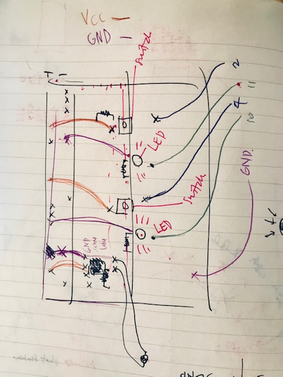

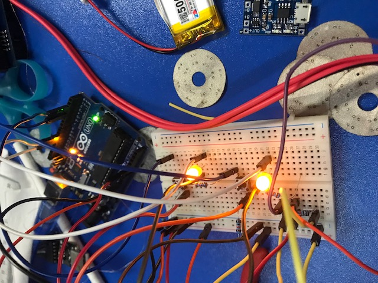

having uploaded and tested the sketch on arduino, i began to make my circuit soft and transfer the sketch to lilypad. 

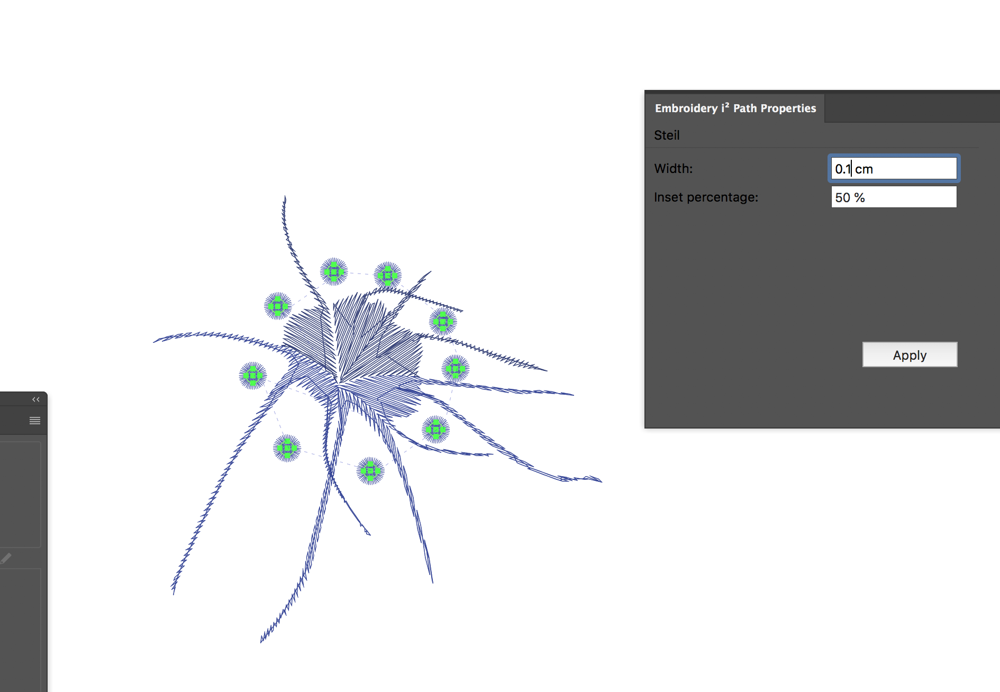

  


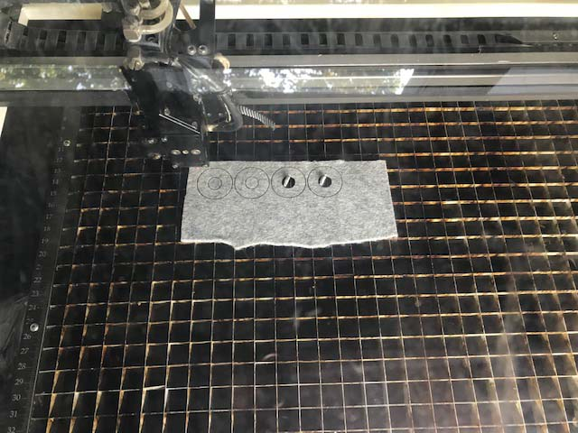


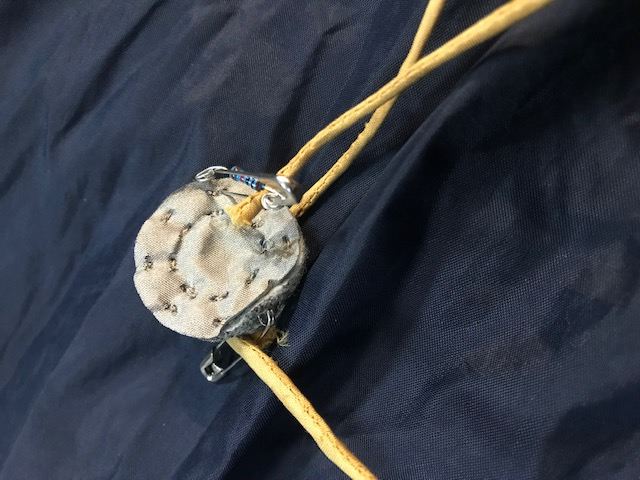

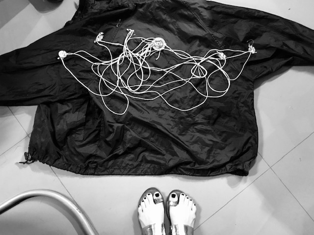

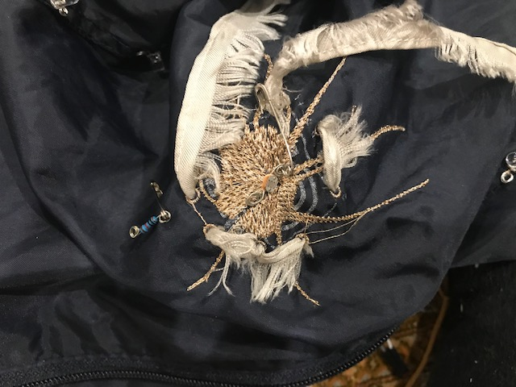

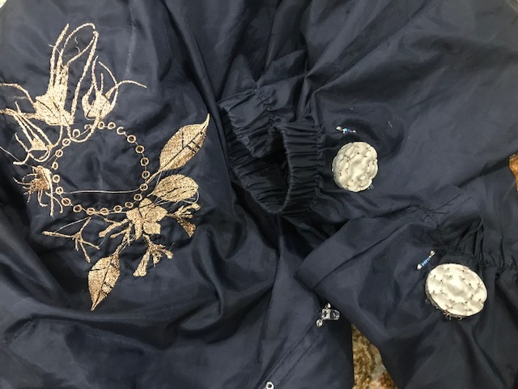

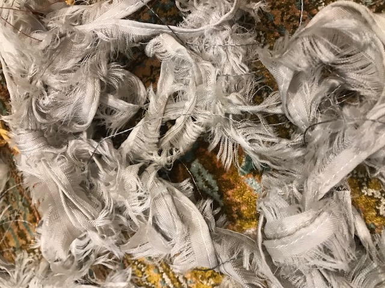

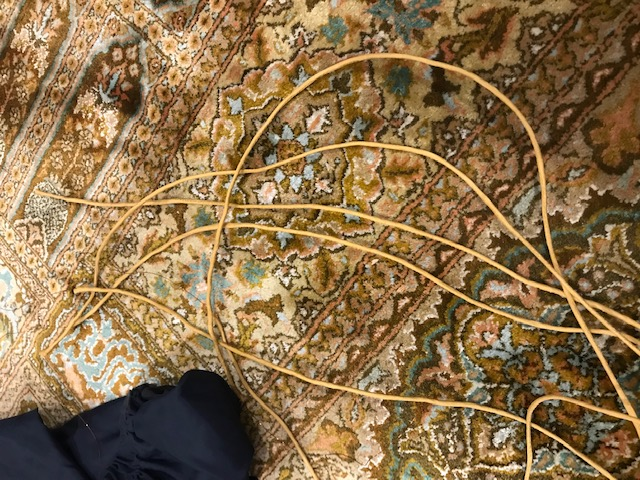

  


  


  


