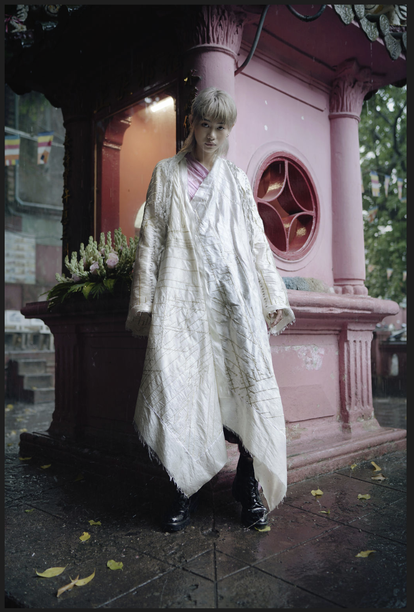

# epiphyte - final project

## epiphyte as design model

this project looks to lichen as a model for alternative design practices. the project takes shape through the creation of a set of embellished modular textile panels. prototyping of the panels allows for the emergence of the following material and technical characteristics:

* **grow on a surface**. the panels take form in relation to both an environment and a set of internal conditions or rules a. draped on a mannequin b. placed as a mesh on an avatar c. instigated as a model on a mesh or nurbs surface. assume form dependent on the form of a substrate. boundaries and surfaces are invested with significance. 
* **grow without depleting**. consisting of salvaged and harvested materials. a response to what isn't immediately apparent with what is already existing.
* **grow idiosycratically**. each design iteration is a single instantiation according to unique conditions
* **grow in intricacy**. intricacy a function of time lapse, both synthesized and actual
* **grow through hybridisation**. synthesises hybridised time spans and modes of spatial organisation  

> _This is how, even in an empty region of space, a particle emerges out of Nothing, “borrowing” its energy from the future and paying for it \(with its annihilation\) before the system notices this borrowing. The whole network can function like this, in a rhythm of borrowing and annihilation, one borrowing from the other, displacing the debt onto the other, postponing the payment of the debt. What this presupposes is a minimal gap between things in their immediate brute reality and the registration of this reality in some medium._
>
> Zizek, 2009

