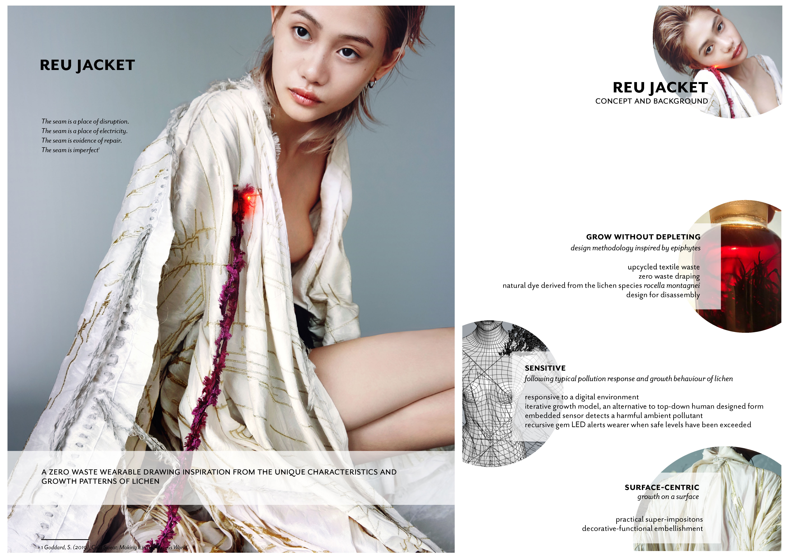
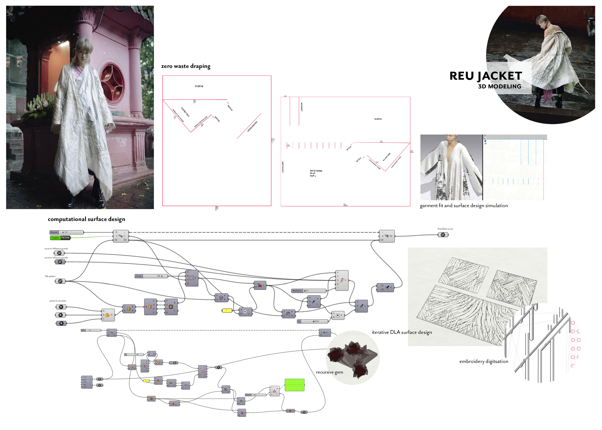
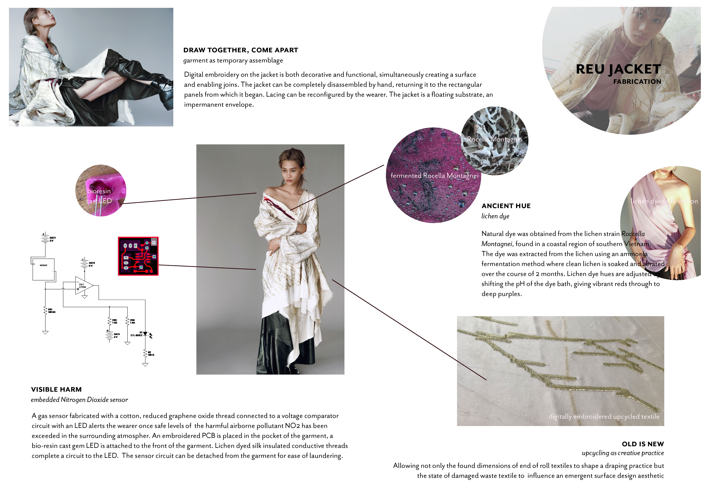

# reu jacket - textile academy final project

The global north’s obsession with growth has led to the transgression of both social foundation and ecological ceiling, a precarious scenario without refuge from toxic penetration, without any meaningful catharsis from excess and over-stimulation. Similarly fashion’s growth model, predicated on endlessly depleting finite resources to deliver faux choix to an ambivalent consumer, is not only creatively and ethically bankrupt but it simply cannot be sustained.

This project looks to lichen as a model for adaptive resilience, as a way to design for micro-utopias predicated instead on localism, connectedness and proportionality.

How can we design to float lightly in relationship, without harming or being harmed? How can seams, boundaries and limits be aestheticised and/or made tangible? What kind of futures can we craft with what we already have?

## concept

Lichen have unique qualities that may point to ways of thriving in an increasingly complex world. By studying lichen we may follow with our own critical, speculative design models that: Grow without depleting Exist in dynamic relationship Are sensitive and responsive Operate at the seams, float on a surface

Reu jacket looks to lichen to query typical fashion narratives and explore an alternative. Lichen’s unique characteristics form the basis for a model useful not only in the creation of evocative objects but as an agent of change. The project models from lichen in tangible ways, taking shape through the creation of a set of embellished modular textile panels, forming a garment-as-assemblage sensitive to both digital and urban environment.

### lichen as design model

this project looks to lichen as a model for alternative design practices. the project takes shape through the creation of a set of embellished modular textile panels. prototyping of the panels allows for the emergence of the following material and technical characteristics:

* **grow on a surface**. the panels take form in relation to both an environment and a set of internal conditions or rules a. draped on a mannequin b. placed as a mesh on an avatar c. instigated as a model on a mesh or nurbs surface. assume form dependent on the form of a substrate. boundaries and surfaces are invested with significance. 
* **grow without depleting**. consisting of salvaged and harvested materials. a response to what isn't immediately apparent with what is already existing.
* **grow idiosycratically**. each design iteration is a single instantiation according to unique conditions
* **grow in intricacy**. intricacy a function of time lapse, both synthesized and actual
* **grow through hybridisation**. synthesises hybridised time spans and modes of spatial organisation  

## modeling

Zero waste draping and upcycling allow for emergent forms of creative reuse by taking inspiration from and working with the found as it is encountered.

Modeling iterative growth through computational surface design brought found dimensions and emergent forms into a generative, responsive digital space by simulating natural growth patterns through diffusion limited aggregation \(DLA\). Natural dyeing and the embedding of soft sensors allow for the unseen to be revealed. Lichen acids, invisible to the naked eye, can be transformed through ancient means to convey the simple beauty of vivid colour. Like lichen acids, nitrogen dioxide \(NO2\) is also invisible and is considered a surrogate for a cluster of other unseen harmful airborne pollutants. Embedding graphene as a sensor allows for NO2 to be detected such that limits may become visible signs of transgression.

The hybridizing of surface design and pattern cutting highlight the significance of seams and the importance of drawing together the disparate while allowing for disassembly and rearrangement.

## fabrication

End of roll and damaged silk was sourced from a local HCMC based weaving facility. Form emerged from the shapes of end of roll fragments, which also gave shape to generative surface design through DLA modeling and determined the digitally embroidered laced seams. Surface design is synthesized with pattern cutting and garment construction whereby seams and cuts into each garment panel are stitched out at the same time as the decorative elements.

Lichen was sourced responsibly from dead trees and branches in Binh Thuan province in southern Vietnam. The sourcing and fermentation processes involved in deriving natural colour from lichen invite an exploration of alternative fashion production flow. Lichen for this project is used to dye silk tapes that insulate conductive thread. Hues were shifted by adjusting the pH of the dye bath. Designing for inclusion of a small component to be naturally dyed limits the impact on local environments though at the same time allows for a meaningful connection to arise.

The sensor is fabricated by repeatedly dip coating scoured cotton thread in graphene oxide \(GO\) and a binding agent, the GO is then chemically reduced and heat treated creating a reduced graphene oxide \(rGO\) thread which can be used as a sensor. Uniquely sensitive to NO2, the resistance in the sensor will drop in the presence of the gas - a resistance threshold is set corresponding to WHO permissible levels. Please refer to Figure 1, below.

A custom LED is cast in bio-resin from 3d printed PLA. The circuit is embroidered and concealed in the folds of the right hand pocket, the LED and sensor hang from an ornamental pin.

## dissemination strategy

The design approach underpinning Reu Jacket is flexible and adaptable, inviting engagement within parameters to derive unique one-off iterations based on specific material-based conditions.

The design is customizable, responsive to local textile waste realities and to the requirements of a customer. It can be adapted to local conditions and is suited to the reuse of end of roll textiles. Since this model is surface centric and can be detailed it is also suited to the upcycling of damaged textiles with surface defects or stains. While this project iteration drew upon digital embroidery, other surface finishing techniques could be adopted such as laser etching, 3d printing on textile, digital print, digital wax print and so on.

The sensor circuit can be fabricated with few materials, and can be completely detached from the garment. This wearable makes invisible pollution transgressions a tangible reality for the wearer without the need for costly and inaccessible gas detection equipment. This makes the piece useful in situations where air pollution is a significant threat to urban populations, and in particular to those with respiratory issues.

Though perhaps most importantly the project adds its voice to a chorus of counter narratives refusing the current dystopian trajectory of an industry that has lost its way, proposing a more holistic and relational idea of fashion design.



> _This is how, even in an empty region of space, a particle emerges out of Nothing, “borrowing” its energy from the future and paying for it \(with its annihilation\) before the system notices this borrowing. The whole network can function like this, in a rhythm of borrowing and annihilation, one borrowing from the other, displacing the debt onto the other, postponing the payment of the debt. What this presupposes is a minimal gap between things in their immediate brute reality and the registration of this reality in some medium._
>
> Zizek, 2009

