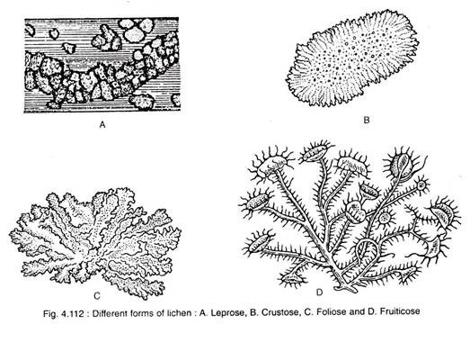
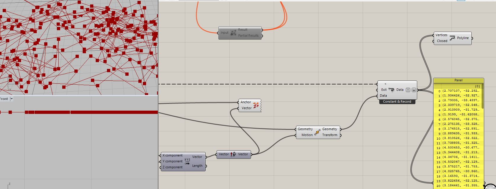
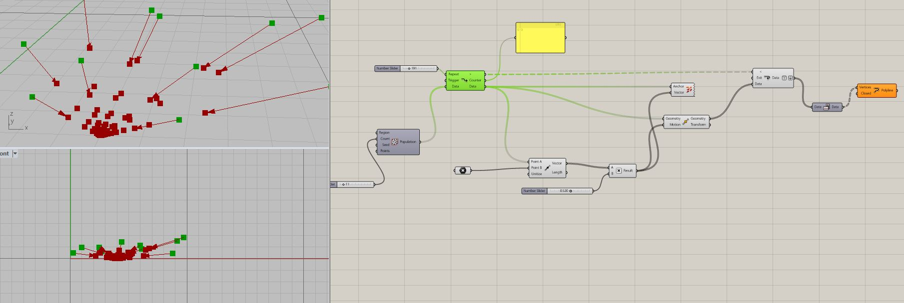
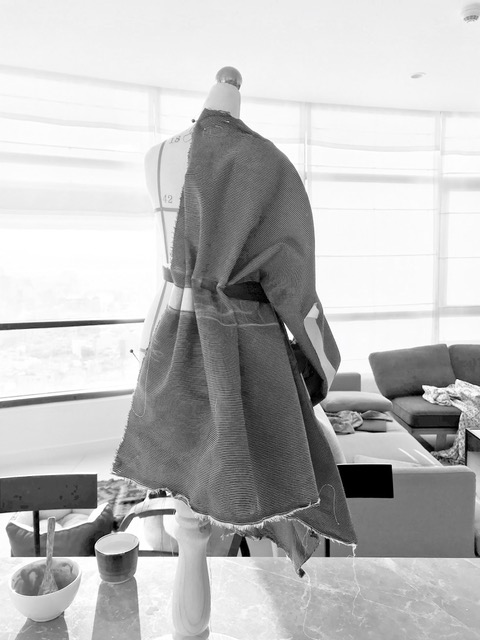

# final project

## epiphyte as design model

this project looks to lichen as a model for alternative design practices. the project takes shape through the creation of a set of embellished modular textile panels. prototyping of the panels allows for the emergence of the following material and technical characteristics:

* **grow on a surface**. the panels take form in relation to both an environment and a set of internal conditions or rules a. draped on a mannequin b. placed as a mesh on an avatar c. instigated as a model on a mesh or nurbs surface. assume form dependent on the form of a substrate. boundaries and surfaces are invested with significance. 
* **grow without depleting**. consisting of salvaged and harvested materials. a response to what isn't immediately apparent with what is already existing.
* **grow idiosycratically**. each design iteration is a single instantiation according to unique conditions
* **grow in intricacy**. intricacy a function of time lapse, both synthesized and actual
* **grow through hybridisation**. synthesises hybridised time spans and modes of spatial organisation  

### lichen 

lichen is a self-supporting mycobiont \(fungal partner\) and photobiont \(photosynthetic partner\).

> the fungal partner occupies the major portion of the thallus and produces its own reproductive structures. The algal partner manufactures the food through photosynthesis which probably diffuses out and is absorbed by the fungal partner.. the algal partner-produced carbohydrate through photosynthesis is utilised by both of them and the fungal partner serves the func­tion of absorption and retention of water
>
> \(source: [http://www.biologydiscussion.com/notes/lichens/lichens-meaning-characteristics-and-classfication/46549](http://www.biologydiscussion.com/notes/lichens/lichens-meaning-characteristics-and-classfication/46549)\)

\(source: [http://www.biologydiscussion.com/notes/lichens/lichens-meaning-characteristics-and-classfication/46549](http://www.biologydiscussion.com/notes/lichens/lichens-meaning-characteristics-and-classfication/46549)\)

 lichen have particular characteristics that make them fascinating subjects to study:

* lichen are survivors: P. chlorophanum has survived simulated Martian conditions including blasts of Xenon radiation rays and -50 degree celcius temperatures. 
* diverse and adaptable: lichen can be found all over the world, from the tropics to the poles
* lichen are sensitive to SO2, CO, CO2 and others thus often will not be found growing in heavily industrialised areas. they can be used as pollution indicators.
* often first species to colonise an area after it has been destroyed
* occupy cities [like edinburgh](https://www.youtube.com/watch?v=0yaB18pL_3c) and man made structures [such as cemetaries](https://www.youtube.com/watch?v=Wqg7AeDDYus) as much as trees and rocks
* hybrid: the word symbiosis was invented to describe lichens
* lichen is a symbiote, not only of an algae and a fungus but of an additional partner - a fact which has remained elusively hidden for over 150 years in the study of lichen - [between two lichens](https://www.youtube.com/watch?v=Fkw_VF5zDT0)
* long history of use as a prized dyestuff

### lichen in vietnam

vietnam has a tropical monsoon climate which is favorable for diverse tropical lichens. The lichen flora of vietnam was estimated at least 1,000 species. a checklist of lichen species in vietnam is available [here](http://lichenvietnam.myspecies.info/).  many of the lichen known to produce excellent textile dyes can be found in vietnam, including many others with promising medical and health benefits all of which are still being uncovered through research. lichen study in vietnam is a growing field with much undiscovered and unexplored. 

### rocella montagnei

Roccella montagnei is a fruticose lichen belonging to the Roccellaceae family. Montagnei is a rich source of many secondary metabolites such as orcinol, montagnetol, carotene, sitosterol, roccellic acid, lecanoric acid \(Mishraa, Shuklaa et al, 2017\) however for textile dyeing purposes it is erythrin that makes montagnei special \(Shukla, P, Upreti DK and Tiwari, P, 2014\). 

rocella montagnei \(RM\) can be found in vietnam, however in my limited experience it is not abundant or easily located. I found RM near the southern coastal city of Phan Thiet, in an undeveloped, sandy coastal area that essentially resembled a tip. according to locals RM could previously be found growing extensively in other coastal areas, though with clearing and development is found less and less. locals claimed that since RM typically grows on a tree favoured for kindling, much of the locally available RM would most likely have been burned in household fires over the course of the past decade. no one was aware of its value as a dyestuff, cancer treatment or otherwise. much of the RM I collected was found on dead tree branches, apparently completely dehydrated. on washing, the colour of RM changed from pale grey to grass green when immersed in water. 

### tyrian purple 

dyeing with lichen is an ancient art. 

the phoenician purples, or what is now widely referred to as tyrian purple, was a highly sought after colour [\(\#66023c\)](https://www.colorhexa.com/66023c) initially obtained from the mucus of the predatory sea snail murex. According to Jacoby \(2004\) twelve thousand snails \(would\) ... yield no more than 1.4 g of pure dye, enough to colour only the trim of a single garment. since 'purple proclaimed rank' \(Casselman, 2001\) the price was inflated and the resource exploited until it was almost wiped out. the extreme value and over-exploitation of this resource led to the development of lichen as a dyestuff. 

lichens have been used to dye textiles as far back as 2000BC. it is mentioned in the bible \(ezekiel 27:7\). 

casselman \(2001\) explains that the murex dyehouses were notoriously noisome, though the olfactory assult was rivalled by early industrial lichen dye houses in which lichen fermented in contaminated urine. since the colour obtained from these processes was so beautiful, the stench was tolerated until william henry perkin stumbled upon mauveine in 1856. mauveine precipitated the industrial manufacture of synthetic dyes, replacing tyrian purple and bringing royal colour to the masses. 

\(source [https://www.britishmuseum.org/research/collection\_online/collection\_object\_details.aspx?objectId=327282&partId=1](https://www.britishmuseum.org/research/collection_online/collection_object_details.aspx?objectId=327282&partId=1)\)

a tradition similar to murex dyeing though less exploitative is continued to this day in Oaxaca \([The Color Purple–Purpura Shell Dyeing in Oaxaca](https://www.clothroads.com/the-color-purple-purpura-shell-dyeing-in-oaxaca/)\) with the purpura snail, the harvesting-dyeing process can be viewed [here](https://www.youtube.com/watch?v=PkSIiC5xkgs).  as scarcity of murex drove prices impossibly high a lichen dye - orchil - was discovered and used to duplicate and extend the colour 'murex'. the orchil dye formulation was a closely guarded secret. there are 3 main lichen dyes which have been used historically to produce red and purple textile dyes: english orchil, scottish cudbear and norwegian korkje. 

> The Phycos Thalassion of the Greeks is undoubtedly the lichen Roccella which grows on rocks by the sea. Its use as a dye substance came from the East to Greece and to Italy; afterwards the art seems to have been lost, then rediscovered in the fourteenth century by a Florentine merchant, Roderigo, who made a large fortune and founded the family of the Orcellarii or Rucellai, hence possibly the name Roccella, and the derivation of orchil.
>
> \(Smith, 2009, p. 46\)

### dyeing with lichen

* lichens dye protein fibres
* lichen dyes are substantive, they do not require a mordant. however alum, soda ash and others can be used to adjust the pH of the dyebath, affecting the final colour of the dyed fibre. 
* lichen acids are invisible, thus the colour of the fermentation liquor or dyebath may not necessarily be indicative of the final fibre colour
* lichen dyes can be sensitive to UV light

rocella montagnei contains the organic compound erythrin \(C20H22O10\), which takes its name from the ancient greek eruthrós or “red”. 

lichen acids can be extracted for dyeing using ammonia fermentation, which is a bacterial process. the lichen acid is converted to both orcein and carbonic acid. when orcein is exposed to the air it becomes orceine. orceine is the key component in orchil dyes, used to create distinctive red, purple and deep blue hues in textiles. 

according to correct ammonia fermentation protocol, RM should be fermented for at least 3 weeks or until  its foam starts to break down quickly upon shaking. the fermentation process must be accompanied by daily aeration and vigorous shaking 3 times daily for the first 7 days and twice daily for the remainder of the fermentation period \(casselman, 2001\). the fermentation jars should be kept out of direct heat and sunlight. lichen fermentation jars can allegedly be maintained for years. 

#### dyeing method

add 1 part fermentation liquid to 4 parts water, simmer with fibre at 74 to 82 degrees celcius for one hour. 30g of dry fibre will require up to one cup of fermentation liquid to dye a vibrant hue \(allen, 2014\). the pH of the dye bath can be shifted to achieve the desired hue. a more acidic bath will increase the warmth of the final dye colour, neutralising the dye bath will make the colours cooler. 

### modelling lichen

for this project i will model lichen growth with a view to creating two and three dimensional surface design embellishments on textile. the modelling for my project draws on sumner's research into lichen modelling, the iterative modelling of pernecky and zwierzycki and the generative art of yufan xie \(cubicRAB\). 

a foundational design objective for the project is to craft a certain organic randomness into lichen growth models. sumner is an inspiration in this regard when he reminds us be wary of a tendency to sterility in CGM:

> computer generated models are often conspicuously clean and lack the rich detail of the real world. biological growth on a real object provides a compelling reminder that the object exists in a complex and dynamic environment. of these biological agents, lichen flora form some of the most beautiful  and intricate patterns
>
> \( Sumner, 2001, p. 2\)

i addressed the tendency to arid conformity and repetition by studying the work of pernecky and zwierzycki, as i will go into in the subsection 'modelling randomness' to follow. 

sumner relied upon visual research and compiled a library of lichen images upon which to base his research. he verifies the authenticity and verisimilitude of his computer generated models by eye. sumner \(2001\) identifies 2 strategies for modelling the three main morphological categories of lichen - crustose, foliose and fruticose. he states that -

> fruticose lichen are shrub-like and stand out from the surface of the substrate. since fruticose lichen are structurally similar to plants, their form is a good condidate for a structure-oriented model such as l-systems

modelling of fruticose lichen, such as rocella montagnei, would thus be in the x y & z planes and could be approximated using l-systems. i have also found that 'shortest walk' branching structure modelling can be used to approximate the growth structure of rocella, as i will go into in further detail later. 

for crustose and foliose lichen, sumner investigated and proposed alternative growth simulation models conforming to radial expansion along a 2-dimensional plane. 

#### modelling randomness

iterative coding to approach the apparently random aspect of natural growth. these definitions were created following the work of jan pernecky and mateusz zwierzycki. the ideas expressed through pernecky and zwierzycki's design methods are used as a foundation for future research and experimentation into modelling lichen growth, in the hope of dodging what sumner refers to as the 'conspicuously clean'.  

#### saffman taylor instability

the saffman taylor instability was initially developed in the context of fluid displacement

#### shortest walk branching

#### game of life and cellular automata

#### l-systems

### differential draping

for this project i am drawing upon a practice of zero waste draping around the basic square or rectangle, following the work of elena ryleeva. this practice takes an uncut piece of woven textile, often using the strategy of adopting found dimensions 'as is' where the size of an offcut or the selvedge are incorporated as a creative provocation and design parameter. various cuts and folds are then enacted on this two dimensional plane to give it three dimensional shape. a garment takes shape through differential growth from any given substrate. 

#### CITATIONS

Åkermark, Björn & Falkehag, Ingemar & Smith, Bengt & A. Sim, G & Theander, Olof. 1962. Studies on the Chemistry of Lichens. 16. The Absolute Configuration of Roccellic Acid. Acta Chemica Scandinavica - ACTA CHEM SCAND. 16. 599-606. 10.3891/acta.chem.scand.16-0599

Allen, A. 2014. Getting Started with Lichen Dyes in Fungi, Volume 7:2-3, p. 66-69

Cartwright, M. 2016. [Tyrian Purple](https://www.ancient.eu/Tyrian_Purple/). Ancient History Encyclopedia. Retrieved from https://www.ancient.eu/Tyrian\_Purple/

Casselman, K. 2001. Lichen Dyes: The New Source Book. Dover Publications.

Jacoby, D. 2004. "Silk economics and cross-cultural artistic interaction: Byzantium, the Muslim world, and the Christian west". Dumbarton Oaks Papers. **58**: 210, 197–240

Mishraa, T, Shuklaa, S et al \[eds\]. 2017. 'Isolation and identification of cytotoxic compounds from a fruticose lichen Roccella montagnei' in Revista Brasileira de Farmacognosia 27 p.724–728 [http://www.scielo.br/pdf/rbfar/v27n6/0102-695X-rbfar-27-06-0724.pdf](http://www.scielo.br/pdf/rbfar/v27n6/0102-695X-rbfar-27-06-0724.pdf)

Shukla, P, Upreti DK and Tiwari, P. 2014. 'Assessment of Dye Yielding Potential of Indian Lichens' in Indian Journal of Plant Sciences, Vol.3 \(1\) 2014, p.57-63

Smith, AL. 2009. ‘Lichen Dyes’ in Transactions of the British Mycological Society, Volume 11 issue 1-2, p.45-50

