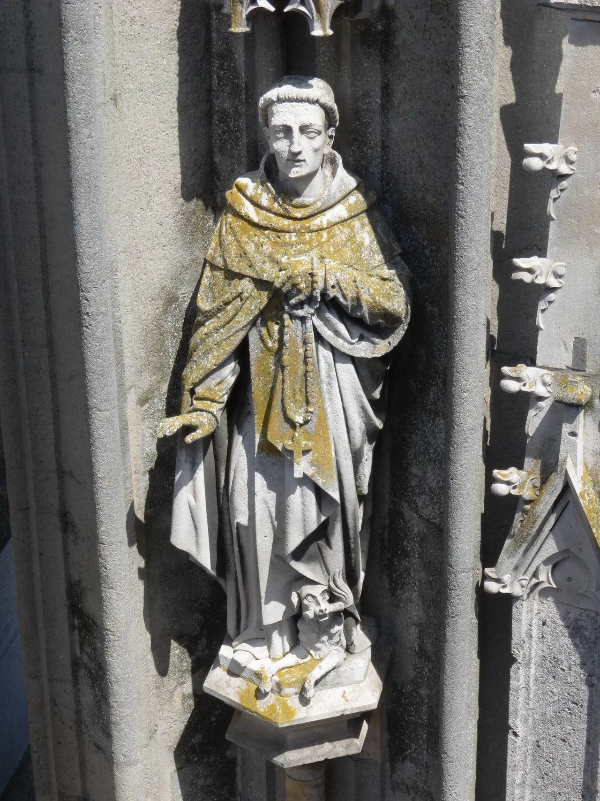

# lichen as dyestuff

### tyrian purple: history of lichen as a dyestuff

> The phoenicians said “gold is where you find it.” They were among the first great princes of Serendip, that is to say, commercial technologists who trespassed successfully into the principality of Serendipity and guarded their secrets well.
>
> Jensen, 1963, p118

dyeing with lichen is an ancient art. 

the phoenician purples, or what is now widely referred to as tyrian purple, was a highly sought after colour [\(\#66023c\)](https://www.colorhexa.com/66023c) initially obtained from the mucus of the predatory sea snail murex. According to Jacoby \(2004\) twelve thousand snails \(would\) ... yield no more than 1.4 g of pure dye, enough to colour only the trim of a single garment. since 'purple proclaimed rank' \(Casselman, 2001\) the price was inflated and the resource exploited until it was almost wiped out. the extremely high price and over-exploitation of this resource led to the development of lichen as a dyestuff. 

lichens have been used to dye textiles as far back as 2000BC. lichen dyes are mentioned in the bible \(ezekiel 27:7\).

source: [lichen media](https://en.wikipedia.org/wiki/Lichen#/media/File:Der_Heilige_Dominikus_am_Nordturm_des_Regensburger_Doms.jpg)

casselman \(2001\) explains that the murex dyehouses were notoriously noisome, though the olfactory assault was rivalled by early industrial lichen dye houses in which lichen fermented in contaminated urine. since the colour obtained from these processes was so sought after, the stench was tolerated until william henry perkins stumbled upon mauveine in 1856. mauveine precipitated the industrial manufacture of synthetic dyes, replacing tyrian purple and bringing royal colour to the masses. we have instead been tolerating cancer and water pollution sans the detectible odor of decomposition since. 

\(source [https://www.britishmuseum.org/research/collection\_online/collection\_object\_details.aspx?objectId=327282&partId=1](https://www.britishmuseum.org/research/collection_online/collection_object_details.aspx?objectId=327282&partId=1)\)

as scarcity of murex drove prices impossibly high a lichen dye - orchil - was discovered and used to duplicate and extend the colour 'murex'. the orchil dye formulation was a closely guarded secret. there are 3 main lichen dyes which have been used historically to produce red and purple textile dyes: english orchil, scottish cudbear and norwegian korkje. 

> The Phycos Thalassion of the Greeks is undoubtedly the lichen Roccella which grows on rocks by the sea. Its use as a dye substance came from the East to Greece and to Italy; afterwards the art seems to have been lost, then rediscovered in the fourteenth century by a Florentine merchant, Roderigo, who made a large fortune and founded the family of the Orcellarii or Rucellai, hence possibly the name Roccella, and the derivation of orchil.
>
> \(Smith, 2009, p. 46\)

a tradition similar to murex dyeing though less exploitative is continued to this day in Oaxaca \([The Color Purple–Purpura Shell Dyeing in Oaxaca](https://www.clothroads.com/the-color-purple-purpura-shell-dyeing-in-oaxaca/)\) with the purpura snail, the harvesting-dyeing process can be viewed [here](https://www.youtube.com/watch?v=PkSIiC5xkgs).  

### tradition: dyeing with lichen

* lichens dye protein fibres
* lichen dyes are substantive, they do not require a mordant. however alum, soda ash and others can be used to adjust the pH of the dyebath, affecting the final colour of the dyed fibre. 
* lichen acids are invisible, thus the colour of the fermentation liquor or dyebath may not necessarily be indicative of the final fibre colour
* lichen dyes can be sensitive to UV light

rocella montagnei contains the organic compound erythrin \(C20H22O10\), which takes its name from the ancient greek eruthrós or “red”. 

lichen acids can be extracted for dyeing using ammonia fermentation, which is a bacterial process. the lichen acid is converted to both orcein and carbonic acid. when orcein is exposed to the air it becomes orceine. orceine is the key component in orchil dyes, used to create distinctive red, purple and deep blue hues in textiles. 

according to correct ammonia fermentation protocol, RM should be fermented for at least 3 weeks or until  its foam starts to break down quickly upon shaking. the fermentation process must be accompanied by daily aeration and vigorous shaking 3 times daily for the first 7 days and twice daily for the remainder of the fermentation period \(casselman, 2001\). the fermentation jars should be kept out of direct heat and sunlight. lichen fermentation jars can allegedly be maintained for years. 

#### dyeing method

add 1 part fermentation liquid to 4 parts water, simmer with fibre at 74 to 82 degrees celcius for one hour. 30g of dry fibre will require up to one cup of fermentation liquid to dye a vibrant hue \(allen, 2014\). the pH of the dye bath can be shifted to achieve the desired hue. a more acidic bath will increase the warmth of the final dye colour, neutralising the dye bath will make the colours cooler. 

