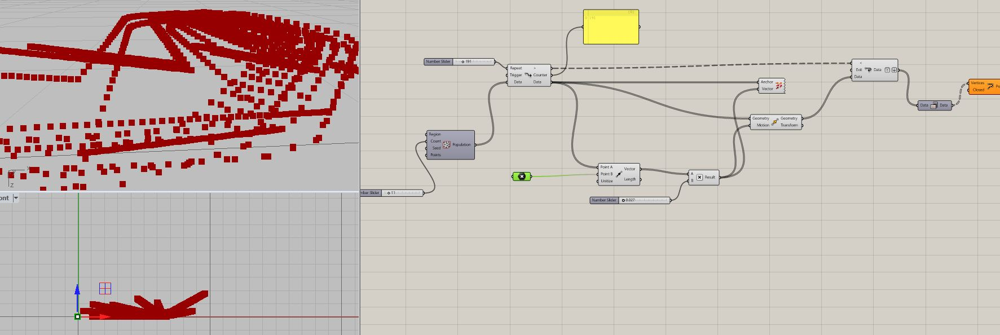
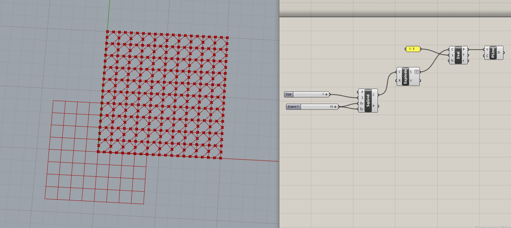
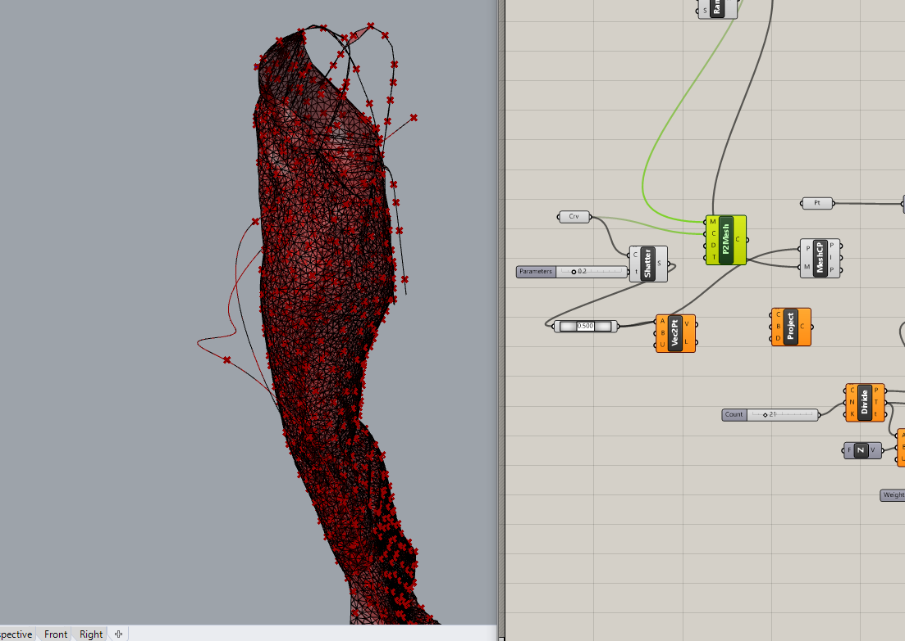

# lichen modeling development


### modeling randomness

iterative coding to approach the apparently random aspect of natural growth. these definitions were created following the work of jan pernecky and mateusz zwierzycki. the ideas expressed through pernecky and zwierzycki's design methods are used as a foundation for future research and experimentation into modeling lichen growth, in the hope of dodging what sumner refers to as the 'conspicuously clean'.  




random component in grasshopper \(sets &gt; sequence &gt; random\) is inadequate in generating authentically random values. pernecky suggests drawing on actual data or finding other means of inputting values to avoid sterility and/or repetition. boid library is one way of adding randomness doubly inbuilt \(more on this in flocking\), however randomness can also be created using a custom c\# component

> Random number in most \(of\) \[sic\] programming language including C\# and C++ is not properly shuffled \(before using them\) \[sic\]. This means that you will get the same number over and over, which isn't really random. To avoid \(to draw\) \[sic\] the same number over and over, you need a seed. Typically, ticks in time is ok for this task. Remember that you will get the same number over and over if you are using the same seed every time. So try to use varying seed always. Time is a good source for seed because \(they\) \[sic\] change always.

```text
int GetRandomNumber(int min, int max)
{
    Random rand = new Random((int)DateTime.Now.Ticks);
    return rand.Next(min, max);
}

```

source: [https://stackoverflow.com/questions/2706500/how-do-i-generate-a-random-int-number](https://stackoverflow.com/questions/2706500/how-do-i-generate-a-random-int-number)

a similar approach, scripted in grasshopper -  

```text
  private void RunScript(ref object A)
  {

    var rand = new Random();
    var rtnlist = new List<double>();

    for (int i = 0; i < 100000; i++)
    {
      rtnlist.Add(rand.Next(1000));
    }
    A = rtnlist;

  }
```

source: [http://james-ramsden.com/create-a-list-of-random-numbers-in-c/](http://james-ramsden.com/create-a-list-of-random-numbers-in-c/)

### flocking

based on the modelling work of hector sanchez [flocking with predation](http://modelingcommons.org/browse/one_model/3956#model_tabs_browse_files) and jan pernecky's work with anemone and boid library. these experiments begin to explore how flocking can be used as a textile design tool by causing interactions with digital objects and surfaces. anemone enables the programming of functions such as particles adhering to one another or sliding off a surface where randomness is, as pernecky puts it - "doubly inbuilt". these models can be used to allude to what would generally be considered 'natural' systems or processes and practically establish an emergent approach to design.








### iterative growth

following pernecky


### dla growth




#### shortest walk branching

modelling fruticose lichen with shortest walk branching for 3d surface embellishment, following the work of [alan rodriguez carrillo](https://archinect.com/alanroo).


modelling crustose and foliose lichen with shortest walk branching for 2d surface embellishment, based on a definition shared by [daniel abalde](https://www.grasshopper3d.com/forum/topics/shortest-walk-tapered-branching-script), applied to curved surface. the definition allows branching structure to 'grow' across a simulated textile surface. this modelled growth in x y & z axes can then be translated back to 2 flat panels \(per garment panels\) by joining then unrolling the surfaces. this process will enable 2 dimensional surface design \(such as digital embroidery\) to be combined with the design of 3d embellishments \(such as cast or 3d-printed shapes or unique bead-like min-structures\). this approach would also enable garment patterns to be creatively navigated in the space of surface design. 


#### game of life and cellular automata

following [agata migalska](http://parametric.support/about-us/)'s code to grasp how python scripting can be used in grasshopper to simulate growth patterns. 


### l-systems


### simulating textile

following [giancarlo di marco](http://giancarlodimarco.com.mx/)'s work in kangaroo to simulate forces enacted on a textile surface


applying [junichiro horikawa'](https://www.youtube.com/channel/UC5NStd0QmACnWs9DzqJ3vHg)s work on origami in grasshopper to simulate garment folds




simulating folds on a surface extracted from a digital mannequin, then unrolling these folds. this method is not appropriate to the digital fabrication methods i will be using to prototype embellished garment panels. an alternative solution is required. 


## synthesis: simulating growth on surfaces

the final phase in 3d development before prototyping and fabrication can begin. 

the focus is on Agent Based Modeling \(ABM\) as a tool to simulate the propogation of lichen across a surface in 3d. modeling in this phase will need to consider the successful resolution of a number of persistent issues, moving towards key outcomes

#### **proposed key outcomes**

* model runs over and/or emanates from a surface
* model is available as points or lines with actual 3d co-ordinates
* model is baked and exported
* select elements of the model can be digitised for digital embroidery and can likewise be prepared for 3d printing
* model is set up so that anyone can create a custom, parametric surface design on a garment based on the unique inputs of a user. 

#### **main obstacles to the realisation of these outcomes**

* **meshes must be closed**. this process cannot be automated, it has to be done manually in rhino


there is not much to say here other than that you wouldn't bother doing it unless you're in love with an idea ie. its a craft thing. 

* bringing **custom 3d surfaces** into **ABM environments**

i have continued investigating ways of bringing complex meshes into growth model definitions as surfaces on which to propogate DLA simulations.




i followed [long nguyen](https://www.youtube.com/channel/UCUJgViAduAoRsf89ZtyF8dQ)'s C\# scripting workshop \(available [here](https://www.youtube.com/watch?v=pFCrIzENDn8)\) so that i could look inside GH components without getting the [howling fantods](https://blog.oxforddictionaries.com/2014/07/14/language-of-david-foster-wallace/), though looking into components led to the discovery of Goo - more on that later. 

side note: long nguyen's siêu cute ghostly component, and also how i feel about C\# and trying to apply agent based modeling to a fashion design environment most of the time. 



ABM is a complex field with a steep learning curve. trying to grasp what i need as fast as possible i have spent weeks reading slowrobotics and toxiclibs documentation. learning about the difference between agents and particles. what is a KD tree? how to adapt C\# components? what is the pointAt function? what are springs? etc etc. i have been able to gain a very modest functional grasp of ABM using nursery, anemone, boid library and quelea in grasshopper. 

i will begin with nursery, and the issues arising from an intention to generate geometries with ABM in nursery.

nursery's C\# agent based model uses non-geometry based data types such as agents and behaviours, all of which are contextualised in fields or on planes. 

* translate an agent list \(as per output from DLA growth models\) to points/polylines

a finished ABM simulation in nursery will create a list of agents. agents are a data type specific to the libraries nursery draws from. it is possible to deconstruct the agent list, then deconstruct the agent to arrive at plane3d coordinates. having deconstructed the agent list, deconstructed the agent, the Plane3d co-ordinates are still "wrapped in Goo". can't bake goo. so, what is Goo?

a key aspect in the resolution of import and export issues when working towards digital fabrication of ABM models is that of type conversion. 


IGH\_Goo and IGH\_GeometricGoo for C\# type conversion


IGH\_Goo is a wrapper class that allows boolean values to be converted to other data types such as integers or strings. Goo is introduced the rhino developer site [here](https://developer.rhino3d.com/guides/grasshopper/grasshopper-data-types/#related-topics). IGH\_GeometricGoo allows for the conversion to geometric types of data and transformations. there are 3 methods in GH:

```text
CastFrom
CastTo
ScriptVariable
```

IGH\_Goo [interface](https://developer.rhino3d.com/wip/api/grasshopper/html/T_Grasshopper_Kernel_Types_IGH_Goo.htm)

IGH\_GeometricGoo [interface](https://developer.rhino3d.com/wip/api/grasshopper/html/T_Grasshopper_Kernel_Types_IGH_GeometricGoo.htm)

converting IGH\_Goo to Geometry is covered on the forum [here](https://discourse.mcneel.com/t/convert-igh-goo-to-geometry/67631/5)

> If it’s a C\# script, then you’d best stay away from goo. The script components were designed to hide those wrapper classes from the developer.

again [here](https://www.grasshopper3d.com/forum/topics/igh-geometricgoo-cast) where David Rutten mentions that - 

> if you ask for IGH\_Goo derived types then you get the actual data which is in the input. This data may be shared with any number of other parameters so you have to make a copy of it yourself before -say- transforming it.
>
> It is almost always better to ask directly for the type you're interested in and leave the IGH\_Goo types to Grasshopper. There are however rare occasions when you do need the real data, in which case you have to be very careful about it.

again [here](https://www.grasshopper3d.com/forum/topics/persistent-data-igh-goo-initialization?commentId=2985220%3AComment%3A1332869) 

> IGH\_Goo is an interface and interfaces are not objects that can be constructed. You'll have to get the actual type ID of the instances that implement IGH\_Goo, and then try to construct those specific types.

and another point to be aware of, as mentioned [here](https://www.grasshopper3d.com/forum/topics/baking-1?commentId=2985220%3AComment%3A85971)

> One important thing to realize is that GH\_Goo \(or IGH\_Goo, or IGH\_GeometricGoo\) do not provide the methods for baking. BakeGeometry\(\) is defined in the IGH\_BakeAwareData interface \(indeed, this interface defines nothing else\), but a lot of classes that implement IGH\_Goo also implement IGH\_BakeAwareData.
>
> Thus if you have an instance of IGH\_Goo or IGH\_GeometricGoo you still won't be able to bake it until you cast it to IGH\_BakeAwareData

further points, [here](https://www.grasshopper3d.com/forum/topics/preview-geometry-from-custom-class?commentId=2985220%3AComment%3A567676) 

> _IGH\_PreviewObject_ is for things like Components and Parameters, _IGH\_PreviewData_ is for _IGH\_Goo_ derived types. If you put a class that implements _IGH\_Goo_ and _IGH\_PreviewData_ inside a Generic parameter, it will display. If you make your own parameter that specifically handles your own goo, then that parameter will need to implement _IGH\_PreviewObject_.

the type of data output by the deconstruct agent/agent list components is of type [Plane3D](https://bitbucket.org/gwyllo/slowrobotics/src/master/SlowRobotics/Core/Plane3D.cs)

script variable method [here](https://developer.rhino3d.com/wip/api/grasshopper/html/M_Grasshopper_Kernel_Types_IGH_Goo_ScriptVariable.htm)

point3d\(vec3d\) [here](https://developer.rhino3d.com/api/RhinoCommon/html/M_Rhino_Geometry_Point3d__ctor_3.htm)


more goo but with [ironpython](https://discourse.mcneel.com/t/custom-type-can-it-be-done-from-gh-python/64653) 


in the nursery API we can find that the simulate component calls Plane3D \(from softrobotics\) and Vec3D \(toxiclibs\) in order to construct the simulation

it is possible to access Plane3D data and output as Point3d using a custom C\# component. this method is inadequate as creates an unsorted matrix of Point3D, from which the DLA model cannot be reconstructed as geometry. it does, however, show how simple it can be to bypass the Goo issue. you just call the types you need. slowrobotics and toxiclibs DLLs were added first. 

```text
Plane3D b_p = x as Plane3D
A = b_p.ToPoint3d();

```




Alex Fischer's [Quelea ](http://quelea.alexjfischer.com/)is another AMB plug in for grasshopper. Quelea tutorials can be found on Fischer's Quelea [playlist](https://www.youtube.com/playlist?list=PLHzlR9sko50a-xbEPC1af32MNSw9T8dsT). Fischer explains ABM clearly and makes using his already user-friendly modeling tool even more approachable. 

an agent is an extension of a particle \(which is basically a point that moves\). anything you can do to a particle, you can also do to an agent, yet an agent has no perception of its environment. we can add rules to an agent, forces to a particle - for example separation rules work for agents, not particles. 


Quelea converts agents \(quelea\) to point3d using the following [method](https://github.com/lxfschr/Quelea/blob/master/Quelea/Quelea/Quelea/Components/DebugDeconstructAgent.cs)





```text

```

giuilio piacentino's C\# GH tools [here](http://www.giuliopiacentino.com/grasshopper-tools/)

* flatten 3d models to 2d surfaces \(where 2d surfaces are unbroken panels, corresponding to the reality of a flat textile to a high degree of accuracy\*\) 

  \(\*currently to convert 3d form to 2d flat surface the only options are to unroll, smash or split the surface into smaller components. this is not an efficient or realistic way to work with 3d textile models, moreover has a 7% error margin whereby points will shift significantly from 3d shape to 2d panel\)

export from rhino to illustrator

{% embed url="https://wikis.utexas.edu/display/SOAdigitech/Exporting+from+Rhino+to+.dwg%2C+.ai" %}

flatten mesh




* 
flocking and random point generation in relation to a body 


