# modeling lichen

## 3d modeling development

### modeling lichen

for this project i will model lichen growth with a view to creating two and three dimensional surface design embellishments on textile. the modeling for my project draws on sumner's research into lichen modeling, the iterative modeling of pernecky and zwierzycki and the generative art of yufan xie \(cubicRAB\). 

a foundational design objective for the project is to craft a certain organic randomness into lichen growth models. sumner is an inspiration in this regard when he reminds us be wary of a tendency to sterility in CGM:

> computer generated models are often conspicuously clean and lack the rich detail of the real world. biological growth on a real object provides a compelling reminder that the object exists in a complex and dynamic environment. of these biological agents, lichen flora form some of the most beautiful  and intricate patterns
>
> \( Sumner, 2001, p. 2\)

i addressed the tendency to arid conformity and repetition by studying the work of pernecky and zwierzycki, as i will go into in the subsection 'modeling randomness' to follow. 

sumner relied upon visual research and compiled a library of lichen images upon which to base his research. he verifies the authenticity and verisimilitude of his computer generated models by eye. sumner \(2001\) identifies 2 strategies for modelling the three main morphological categories of lichen - crustose, foliose and fruticose. he states that -

> fruticose lichen are shrub-like and stand out from the surface of the substrate. since fruticose lichen are structurally similar to plants, their form is a good condidate for a structure-oriented model such as l-systems

modelling of fruticose lichen, such as rocella montagnei, would thus be in the x y & z planes and could be approximated using l-systems. i have also found that 'shortest walk' branching structure modelling can be used to approximate the growth structure of rocella, as i will go into in further detail later. 

for crustose and foliose lichen, sumner investigated and proposed alternative growth simulation models conforming to radial expansion along a 2-dimensional plane. 

### diffusion-limited aggregation \(DLA\)

the saffman-taylor instability and laplacian growth can be used to model lichen. such cluster growth models simulate diffusion using random movement of particles, which can be modelled using diffusion- limited aggregation \([DLA](https://en.wikipedia.org/wiki/Diffusion-limited_aggregation)\) equations.  

Desbenoit, Galin and Akkouche outline an approach to simulating lichen growth based on DLA modelling whereby an initial particle or agent is placed within a field of numerous random-walking particles, which collide and cluster.  They state:

> The propagation of lichen over the surface of the colonized objects is performed by constraining a particle system to \[sic\] triangle meshes. Starting from a seed particle, our method incrementally creates a cluster of particles by randomly moving new particles over the mesh and possibly aggregating them to the cluster when collisions occur. A particle is constrained to the triangle mesh and is geometrically defined by its center, radius, and an index to its supporting triangle. Given a starting particle... the algorithm incrementally creates a cluster of particles by aggregating particles moving randomly over the surface and that come into contact with the cluster. In general, new particles are created at a fixed distance. If the particles move too far away from the initial seed particle, they are removed from the simulation.
>
> Desbenoit, Galin and Akkouche, 2004, p. 7

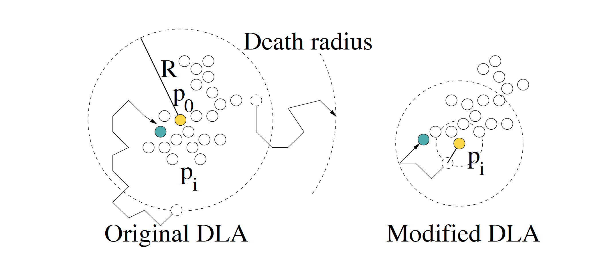

Here is Daniel Schiffman's explanation of DLA



Inspired by the work of Andy Lomas, Karsten Schmidt's  [simutilis](http://toxiclibs.org/2010/02/new-package-simutils/), found on his [toxiclibs](http://toxiclibs.org/) open source library, can be used to model DLA, also using java. [toxiclibs](https://github.com/postspectacular/toxiclibs) can be found on github.



[woojae sung](https://woojsung.com/)'s DLA system workshop notes explain DLA clearly in 8 finite steps. this basic system forms the basis of many varied approaches to modeling organic and emergent phenomena.  

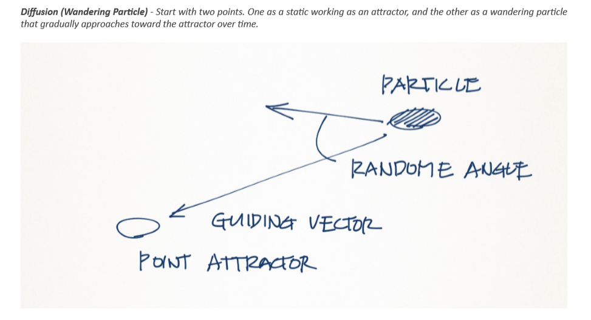

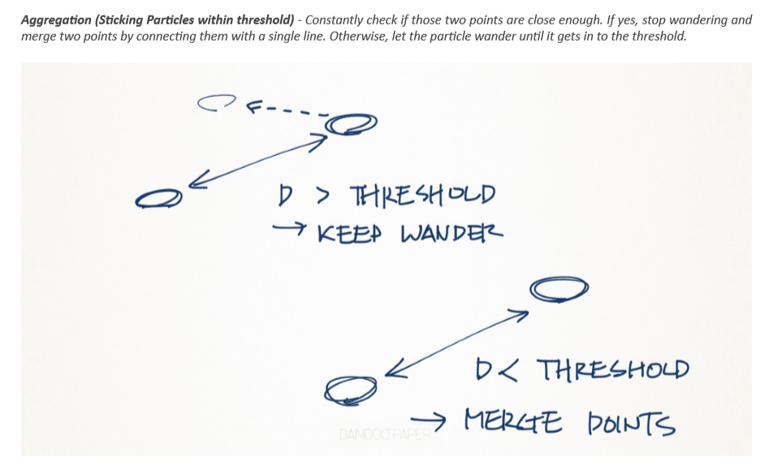

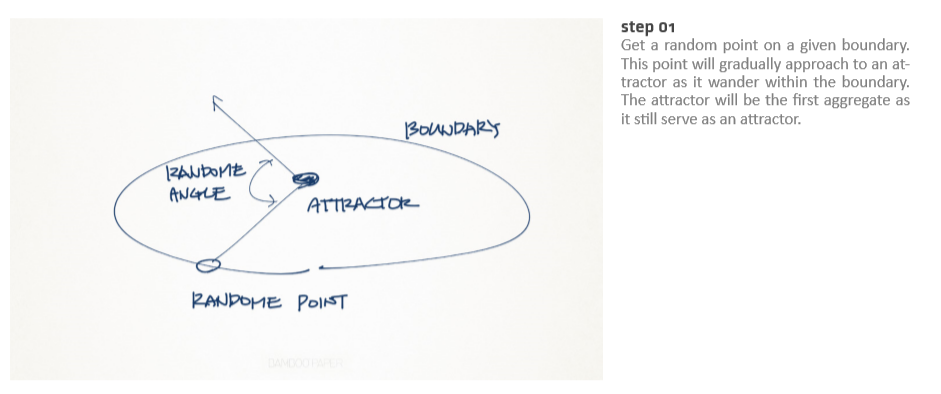

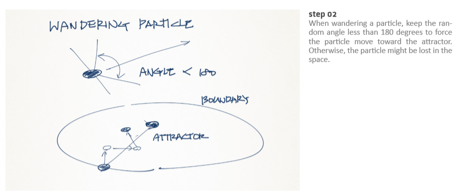

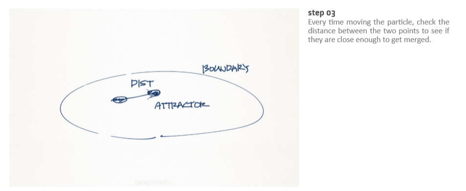

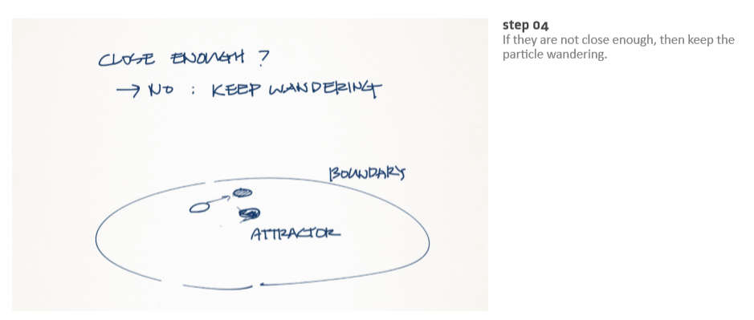

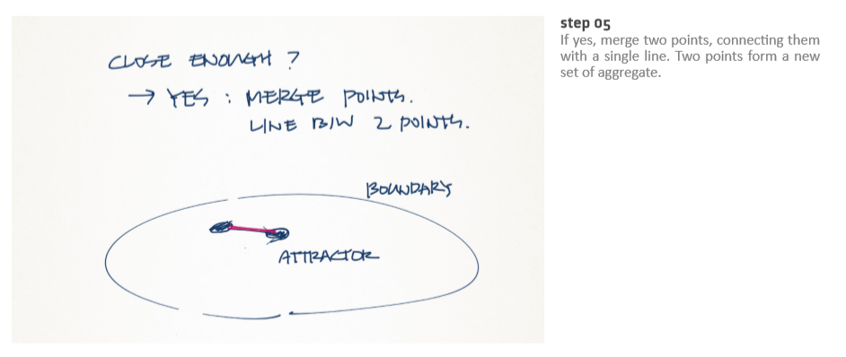

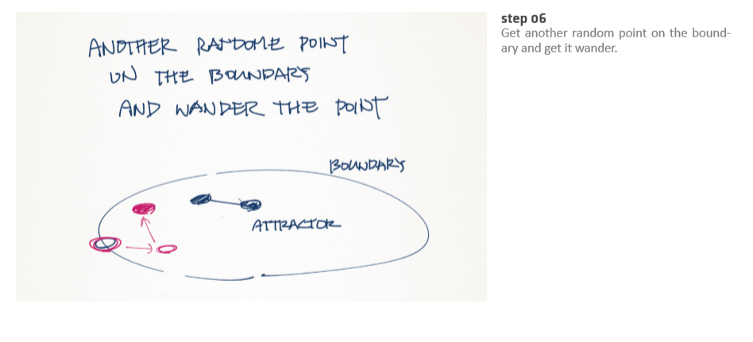

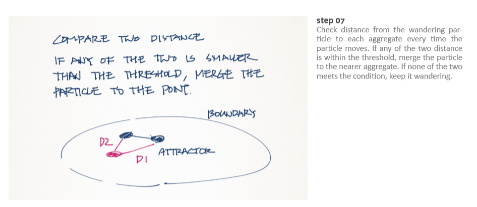

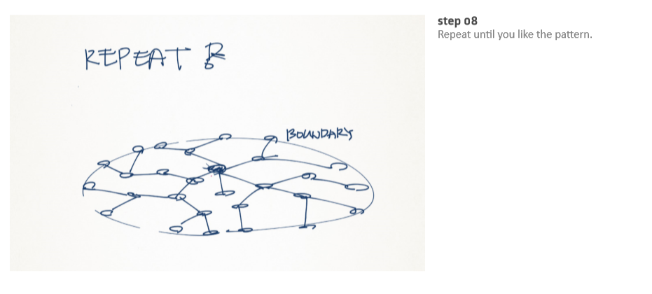

[Gwyllim Jahn](https://www.rmit.edu.au/contact/staff-contacts/academic-staff/j/jahn-mr-gwyllim)'s [nursery ](https://www.food4rhino.com/app/nursery)draws upon slowrobotics and toxiclibs libraries in a C\# scripted DLA component. Similar to simultils in its use of pointOctree in java to solve the issues of linear processing of a large data set, nursery makes it possible to use a KD Tree to solve the 'nearest neighbour problem'. Shaknarovich explains how KD Trees work: 

> Given a set of n points in a d-dimensional space, the kd-tree is constructed recursively as follows. First, one finds a median of the values of the ith coordinates of the points \(initially, i = 1\). That is, a value M is computed, so that at least 50% of the points have their ith coordinate greater-or-equal to M, while at least 50% of the points have their ith coordinate smaller than or equal to M. The value of x is stored, and the set P is partitioned into PL and PR , where PL contains only the points with their ith coordinate smaller than or equal to M, and \|PR \| = \|PL \|±1. The process is then repeated recursively on both PL and PR , with i replaced by i + 1 \(or 1, if i = d\). When the set of points at a node has size 1, the recursion stops.

source: [http://people.csail.mit.edu/gregory/annbook/introduction.pdf](http://people.csail.mit.edu/gregory/annbook/introduction.pdf)

