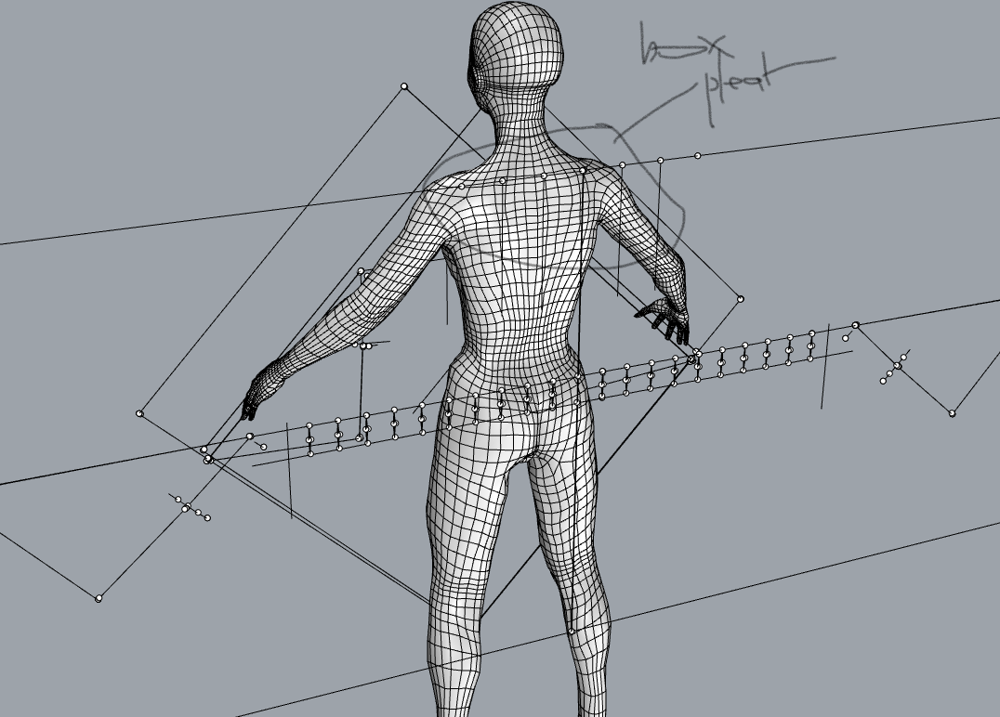

# prototype development

### concept and key elements

the final project will consist of a capsule collection of **upcycled**, **zero waste** garments. the **surface design** of each piece will be **synthesised** **with garment construction**, meaning that seams and cuts into each garment panel will be delineated \(thus fray-checked\) using **digital embroidery** and will be stitched out at the same time as the 'decorative' elements of each piece. the remaining garment construction and embellishment assembly will be completed by hand using a packing needle, silk tapes and embroidery with dyed silk thread. 

digital embroidery will be created using **silk thread**. lichen dyes, like the erythrin in rocella montagnei, is best taken up by protein fibres. furthermore, being a substantive dye means that the quality of the silk can be maintained during the dyeing process since mordants are not required. placing silk thread into industrial embroidery machines goes against standard local practice -- nylon and polyester are used exclusively. 

#### MATERIALS







#### 

