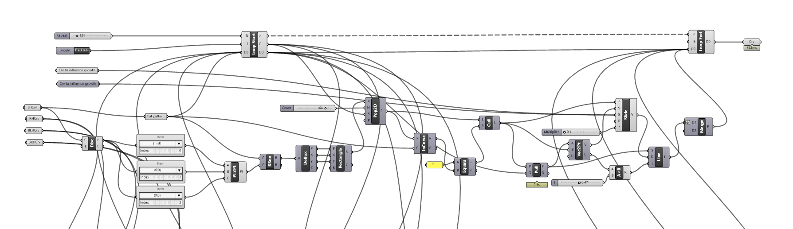
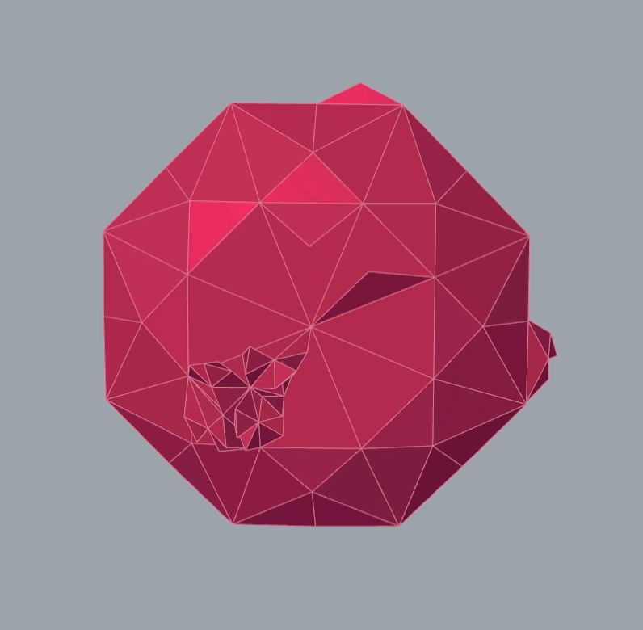

# prototype development

### concept and key elements

the final project puts forward a design methodology for **upcycled**, **zero waste** garments. **surface design** is **synthesised** **with garment construction**, meaning that seams and cuts into each garment panel will be delineated \(thus fray-checked\) using **digital embroidery** and will be stitched out at the same time as the decorative elements of each piece. decorative elements are generative based on natural growth patterns and respond to the uncut garment panel shapes. the design methodology is grounded in digital design and fabrication, however this is a hybrid process. garment construction and embellishment assembly will be completed by hand using a packing needle, silk tapes and embroidery with dyed silk thread. 

### applying growth modeling to zwd

### digitisation and digital embroidery

### 3d printing

### garment construction and assembly

#### MATERIALS







#### 

