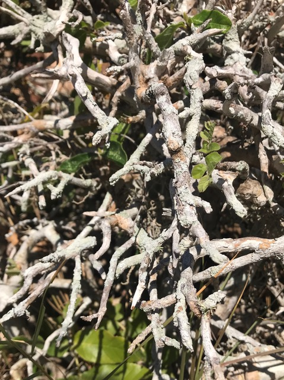

# why lichen

## lichen: research supporting concept elaboration

lichen is a self-supporting mycobiont \(fungal partner\) and photobiont \(photosynthetic partner\).

> the fungal partner occupies the major portion of the thallus and produces its own reproductive structures. The algal partner manufactures the food through photosynthesis which probably diffuses out and is absorbed by the fungal partner.. the algal partner-produced carbohydrate through photosynthesis is utilised by both of them and the fungal partner serves the func­tion of absorption and retention of water
>
> \(source: [http://www.biologydiscussion.com/notes/lichens/lichens-meaning-characteristics-and-classfication/46549](http://www.biologydiscussion.com/notes/lichens/lichens-meaning-characteristics-and-classfication/46549)\)

\(source: [http://www.biologydiscussion.com/notes/lichens/lichens-meaning-characteristics-and-classfication/46549](http://www.biologydiscussion.com/notes/lichens/lichens-meaning-characteristics-and-classfication/46549)\)

 lichen have particular characteristics that make them fascinating subjects to study:

* lichen are survivors: P. chlorophanum has survived simulated Martian conditions including blasts of Xenon radiation rays and -50 degree celcius temperatures. 
* diverse and adaptable: lichen can be found all over the world, from the tropics to the poles
* lichen are sensitive to SO2, CO, CO2 and others thus often will not be found growing in heavily industrialised areas. they can be used as pollution indicators.
* often first species to colonise an area after it has been destroyed
* occupy cities [like edinburgh](https://www.youtube.com/watch?v=0yaB18pL_3c) and man made structures [such as cemetaries](https://www.youtube.com/watch?v=Wqg7AeDDYus) as much as trees and rocks
* hybrid: the word symbiosis was invented to describe lichens
* lichen is a symbiote, not only of an algae and a fungus but of an additional partner - a fact which has remained elusively hidden for over 150 years in the study of lichen - [between two lichens](https://www.youtube.com/watch?v=Fkw_VF5zDT0)
* long history of use as a prized dyestuff

### lichen in vietnam

vietnam has a tropical monsoon climate which is favorable for diverse tropical lichens. The lichen flora of vietnam is estimated to comprise at least 1,000 species. a checklist of lichen species in vietnam is available [here](http://lichenvietnam.myspecies.info/).  many of the lichen known to produce excellent textile dyes can be found in vietnam, including many others with promising medical and health benefits all of which are still being uncovered through research. lichen study in vietnam is a growing field with much undiscovered and unexplored. 

### rocella montagnei

roccella montagnei is a fruticose lichen belonging to the roccellaceae family. montagnei is a rich source of many secondary metabolites such as orcinol, montagnetol, carotene, sitosterol, roccellic acid, lecanoric acid \(Mishraa, Shuklaa et al, 2017\) however for textile dyeing purposes it is erythrin that makes montagnei special \(Shukla, P, Upreti DK and Tiwari, P, 2014\). 

rocella montagnei \(RM\) can be found in vietnam, however in my limited experience it is not abundant or easily located. I found RM near the southern coastal city of Phan Thiet, in an undeveloped, sandy coastal area that essentially resembled a tip. according to locals RM could previously be found growing extensively in other coastal areas, though with clearing and development is found less and less. locals claimed that since RM typically grows on a tree favoured for kindling, much of the locally available RM would most likely have been burned in household fires over the course of the past decade. no one was aware of its value as a dyestuff, cancer treatment or otherwise. much of the RM I collected was found on dead tree branches, apparently completely dehydrated. on washing, the colour of RM changed from pale grey to grass green when immersed in water. 

### 

