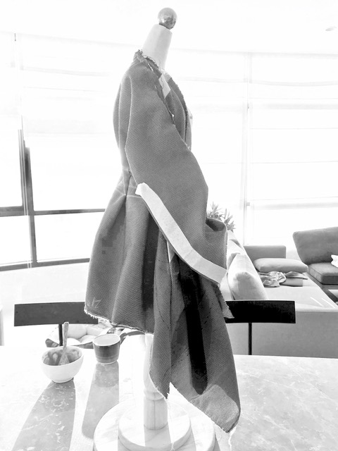
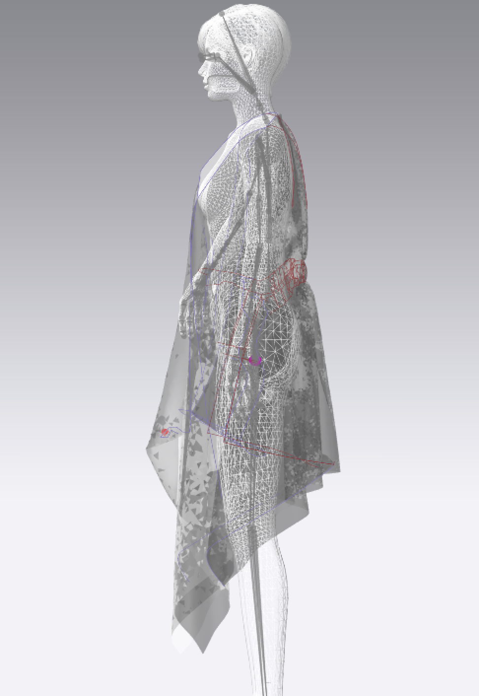
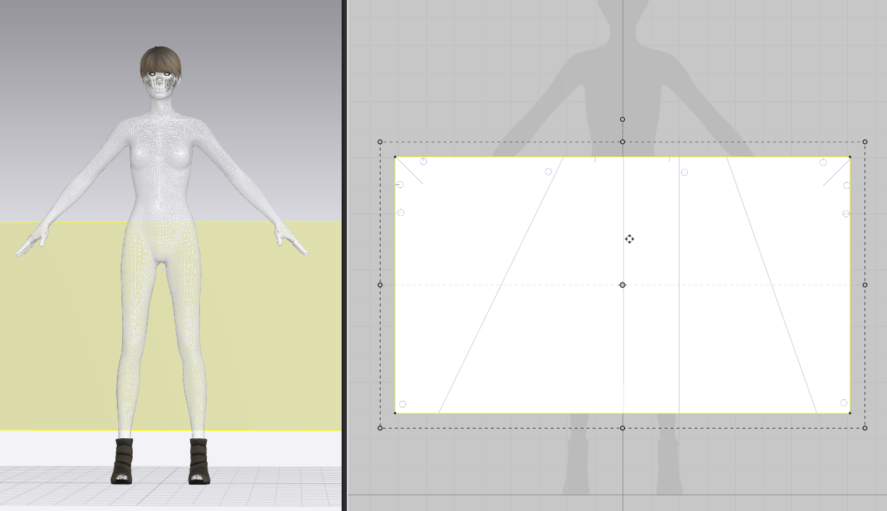

# zwd development

### form finding - differential draping development

for this project i am drawing upon a practice of zero waste draping around the basic square or rectangle, following the work of [elena ryleeva](https://www.ewstfashionlab.com/). this practice takes an uncut piece of woven textile, often using the strategy of adopting found dimensions 'as is' where the size of an offcut or the selvedge are incorporated as a creative provocation and design parameter. various cuts and folds are then enacted on this two dimensional plane to give it three dimensional shape. a garment takes shape through differential subdivisions. 

## simulated zero waste draping

simulated draping in a digital design environment is its own discrete field. i would say that it is an incipient digital craft that must be cultivated separately to real-world draping skills. getting simulated textile onto an avatar, contending with arms and fingers, placing and manipulating "pins", rhythmically freezing and re-simulatating garment drape are some of the idiosyncracies that aid in finding creative flow in the surreal environment of digital draping. 

### pleats

pleats need an internal plane, an origin plane and a target plane. these are assigned radian values - 360 degrees for internal, 0 for origin and 180 for target. pleats are traced from internal polylines then values are manually assigned accordingly. the pleats are then closed with free sewing beginning form the internal seam to the origin, from the internal seam to the target, then from origin to target. i formed pleats in this way prior to draping a panel to the avatar. 

an alternative approach i used was to create creases using the above method, drape on the avatar, position a tape in 3d, then use this tape/panel to sew the pleats closed to give stability. 

some background on what is happening when modeling pleats, c/o eric demaine

[https://www.youtube.com/watch?v=\_OcgtpQvrVs](https://www.youtube.com/watch?v=_OcgtpQvrVs)

as i found with knotting digital fabric, it is far easier to conduct surface manipulations before drape simulation has been activated than during or after.  





knotting digital fabric is about a million times easier than it looks. increasing collision density helps - a normal value is 2.5 - this can be doubled. another strategy is choose a stiffer fabric and or to stiffen the fabric. this can be done while knotting the fabric, then values can be restored to previous state once the knot has been completed. i found, however, that this can result in the knot slipping open again. 







### outcomes of this modeling phase

* a range of digital, draped garments as .obj files 
* potential surface design leads to follow \(flocking, DLA, shortest walk branching\)
* rectangular textile panels with fixed dimensions and drape information on which to propagate growth

### reflections

* modeling zero waste draping in grasshopper is a long term project requiring research into physics modeling based on actual textile weights and drape properties, setting up a parametric mannequin, exploring means of approximating pleats, tucks, folds, surface disruptions such as buttonholes, embroidery etc. outside the scope of this project but worth pursuing in future. it is currently not possible to "do everything" in one single application. 
* zero waste draping is its own creative field, worth exploring for its own sake. it could be explored as a system within the above-mentioned set-up. 
* DLA models are highly suited to modeling lichen growth on a surface

