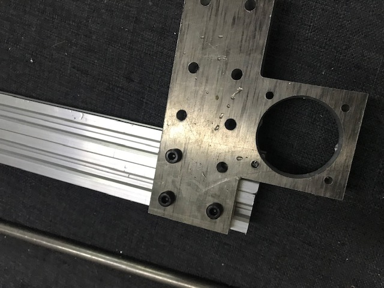
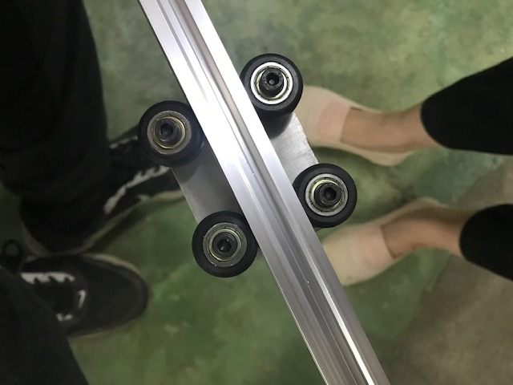
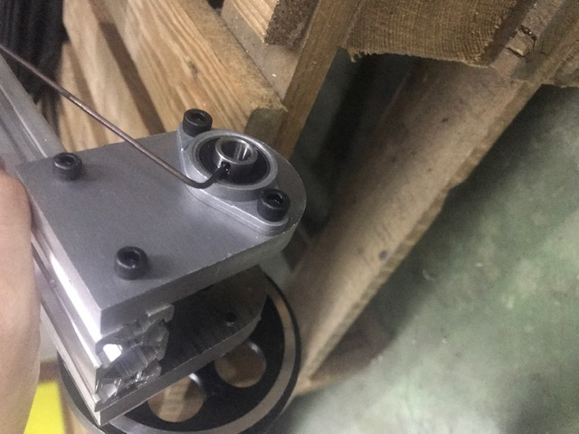
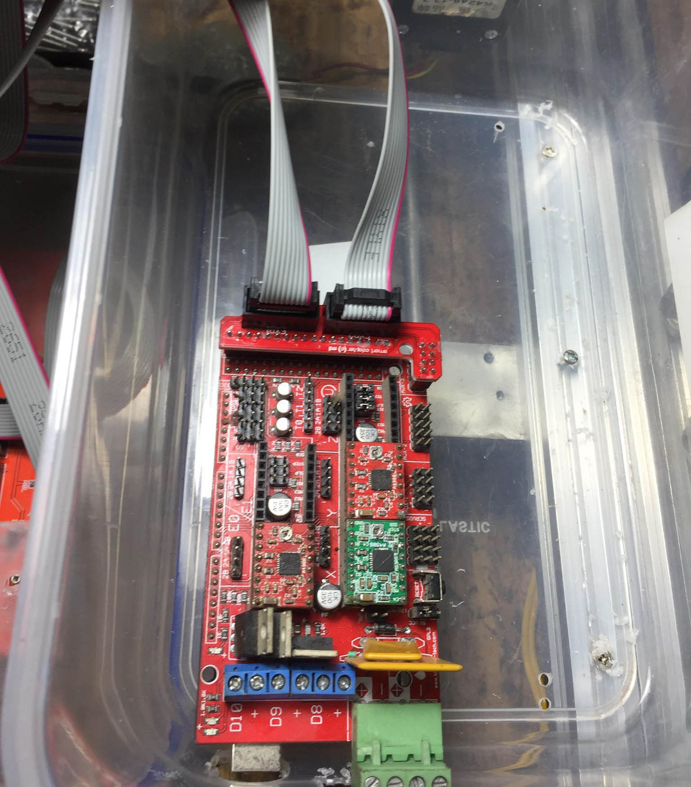
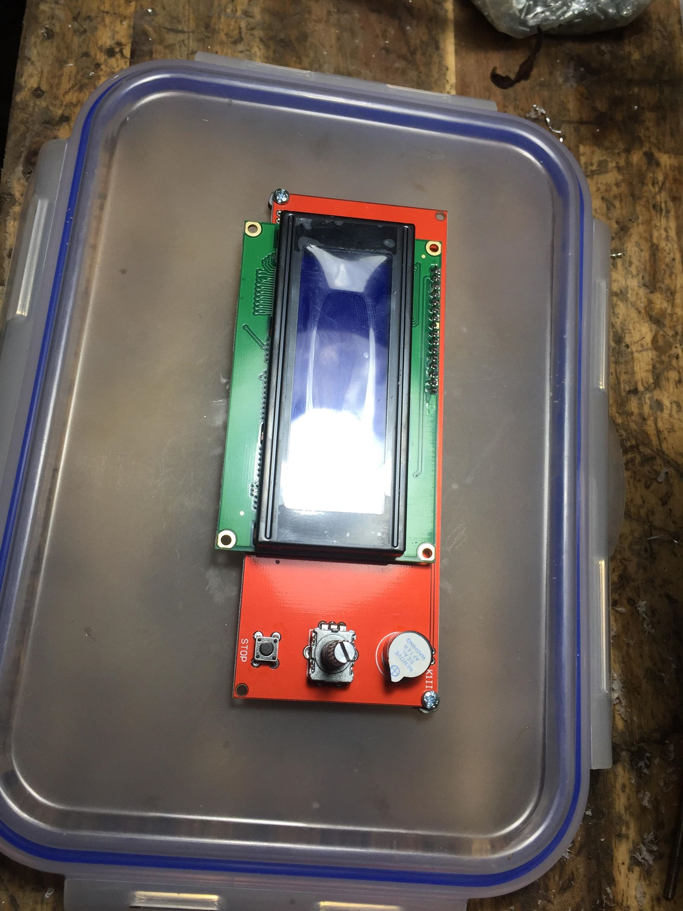

# open source hardware

## tools to shape practice

the tools and technologies we use to create, finish and embellish textiles give them shape. the construction and use of such tools play an important role in the creation of an idiosyncratic language of each textile piece. customising hardware can be an effective means to creatively engage with and adapt the tactile and visual language of textiles. 

## inspiration

eugenia murporgo's digital wax print [machine](http://digitalwaxprint.com/about/) shows how hardware can be customised to accommodate textile embellishment, furthering traditional craft practice by enabling digital intervention. in creating specialised custom hardware she has in effect created a new system and textile embellishment language which can be propogated in diverse contexts and making scenarios. 

## preparing and adapting components 

assemble the required parts. many of the required components such as T nuts, pulleys, wheels, ballbearings, screw and bolts can be purchased locally \(HCMC\) from linh kien 283 [here](http://linhkien283.com/)

some parts were not available for sale in HCMC and thus needed to be adapted from exisitng parts or had to be drawn in solidworks and cnc milled from aluminium. 

  
the wheel axis dimension did not fit with the rod so needed to be drilled wider. 

## making the machine

make the z axis

1. cnc adaper to join z axis to v slot gantry plate
2. v slot gantry plate connect to belt
3. pressure hook to fix cable carrier

x axis

1. wheel kit: a. bearing b. shim c. bearing \(incl. extra shim and m5 nut\)

1. attach bearing, screw & spacer to plate
2. add plate to vslot
3. STEPPER MOTOR MOUNT PLATE ASSEMBLY attach stepper motor to mount plate. add belt pulley to stepper motor shaft, screw to lock. 
4. \(STOPPER?\) PLATE ASSEMBLY belt loop plate
5. mounting plate
6. thread timing belt through v slot, over pulley/stepper motor shaft and finishing/locking on plate. 

y axis

1. attach corner brackets to the central linear rail w/ joining plate.
2. back axle. attach ball bearing pillow, adapters and screws.
3. front axle. mount ball bearing pillow on to adapter. keep screws loose to insert into back frame rail. 
4. mount y axis: insert 3 ball bearing pillow units into linear rail. fix one at edge. fix others at 300mm from others. insert metal rod into ball bearing pillow units, add timing pulley and timing belt onto metal rods. fix stepper motor by inserting internal rail of back frame. insert remaining ball bearing pillow units. once the rod is rotating properly tighten onto rails. T nuts
5. screw mounting backet onto v-slot gantry plate. assemble stepper motor  onto mounting bracket. mount timing pulley on axis of motor. fix v-slot gantry platt to T nuts in back frame rail. 

connect x axis to back frame

1. insert T nuts into inside rails of back frame

1. turn x axis upside down and insert cast corner brackets onto rails so brackets face each other. 

1. align x axis so that it is exactly straightforward 

mount front wheels onto back frome

1. insert front ball bearing pillow units onto small rail of back frame. 

electronics

1. mount custom casing

1. mount mechanical endstops on x and y axis
2. mount z axis stepper motor
3. connect cables from motor to ramps/arduino

add the drawing element

full instructions on the how to assemble the textile drawing machine can be found on eugenia murporgo's github [here](https://github.com/eumorpurgo/TextileDrawingMachine/blob/master/BuildTheMachine.md)

basic instructions on how to assemble a v slot actuator are available on openbuilds[ here](https://openbuilds.com/builds/v-slot%E2%84%A2-linear-actuator-build-belt-driven.80/) 

#### LINKS





