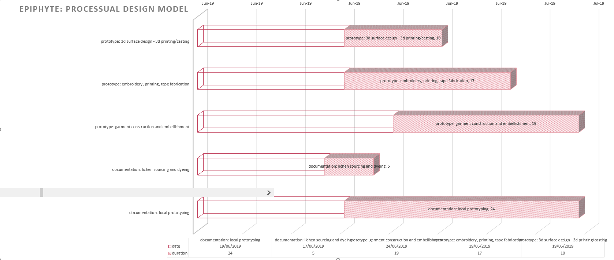

# PM TA final

| 25/04/2019 | 5/05/2019 | delineate concept - epiphyte as emergent, processual design model |
| :--- | :--- | :--- |
| 29/03/2019 | 13/04/2019 | research: lichen |
| 1/04/2019 | 29/04/2019 | research: lichen dyeing practice |
| 1/05/2019 | 23/05/2019 | research: conceptual and artistic context \(processual design, surface oriented, alternative fashion and textile systems\) |
| 1/05/2019 | 26/05/2019 | research: growth models and their application |
| 23/05/2019 | 26/05/2019 | visualisation: lichen dyeing sampling |
| 22/04/2019 | 26/04/2019 | visualisation: zwd differentiating rectangles of fabric |
| 1/05/2019 | 30/05/2019 | visualisation: zwd 2d pattern translation |
| 27/05/2019 | 31/05/2019 | visualisation: "range" planning |
| 28/05/2019 | 7/06/2019 | visualisation: zwd modelling in clo3d |
| 6/05/2019 | 7/06/2019 | visualisation: zwd modelling in rhino/grass |
| 13/05/2019 | 7/06/2019 | visualisation: 3d models as digital surface |
| 13/05/2019 | 7/06/2019 | visualisation: exploring growth models in grass \(DLA, shortest-walk, cellular automata, flocking, looping etc\) |
| 13/05/2019 | 14/06/2019 | visualisation: application of growth models to 3d surfaces |
| 7/06/2019 | 14/06/2019 | visualisation: application of growth models to tapes |
| 13/06/2019 | 16/06/2019 | prototype: synthesizing 2d and 3d surface design |
| 15/06/2019 | 16/06/2019 | visualisation: final digital models review  |
| 17/06/2019 | 21/06/2019 | prototype: dyeing |
| 17/06/2019 | 19/06/2019 | prototype: 3d to 2d - splitting and unrolling surface design components |
| 19/06/2019 | 21/06/2019 | prototype: 2d surface design - embroidery digitising |
| 19/06/2019 | 28/06/2019 | prototype: 3d surface design - 3d printing/casting |
| 19/06/2019 | 5/07/2019 | prototype: embroidery, printing, tape fabrication |
| 24/06/2019 | 12/07/2019 | prototype: garment construction and embellishment |
| 1/05/2019 | 28/06/2019 | documentation: digital design screenshots and captures |
| 27/05/2019 | 2/06/2019 | documentation: research synthesis and presentation |
| 17/06/2019 | 21/06/2019 | documentation: lichen sourcing and dyeing |
| 19/06/2019 | 12/07/2019 | documentation: local prototyping |
| 15/07/2019 | 18/07/2019 | documentation: styling and photoshoot |
| 19/07/2019 | 22/07/2019 | documentation: video composition and editing |

