# skin electronics

### smaller, closer

beauty tech brings technology into contact with the body through fluids and fluid systems, making circuits much smaller and more integrated. by designing to incorporate sensing circuits within traditional adornment and surface embellishment of our bodies, we can engage with technology in novel ways. as with anything, with convenience comes complications. 

katia vega's hairwave [project](https://github.com/katiavega/hairware) shows how hair treatment may be reconfigured as method of technical textile transformation, how a sensor can be apapted to take advantage of subconscious bodily movements and expressions and demonstrates how small and integrated a circuit can become. her project, in addition to inspiration from traditional arabic jewellery, was the basis for this project. 

initially i began sketching an ear piece so that the conductive hair could be suspended, part of the hair, close to the head but not too close. in addition, i designed the ear piece such that a microbattery would hang from the earpiece without disturbing the balance of the head and without placing a lithium battery directly on the head itself. i created an initial sketch with pen and paper then moved into 2d and 3d design software to create a more perfected model. 

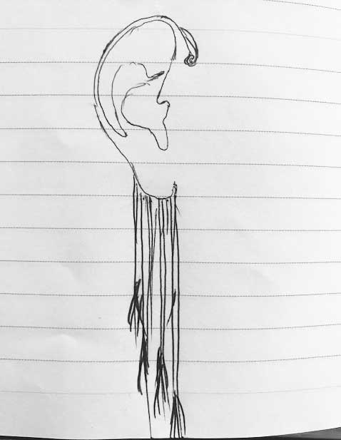

### 

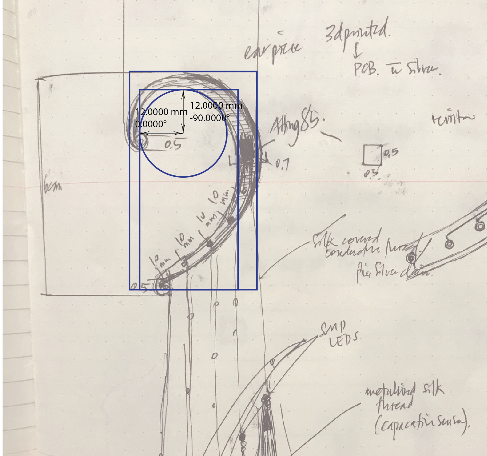

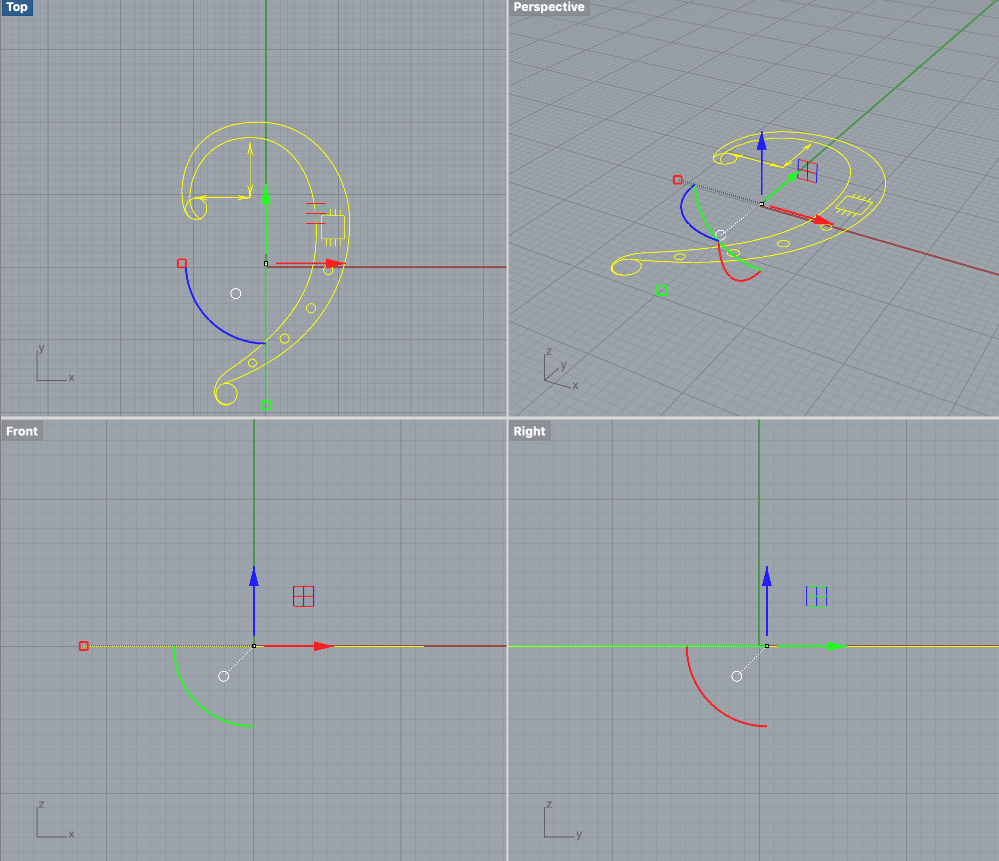

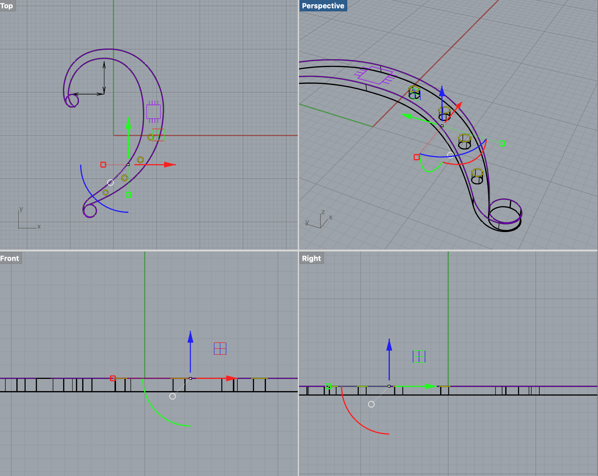

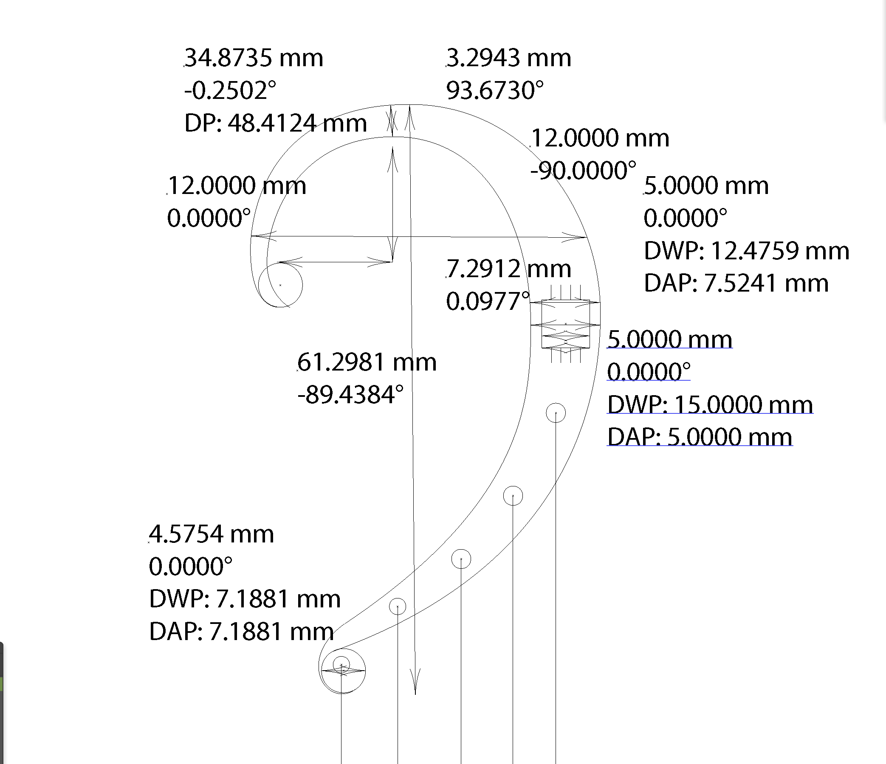

### 

### powering the device

powering a wearable, when all components are at a micro scale, where every element of the design of the circuit and material choice has been selected and arranged in order to make the design innately small is challenging. in seeking to miniaturise a project, we could consider the inclusion of a [micro battery](https://www.sii.co.jp/en/me/files/2018/09/MicroBattery_catalogue_E_2018A_forWeb.pdf).

while the attiny85 requires 5V, it can actually run with less voltage. however, simply considering the voltage of a battery is not sufficient. we also need to consider the capacitance of the battery. 


  
the lithium battery above has a capacitance of 500 milli amperes per hour \(mAh\). in terms of batteries, this would be considered a high capacitance value. by contrast we will find that the nominal capacitance values of most micro batteries, such as those used in watches, is an order of magnitude lower. for example, the nominal capacity of a seiko lithium rechargeable battery is only 5.5mAh. this basically means that we can power a device using micro batteries, however we can only do so for a limited period.  


 size aside, we also find that lithium batteries bring material complications with their compact design.

> By nature, [lithium-ion batteries are dangerous](https://www.wired.com/2017/03/lithium-ion-batteries-turn-skin-searing-firebombs/). Inside, the main line of defense against short circuiting is a thin and porous slip of polypropylene that keeps the electrodes from touching. If that separator is breached, the electrodes come in contact, and things get very hot very quickly. The batteries are also filled with a flammable electrolyte, one that can combust when it heats up, then really get going once oxygen hits it. Not scary enough? That liquid is mixed with a compound that can burn your skin.
>
> source: [https://www.wired.com/2017/03/dont-blame-batteries-every-lithium-ion-explosion/](https://www.wired.com/2017/03/dont-blame-batteries-every-lithium-ion-explosion/)

we should carefully consider how we power wearable devices as there is no convenience in harm. 

### circuit design

i put together a schematic before beginning to design the placement of components and traces on the pcb. the circuit was designed to incorporate 9 smd leds, resistors, a capacitive sensor on an additional resistor and an npn transistor controlled by an attiny85. 

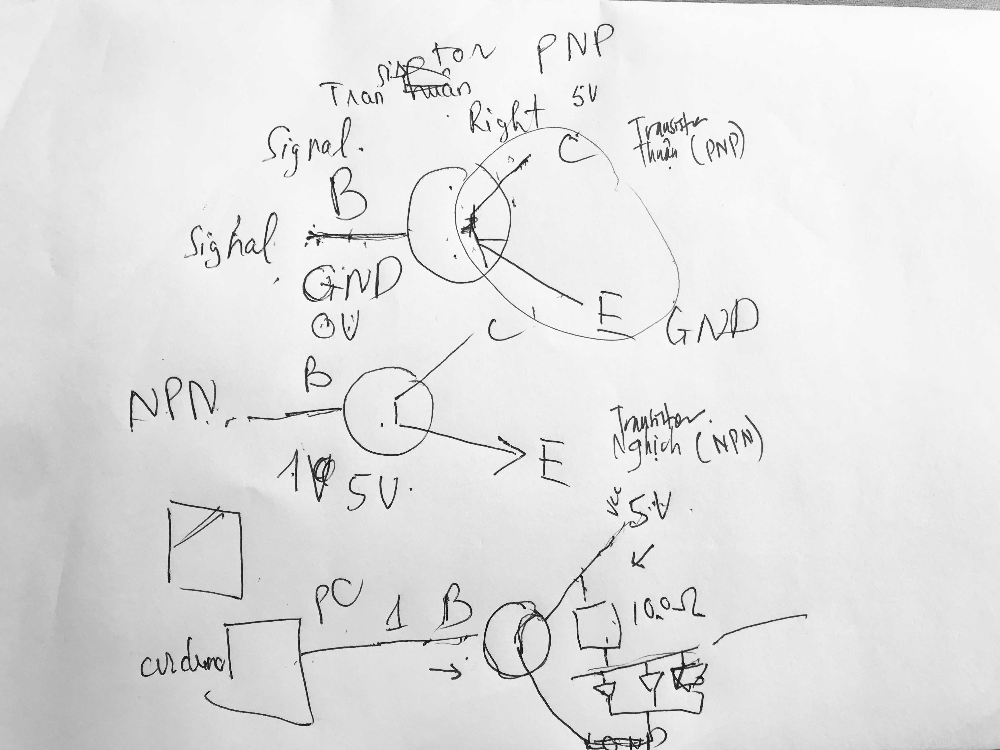

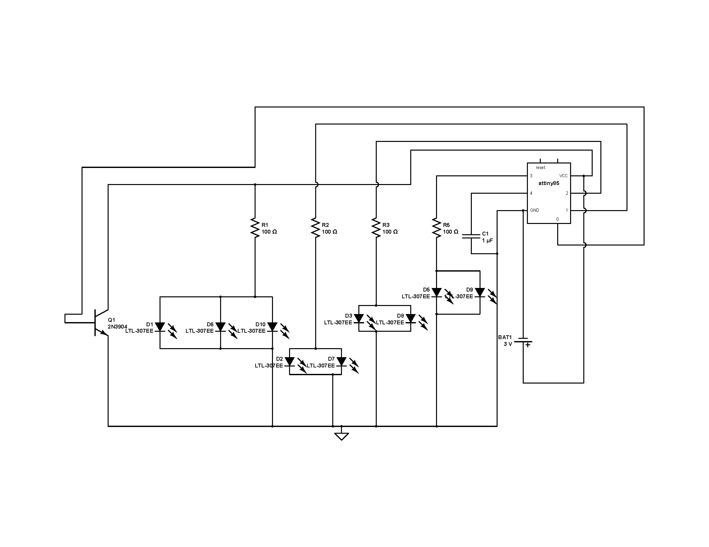

### tiny lights

using smd leds is a way of adding light to a project without the need for high voltage. they can be connected by soldering or by adhering the smd led to a conductive surface or thread using conductive epoxy. i used resin to coat pieces of silver jewellery, then placed the smds onto the surface, laying over 2 drops of silver epoxy, making sure to keep these drops separate, and laying conductive thread over the epoxy. i coated the led with more resin to seal the connection. 

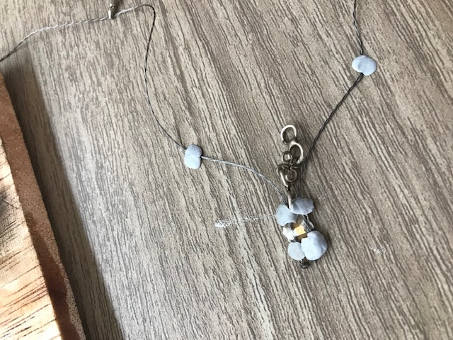

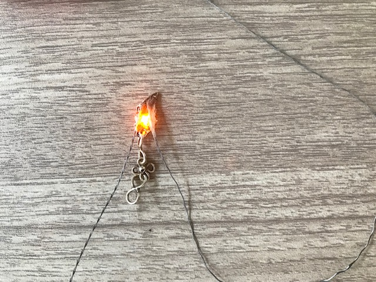

  


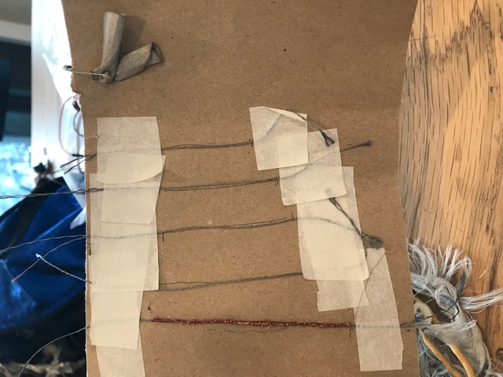

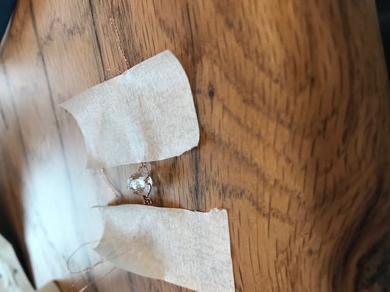

### tiny pcb

using pcb design software like [althium](https://www.altium.com/), it is possible to take existing components and apply them to a smaller or irregularly shaped pcb. 

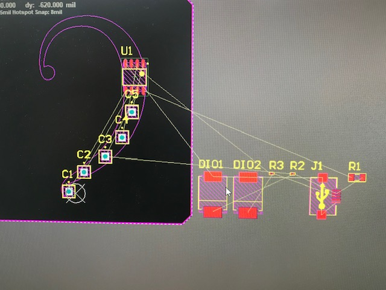

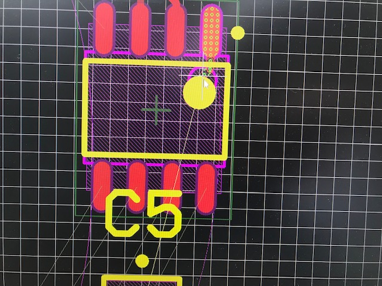

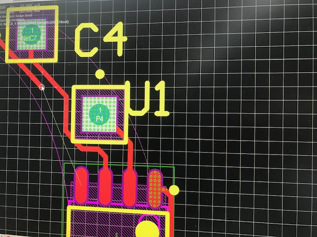

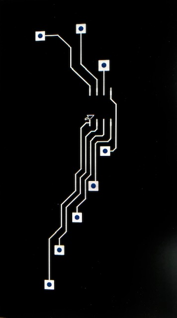

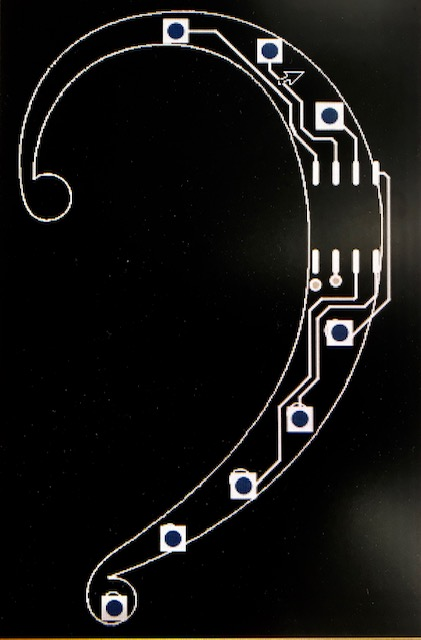

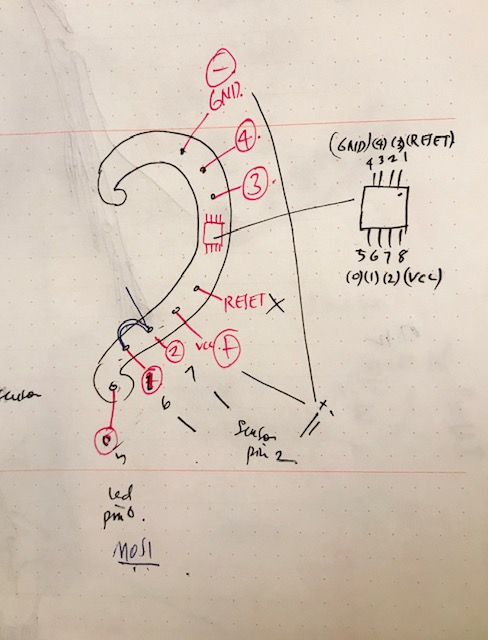

  
once the board was designed, it was laser cut to a coated copper plated thermoplastic board. the board was then cut to shape, cleaned with ethanol and finally etched with ferric chloride. 





### programming the pcb

to program the attiny85 i used [this sketch](https://dev.mikamai.com/2014/07/09/attiny85-based-capacitive-sensor-led-switch/) and this [capacitive sensor](https://playground.arduino.cc/Main/CapacitiveSensor?from=Main.CapSense) library. 

the capacitive sensor library generates and inputs values into the sketch, using 2 pins on the circuit board. 

> The capacitiveSensor method toggles a microcontroller _send_ pin to a new state and then waits for the _receive_ pin to change to the same state as the send pin. A variable is incremented inside a _while_ loop to time the receive pin's state change. The method then reports the variable's value, which is in arbitrary units.
>
> source: [https://playground.arduino.cc/Main/CapacitiveSensor?from=Main.CapSense](https://playground.arduino.cc/Main/CapacitiveSensor?from=Main.CapSense)

the code states the library, the 2 pins used for the capacitive sensor, their values, declares the LED pins and the duration they will be activated by the sensor. in addition, the code uses 'smoothing' to handle the sensor values. 

```text
#include <CapacitiveSensor.h>

int cap_pin_out = 4;
int cap_pin_in = 2;
int lowcap = 300;  // just above reading when noting is near
int highcap = 1800; // cap reading when almost touching
CapacitiveSensor   capsense = CapacitiveSensor(cap_pin_out, cap_pin_in);  // 10M resistor between pins 1 & 2, pin 2 is sensor pin, add a wire and or foil if desired
int ledPin = 13;
int dur = 10; //duration is 10 loops
int brightness;
bool isOn = 0;

/* smoothing */
const int numReadings = 10;
int readings[numReadings];      // the readings from the analog input
int index = 0;                  // the index of the current reading
long total = 0;                  // the running total
int average = 0;                // the average

void setup()
{
  pinMode(ledPin, OUTPUT); // output pin
  pinMode(cap_pin_in, INPUT); // output pin
  pinMode(cap_pin_out, OUTPUT); // output pin

  // initialize all the readings to 0:
  for (int thisReading = 0; thisReading = numReadings)
    // ...wrap around to the beginning:
    index = 0;

  // calculate the average:
  average = total / numReadings;
  // send it to the computer as ASCII digits

  long start = millis();

  brightness = map(average, lowcap, highcap, 0, 255);
  brightness = constrain(brightness, 0, 255);

  if (isOn == true && brightness == 255) {
    isOn = false;
    delay(500);
  } else if (isOn == false && brightness == 255) {
    isOn = true;
    delay(500);
  }

  if (isOn == true) {
    analogWrite(ledPin, 255);
  } else {
    analogWrite(ledPin, brightness);
  }

  delay(10);

}
```



  


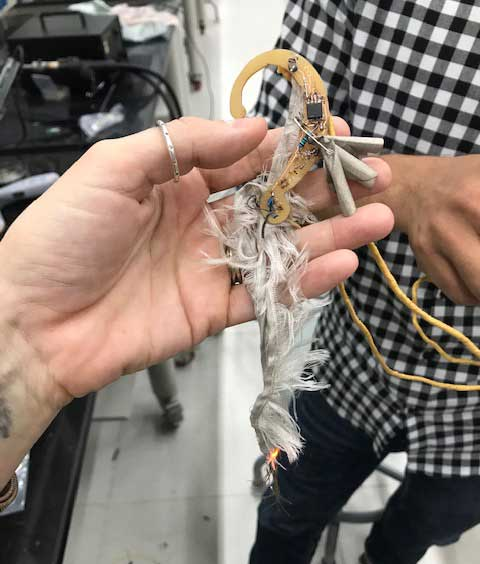

the attiny was soldered to the custom pcb, in addition a resistor was soldered directly onto 2 pins to allow for the capacitive sensor. an smd led was joined to a single pin to test the conductive fabric capacitive sensor on the custom pcb, to see if it would light up the led when touched. omg it worked. 



### conductive hair

the method for coating hair with silver

* 2g AgNO3
* 10mL NH3
* distilled water

21 degrees celcius, 7 minutes


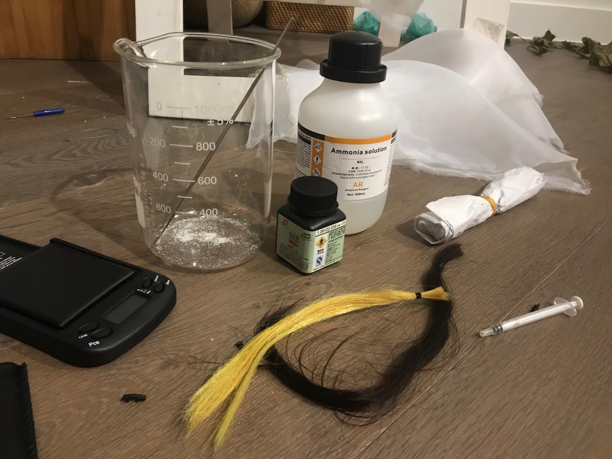

the ammonia fumes burnt my eyes. i don't dare continue. 


### LINKS













