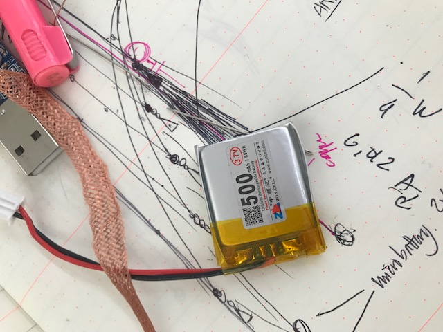
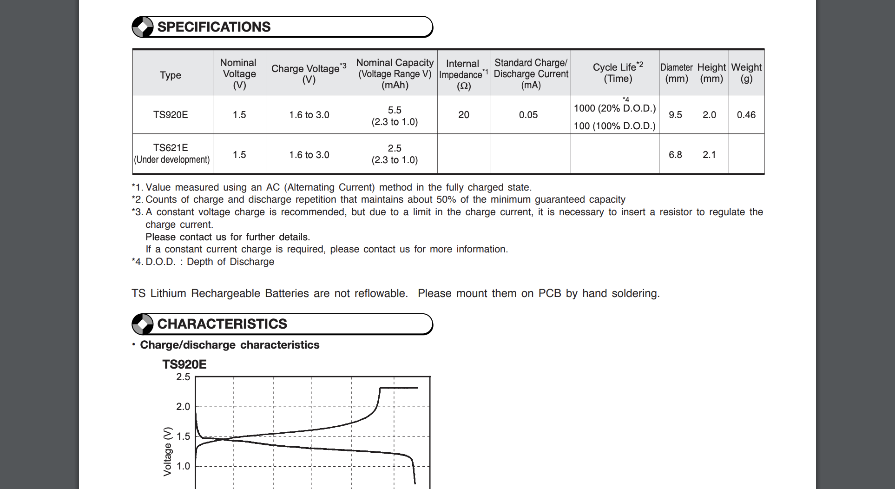

# skin electronics

### powering the device

powering a wearable, when all components are at a micro scale, where every element of the design of the circuit and material choice has been chosen in order to make the design innately small is challenging. in seeking to miniaturise a project, we could consider the inclusion of a [micro battery](https://www.sii.co.jp/en/me/files/2018/09/MicroBattery_catalogue_E_2018A_forWeb.pdf).

while the attiny85 requires 5V, it can actually run with less voltage. however, simply considering the voltage of a battery is not sufficient. we also need to consider the capacitance of the battery. 

  
the lithium battery above has a capacitance of 500 milli amperes per hour \(mAh\). in terms of batteries, this would be considered a high capacitance value. by contrast we will find that the nominal capacitance values of most micro batteries, such as those used in watches, is an order of magnitude lower. for example, the nominal capacity of a seiko lithium rechargeable battery is only 5.5mAh. this basically means that we can power a device using micro batteries, however we can only do so for a limited period.  

 size aside, we also find that lithium batteries bring material complications with their compact design.

> By nature, [lithium-ion batteries are dangerous](https://www.wired.com/2017/03/lithium-ion-batteries-turn-skin-searing-firebombs/). Inside, the main line of defense against short circuiting is a thin and porous slip of polypropylene that keeps the electrodes from touching. If that separator is breached, the electrodes come in contact, and things get very hot very quickly. The batteries are also filled with a flammable electrolyte, one that can combust when it heats up, then really get going once oxygen hits it. Not scary enough? That liquid is mixed with a compound that can burn your skin.
>
> source: [https://www.wired.com/2017/03/dont-blame-batteries-every-lithium-ion-explosion/](https://www.wired.com/2017/03/dont-blame-batteries-every-lithium-ion-explosion/)

we should carefully consider how we power wearable devices as there is no convenience in harm. 

### tiny pcb

using pcb design software like [althium](https://www.altium.com/), it is possible to take existing components and apply them to a smaller or irregularly shaped pcb. 

### LINKS













