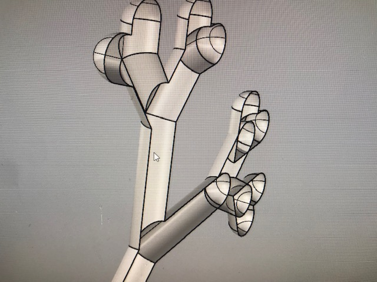
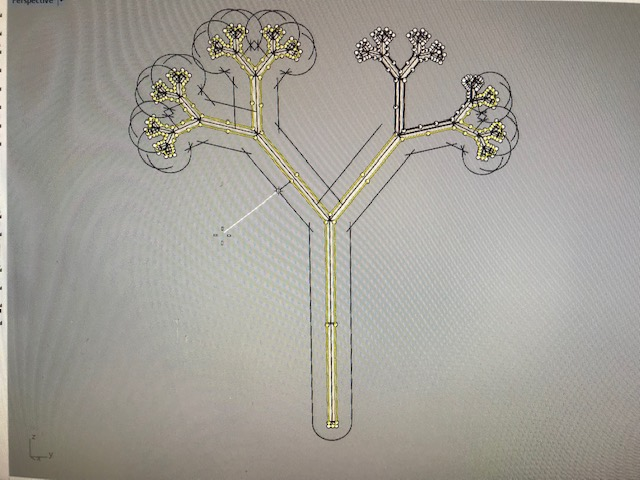
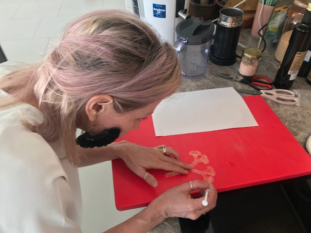

# soft robotics




[sher minn chong](http://pages.cs.wisc.edu/~sher/) has developed and shared an[ l-systems renderer](http://piratefsh.github.io/p5js-art/public/lsystems/) which generates recursive patterns through a simple string rewriting system. 


an example is a binary tree, which consists of the following:

```text
X=F[-X][+X]

X axiom
F draw a line
+ turn left
- turn right
[ save current state
]restore saved state
angle 30º
```

in a similar way to the example above, the equation -

```text
X=F[-X][+X]
```

can be placed into grasshopper to give form to an l-system model for 2d and 3d design applications

 using [rabbit](https://morphocode.com/rabbit/) for grasshopper, it is possible to model l-systems through simple definitions

  
rabbit uses axiom and production rules to generate and visualise l-systems models, as such:

```text
F = Move forward a step of length d
f = Move forward a step of length d without drawing a line
+ = Turn left by angle b
– = Turn left by angle b
\ = roll left
/ = roll right
^ = pitch up
& = pitch down
| = turn around
```

i created a simple binary tree using a few components in rabbit 


the l-system component contains

```text
A = axiom – first Word in the l-system. the ‘seed’ or ‘initiator’
PR = production rules – created in L-system language.
N = number of generations.
W = last word derived by the L-system.
L = list of words generated by the L-system
LS = l-system object, based on the specified axiom and production rules.
```

the turtle component contains

```text
S = Source String
L = Length of the turtle’s step
dL = Step scale length
A = Default angle of the turtle used for rotation
dA = Default angle scale
O = Initial position and orientation of the turtle
TS = Tube settings
```

using the l-system component, i specified an axiom \(x\), a rule \( X=F\[-X\]\[+X\] \)and a number of derivations \(7\). this component was connected to the turtle component in order to visualise the l-system. i specified a step length and an angle increment, then connected the turtle component to a curve, and baked. 

summary source: [https://parametricmonkey.com/2016/03/09/fractals-2/](https://parametricmonkey.com/2016/03/09/fractals-2/)



this form was then used to create a 3d mould to cast a bio silicone inflatable model








inspired by [clara davis](https://clara-davis.com/) virtuosic command of bio plastics in the creation of an inflatable piece, i wanted to create my own bioplastic inflatable using local ingredients


* 3g agar
* 20g gelatine
* 15ml glycerine
* 400ml water


* 50g agar
* 15g glycerine
* 250ml water


* 4g agar
* 3g glycerine
* 400ml later


  
bio siilcone

* 48g gelatine
* 24g glycerine
* 240ml water




  
bio silicone with a higher glycerin content

* 30g gelatine
* 30g glycerine
* 150ml water


###  inflatable with upcycled textile

i dismantled a secondhand windbreaker. i would like to create an oversized jacket that becomes insulated and assumes its 'true' form when inflated. i created some experiments towards this objective by inserting layers of hot melt film and its waxed backing in between layers of synthetic windbreaker panels and applying heat. 




####  attempting laser bonding 


  
to be continued..

  


### LINKS





