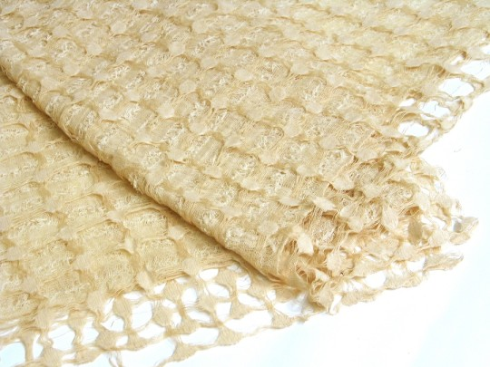
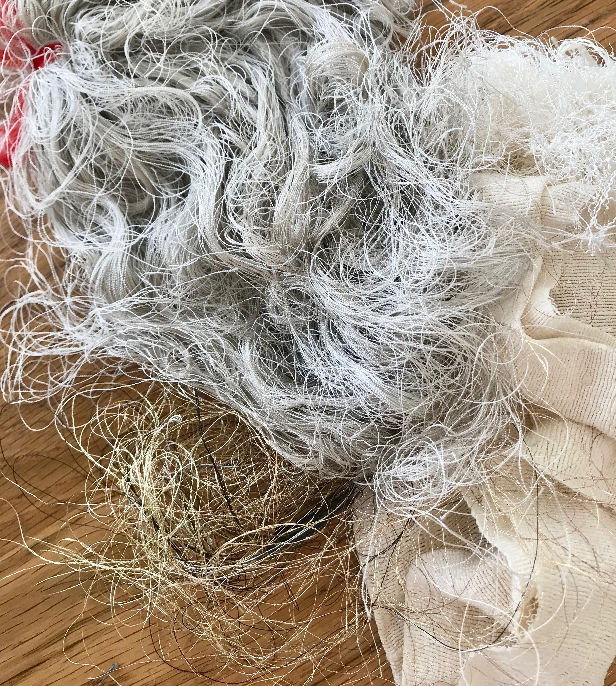

# textile as scaffold

## changing form

woven and knitted textiles are typically used to envelope, cover, embellish and protect the body, however their structures can be adapted to assume other forms and to suggest alternative meanings in new contexts. 

a key aspect of finding new expressions in existing materials is to be found in making methodologies. artist olafur eliason says of a making process -

> “we do not pronounce ahead of time what we need to know” 
>
> source: From the Past with Love, p135

> This image is a layered fabric using milled Merino wool to bind a delicate structure of Tussah silk. It plays on the distortion caused during the finishing of the wool and how this changes that strict linear structure imposed by the loom. This is where I first learned the importance of allowing materials to tell me what they wanted to become – of allowing a process to dictate an outcome. The idea of being out of control or surprised by the outcome was, perhaps, unnerving at first but is now an essential ingredient in my making and my thinking. To speak of ‘playing’ with materials suggests an imposed naivety which allows spontaneity and ultimately some sort of discovery.
>
> source: [https://www.textileartist.org/neil-musson-oca-textiles-tutor](https://www.textileartist.org/neil-musson-oca-textiles-tutor)

by applying materials thinking in unprecendented applications, it becomes possible to practically imagine future scenarios and viable alternatives to the status quo. 

### bio-resin

#### ingeo

Ingeo is a poly lactic acid \(PLA\) or plant-based synthetic polymer. 

> ...plants like corn, cassava, sugar cane or beets to capture and sequester CO2 transforming it into long-chain sugar molecules. The plants are put through a milling process extracting the starch \(glucose\). Enzymes are added to convert the glucose to dextrose via a process called hydrolysis. Microorganisms then ferment this dextrose into lactic acid.A two-step process transforms lactic acid molecules into rings of lactide...the lactide ring is opened and linked together to form the long chain of polylactide polymer.

source: [https://www.natureworksllc.com/What-is-Ingeo/How-Ingeo-is-Made](https://www.natureworksllc.com/What-is-Ingeo/How-Ingeo-is-Made)

### composite

garment construction and machine embroidery can be messy, resource intensive processes. one of the forms of waste formed as a by-product is excess thread. i collect excess threads during embroidery and garment construction, not knowing which specific purpose the threads would serve in a future context. i have previously used these excess threads in digital embroidery by capturing them between layers of textile and using digital embroidery to enclose the threads, as with quilting. the same process of capturing something in another material, where value is undecided, purpose as-yet undefined, will be employed here to create a new composite. 

for this project i will be combining thread waste with bio-resin. 

to do this, i will need to create a mould

### creating a textile mould

###  

## piezoelectric crystals

#### LINKS

[http://mussonretallick.com/projects/supernature](http://mussonretallick.com/projects/supernature)



#### CITATIONS

Eliason, O.  2017. “From the Past with Love” in Pais, AP & Strauss CF \(eds\) 2017. Slow Reader: A Resource for Design Thinking and Practice . Valiz: Amsterdam 

