# wearables


### AUDIO

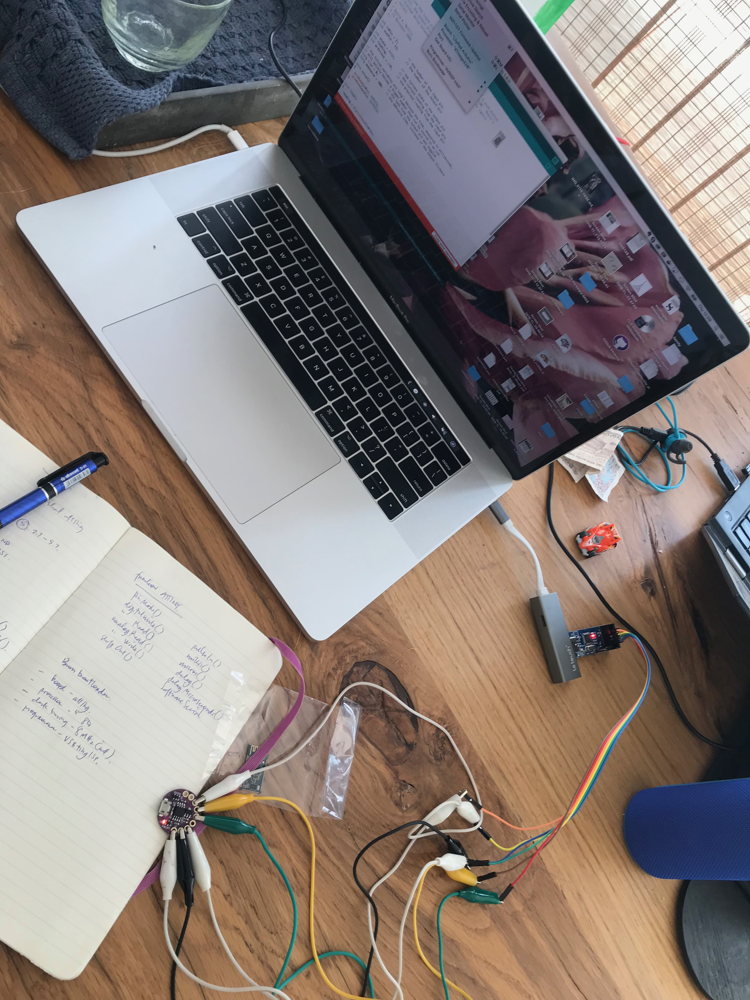

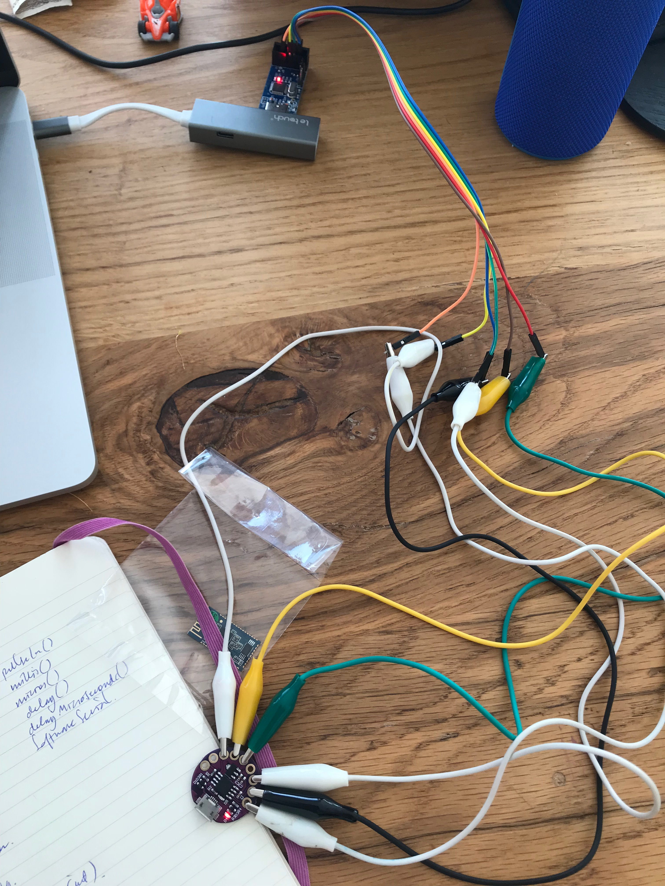

```text
/***************************************************
DFPlayer - A Mini MP3 Player For Arduino
 <https://www.dfrobot.com/index.php?route=product/product&product_id=1121>
 
 ***************************************************
 This example shows the basic function of library for DFPlayer.
 
 Created 2016-12-07
 By [Angelo qiao](Angelo.qiao@dfrobot.com)
 
 GNU Lesser General Public License.
 See <http://www.gnu.org/licenses/> for details.
 All above must be included in any redistribution
 ****************************************************/

/***********Notice and Trouble shooting***************
 1.Connection and Diagram can be found here
 <https://www.dfrobot.com/wiki/index.php/DFPlayer_Mini_SKU:DFR0299#Connection_Diagram>
 2.This code is tested on Arduino Uno, Leonardo, Mega boards.
 ****************************************************/

#include "Arduino.h"
#include "SoftwareSerial.h"
#include "DFRobotDFPlayerMini.h"

SoftwareSerial mySoftwareSerial(10, 11); // RX, TX
DFRobotDFPlayerMini myDFPlayer;
void printDetail(uint8_t type, int value);

void setup()
{
  mySoftwareSerial.begin(9600);
  Serial.begin(115200);
  
  Serial.println();
  Serial.println(F("DFRobot DFPlayer Mini Demo"));
  Serial.println(F("Initializing DFPlayer ... (May take 3~5 seconds)"));
  
  if (!myDFPlayer.begin(mySoftwareSerial)) {  //Use softwareSerial to communicate with mp3.
    Serial.println(F("Unable to begin:"));
    Serial.println(F("1.Please recheck the connection!"));
    Serial.println(F("2.Please insert the SD card!"));
    while(true);
  }
  Serial.println(F("DFPlayer Mini online."));
  
  myDFPlayer.volume(10);  //Set volume value. From 0 to 30
  myDFPlayer.play(1);  //Play the first mp3
}

void loop()
{
  static unsigned long timer = millis();
  
  if (millis() - timer > 3000) {
    timer = millis();
    myDFPlayer.next();  //Play next mp3 every 3 second.
  }
  
  if (myDFPlayer.available()) {
    printDetail(myDFPlayer.readType(), myDFPlayer.read()); //Print the detail message from DFPlayer to handle different errors and states.
  }
}

void printDetail(uint8_t type, int value){
  switch (type) {
    case TimeOut:
      Serial.println(F("Time Out!"));
      break;
    case WrongStack:
      Serial.println(F("Stack Wrong!"));
      break;
    case DFPlayerCardInserted:
      Serial.println(F("Card Inserted!"));
      break;
    case DFPlayerCardRemoved:
      Serial.println(F("Card Removed!"));
      break;
    case DFPlayerCardOnline:
      Serial.println(F("Card Online!"));
      break;
    case DFPlayerPlayFinished:
      Serial.print(F("Number:"));
      Serial.print(value);
      Serial.println(F(" Play Finished!"));
      break;
    case DFPlayerError:
      Serial.print(F("DFPlayerError:"));
      switch (value) {
        case Busy:
          Serial.println(F("Card not found"));
          break;
        case Sleeping:
          Serial.println(F("Sleeping"));
          break;
        case SerialWrongStack:
          Serial.println(F("Get Wrong Stack"));
          break;
        case CheckSumNotMatch:
          Serial.println(F("Check Sum Not Match"));
          break;
        case FileIndexOut:
          Serial.println(F("File Index Out of Bound"));
          break;
        case FileMismatch:
          Serial.println(F("Cannot Find File"));
          break;
        case Advertise:
          Serial.println(F("In Advertise"));
          break;
        default:
          break;
      }
      break;
    default:
      break;
  }
}
```

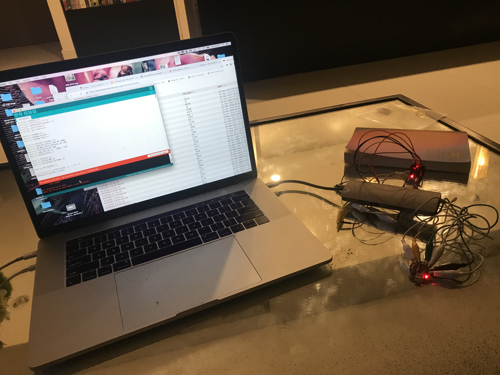

```text
#include <Arduino.h>
#include <SoftwareSerial.h>
#include <DFRobotDFPlayerMini.h>
#include <avr/sleep.h>
#include <avr/eeprom.h>

#define EEPROM_CFG 1
#define EEPROM_FOLDER 2
#define EEPROM_TRACK 4

#define BUTTON_TOLERANCE 25
#define LONG_KEY_PRESS_TIME_MS 2000L
#define VOLUME_CHECK_INTERVAL_MS 200L
#define PLAY_DELAY_MS 500L
#define FADE_OUT_MS 3L * 1000L * 60L
#define READ_RETRIES 3

#define PIN_KEY A3
#define PIN_VOLUME A2
#define PIN_VOLUME_INTERNAL A1

#define NO_FOLDERS 11

SoftwareSerial softSerial(0, 1); // RX, TX
DFRobotDFPlayerMini player;

enum {
  MODE_NORMAL, MODE_SET_TIMER
} mode = MODE_NORMAL;

boolean loopPlaylist = false;
boolean continuousPlayWithinPlaylist = false;
boolean restartLastTrackOnStart = false;

float volFade = 1.0;
int vol = -1;
int key = -1;
unsigned long keyPressTimeMs = 0L;
unsigned long volumeHandledLastMs = 0L;

unsigned long sleepAtMs = 0L;
unsigned long offAtMs = 0L;

unsigned long nowMs;

int16_t curFolder = -1;
int16_t curTrack = -1;
int16_t curTrackFileNumber = -1;

unsigned long startTrackAtMs = 0L;

int maxTracks[NO_FOLDERS];

void turnOff() {
  volFade = 0.0;
  player.volume(0);
  delay(50);
  player.stop();
  delay(50);
  player.outputDevice(DFPLAYER_DEVICE_SLEEP);
  delay(50);
  player.disableDAC();
  delay(50);
  player.sleep();
  delay(200);

  while (1) {
    set_sleep_mode(SLEEP_MODE_PWR_DOWN);
    sleep_mode();
    delay(5000);
  }
}

void initDFPlayer(boolean reset = false) {
  if (reset) {
    player.setTimeOut(6000);
    player.reset();
    player.waitAvailable();
  }
  player.setTimeOut(1000);

  delay(50);

  player.EQ(DFPLAYER_EQ_NORMAL);
  player.outputDevice(DFPLAYER_DEVICE_SD);
  player.enableDAC();
}

void readConfig() {
  uint8_t cfg = eeprom_read_byte((uint8_t*) EEPROM_CFG);

  loopPlaylist = cfg & 1;
  continuousPlayWithinPlaylist = cfg & 2;
  restartLastTrackOnStart = cfg & 4;
}

void writeConfig() {
  uint8_t cfg = eeprom_read_byte((uint8_t*) EEPROM_CFG);

  cfg = (cfg & (0xff ^ 1)) | (loopPlaylist ? 1 : 0);
  cfg = (cfg & (0xff ^ 2)) | (continuousPlayWithinPlaylist ? 2 : 0);
  cfg = (cfg & (0xff ^ 4)) | (restartLastTrackOnStart ? 4 : 0);

  eeprom_update_byte((uint8_t*) EEPROM_CFG, cfg);
}

void readTrackInfo() {
  curFolder = (int16_t) eeprom_read_word((uint16_t*) EEPROM_FOLDER);
  if (curFolder < 0 || curFolder > NO_FOLDERS) {
    curFolder = -1;
    curTrack = -1;

    return;
  }

  curTrack = (int16_t) eeprom_read_word((uint16_t*) EEPROM_TRACK);
  if (curTrack < 0 || curTrack > maxTracks[curFolder - 1]) {
    curTrack = -1;
    curFolder = -1;
  }
}

void writeTrackInfo(int16_t folder, int16_t track) {
  eeprom_update_word((uint16_t*) EEPROM_FOLDER, (uint16_t) folder);
  eeprom_update_word((uint16_t*) EEPROM_TRACK, (uint16_t) track);
}

int readPlayerState(int retries) {
  int ret = -1;
  while (--retries >= 0 && ret == -1) {
    ret = player.readState();
  }
  return ret;
}

int readPlayerFileCountsInFolder(int folderNumber, int retries) {
  int ret = -1;
  while (--retries >= 0 && ret == -1) {
    ret = player.readFileCountsInFolder(folderNumber);
  }
  return ret;
}

int readPlayerCurrentFileNumber(int retries) {
  int ret = -1;
  while (--retries >= 0 && ret == -1) {
    ret = player.readCurrentFileNumber(DFPLAYER_DEVICE_SD);
  }
  return ret;
}

void playOrAdvertise(int fileNo) {
  int state = readPlayerState(READ_RETRIES);
  if (state >= 0) {
    if ((state & 1) == 1) {
      player.advertise(fileNo);
    } else {
      player.playMp3Folder(fileNo);
    }
  }
}

void playFolderOrNextInFolder(int folder, boolean loop = true) {
  startTrackAtMs = 0;

  if (curFolder != folder) {
    curFolder = folder;
    curTrack = 1;
  } else {
    if (++curTrack > maxTracks[folder - 1]) {
      curTrack = 1;

      if (!loop)
      {
        curTrack = maxTracks[folder - 1];
        return;
      }
    }
  }

  startTrackAtMs = millis() + PLAY_DELAY_MS;
}

void setup() {
  pinMode(PIN_VOLUME, INPUT);
  pinMode(PIN_VOLUME_INTERNAL, INPUT);
  pinMode(PIN_KEY, INPUT_PULLUP);

  readConfig();

  delay(50);

  softSerial.begin(9600);

  player.begin(softSerial, false, false); // disable ACK to work with MH2024K-24SS chips

  initDFPlayer();

  for (int i = 0; i < NO_FOLDERS; ++i) {
    maxTracks[i] = readPlayerFileCountsInFolder(i + 1, READ_RETRIES);
  }

  if (restartLastTrackOnStart) {
    readTrackInfo();
    if (curFolder != -1 && curTrack != -1) {
      startTrackAtMs = millis() + PLAY_DELAY_MS;
    }
  }
}

inline void handleSleepTimer() {
  if (sleepAtMs != 0 && nowMs >= sleepAtMs) {
    volFade = 1.0 - (nowMs - sleepAtMs) / (float) (offAtMs - sleepAtMs);
    if (volFade <= 0.0) {
      turnOff();
    }
  }
}

inline void handleVolume() {
  if (nowMs > volumeHandledLastMs + VOLUME_CHECK_INTERVAL_MS) {
    volumeHandledLastMs = nowMs;

    int volCurrent = analogRead(PIN_VOLUME);
    int volInternal = analogRead(PIN_VOLUME_INTERNAL);
    int volNew = (map(volCurrent, 0, 1023, 1,
                      31 - map(volInternal, 1023, 0, 1, 30))) * volFade;
    if (volNew != vol) {
      vol = volNew;
      player.volume(vol);
    }
  }
}

inline void handleKeyPress() {
  int keyCurrent = analogRead(PIN_KEY);

  if (keyCurrent > 1000 && key > 0) {
    switch (mode) {
      case MODE_NORMAL:
        if (nowMs - keyPressTimeMs >= LONG_KEY_PRESS_TIME_MS && key == 11) {
          mode = MODE_SET_TIMER;
          playOrAdvertise(100);
          delay(1000);
        } else if (nowMs - keyPressTimeMs >= LONG_KEY_PRESS_TIME_MS && key == 1) {
          continuousPlayWithinPlaylist = !continuousPlayWithinPlaylist;
          playOrAdvertise(continuousPlayWithinPlaylist ? 200 : 201);
          writeConfig();
          delay(1000);
        } else if (nowMs - keyPressTimeMs >= LONG_KEY_PRESS_TIME_MS && key == 2) {
          loopPlaylist = !loopPlaylist;
          playOrAdvertise(loopPlaylist ? 300 : 301);
          writeConfig();
          delay(1000);
        } else if (nowMs - keyPressTimeMs >= LONG_KEY_PRESS_TIME_MS && key == 3) {
          restartLastTrackOnStart = !restartLastTrackOnStart;
          playOrAdvertise(restartLastTrackOnStart ? 400 : 401);
          writeConfig();
          writeTrackInfo(curFolder, curTrack);
          delay(1000);
        } else {
          playFolderOrNextInFolder(key);
        }
        break;

      case MODE_SET_TIMER:
        playOrAdvertise(key);

        if (key == 1) {
          sleepAtMs = 0;
          offAtMs = 0;
          volFade = 1.0;
        } else {
          sleepAtMs = nowMs + (key - 1) * 1000L * 60L * 5L;
          offAtMs = sleepAtMs + FADE_OUT_MS;
        }

        delay(1000);
        mode = MODE_NORMAL;
        break;

    }

    key = -1;
  } else if (keyCurrent <= 1000) {
    int keyOld = key;

    if (keyCurrent > 949 - BUTTON_TOLERANCE) {
      key = 11;
    } else if (keyCurrent > 894 - BUTTON_TOLERANCE) {
      key = 9;
    } else if (keyCurrent > 847 - BUTTON_TOLERANCE) {
      key = 6;
    } else if (keyCurrent > 801 - BUTTON_TOLERANCE) {
      key = 3;
    } else if (keyCurrent > 754 - BUTTON_TOLERANCE) {
      key = 2;
    } else if (keyCurrent > 701 - BUTTON_TOLERANCE) {
      key = 5;
    } else if (keyCurrent > 635 - BUTTON_TOLERANCE) {
      key = 8;
    } else if (keyCurrent > 553 - BUTTON_TOLERANCE) {
      key = 10;
    } else if (keyCurrent > 444 - BUTTON_TOLERANCE) {
      key = 7;
    } else if (keyCurrent > 286 - BUTTON_TOLERANCE) {
      key = 4;
    } else if (keyCurrent > 0) {
      key = 1;
    }

    if (keyOld != key) {
      keyPressTimeMs = nowMs;
    }
  }
}

void loop() {
  nowMs = millis();

  handleSleepTimer();
  handleVolume();
  handleKeyPress();

  if (startTrackAtMs != 0 and nowMs >= startTrackAtMs) {
    startTrackAtMs = 0;
    player.playFolder(curFolder, curTrack);
    if (restartLastTrackOnStart) {
      writeTrackInfo(curFolder, curTrack);
    }

    // Don't reduce the following delay. Otherwise player might not have started playing
    // the requested track, returning the file number of the previous file, thus breaking
    // continuous play list playing which relies on correct curTrackFileNumber.
    delay(500);
    curTrackFileNumber = readPlayerCurrentFileNumber(READ_RETRIES);
  }

  if (player.available()) {
    uint8_t type = player.readType();
    int value = player.read();

    if (type == DFPlayerPlayFinished && value == curTrackFileNumber) {
      int16_t oldTrack = curTrack;

      if (startTrackAtMs == 0 /* no user request pending */ && continuousPlayWithinPlaylist) {
        playFolderOrNextInFolder(curFolder, loopPlaylist);

        // Don't reduce the following delay. Callbacks that a track has finished
        // might occur multiple times within 1 second and you don't want to move
        // on more than exactly one track.
        delay(1000);
      }

      if (oldTrack == curTrack) {
        writeTrackInfo(-1, -1);
      }
    }
  }

  delay(50);
}
```

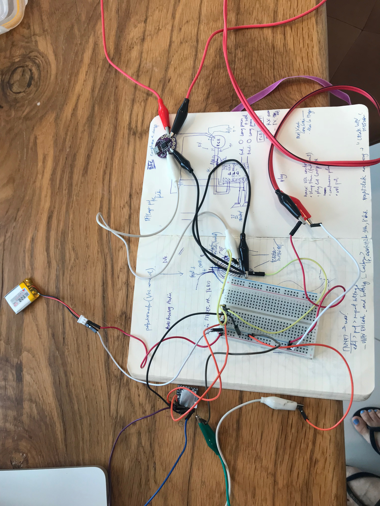


```text
/*
  Melody

  Plays a melody

  circuit:
  - 8 ohm speaker on digital pin 8

  created 21 Jan 2010
  modified 30 Aug 2011
  by Tom Igoe

  This example code is in the public domain.

  http://www.arduino.cc/en/Tutorial/Tone
*/

#include "pitches.h"

// notes in the melody:
int melody[] = {
  NOTE_C4, NOTE_G3, NOTE_G3, NOTE_A3, NOTE_G3, 0, NOTE_B3, NOTE_C4
};

// note durations: 4 = quarter note, 8 = eighth note, etc.:
int noteDurations[] = {
  4, 8, 8, 4, 4, 4, 4, 4
};

void setup() {
  // iterate over the notes of the melody:
  for (int thisNote = 0; thisNote < 8; thisNote++) {

    // to calculate the note duration, take one second divided by the note type.
    //e.g. quarter note = 1000 / 4, eighth note = 1000/8, etc.
    int noteDuration = 1000 / noteDurations[thisNote];
    tone(8, melody[thisNote], noteDuration);

    // to distinguish the notes, set a minimum time between them.
    // the note's duration + 30% seems to work well:
    int pauseBetweenNotes = noteDuration * 1.30;
    delay(pauseBetweenNotes);
    // stop the tone playing:
    noTone(8);
  }
}

void loop() {
  // no need to repeat the melody.
}
```

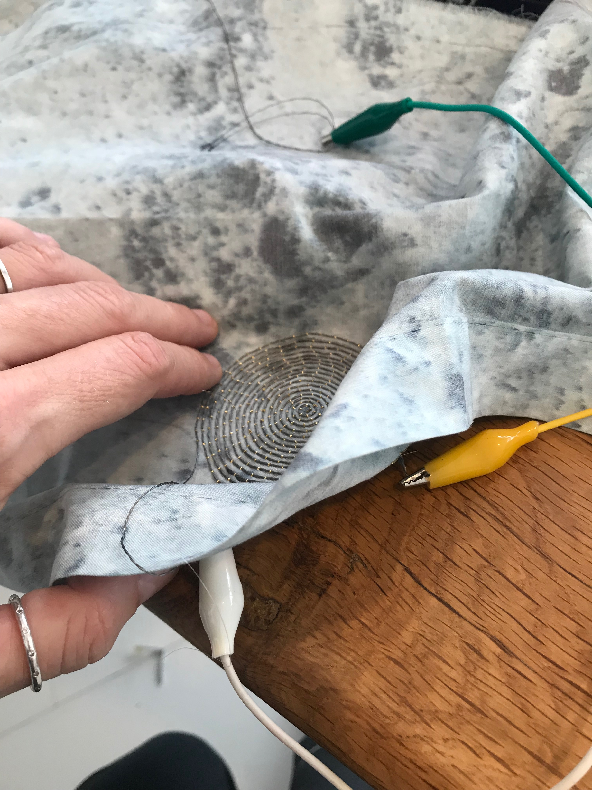


### MP3

Some dfplayer-arduino sketches call for .wav format with 44100 Hz, 16-bit stereo quality on the SD card. In theory, audio files can be converted using iTunes:

```text
Click _> Edit > Preferences > Import Settings_
Change the dropdown to _WAV Encoder_ and Setting: _Custom > 16.000kHz to 32kHz, 8-bit, Mono_
Right click any file in iTunes, and select _"Create WAV Version"_
```

.. yet most are AAC protected files which cannot be converted. An alternative is [this](https://audio.online-convert.com/convert-to-wav) online wav/mp3 converter.  The files exported by this program were corrupted. however, I was able to obtain an mp3 from youtube using the same method. 

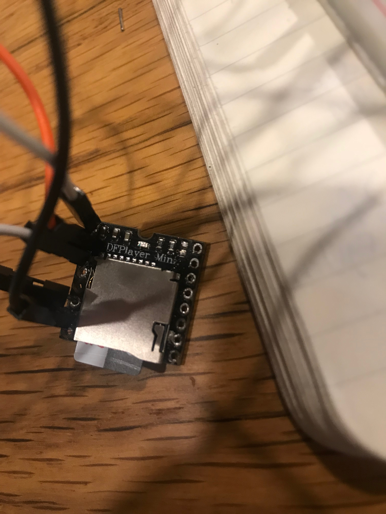

it is only possible to connect the dfplayer to the attiny without removing the pins. the space between the pins is 1mm. soldering skills are required. my soldering skills are not up to this challenge currently. though i was careful i accidentally destroyed the board but causing not only the pins to fall away but also the casing which transmits electricity for each port. 

i have since purchased another for future experiments. 

### SPEAKER

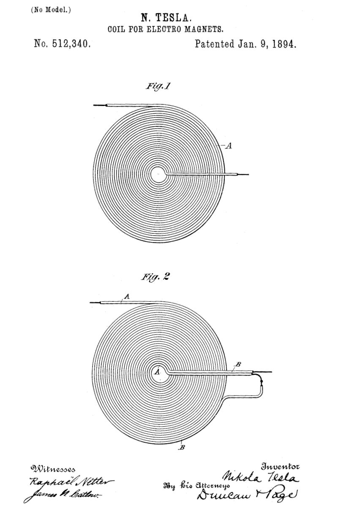

  
when designing a speaker we need to take impedance into account. 

> When talking about things like [watts](https://www.lifewire.com/stereo-amp-wattage-3135065), [voltage](https://www.lifewire.com/voltage-definition-3134824), and power, many audio writers use the analogy of water flowing through a pipe because it's an analogy that people can visualize and relate to.
>
> Think of the speaker as a pipe. Think of the [audio signal](https://www.lifewire.com/signal-to-noise-ratio-3134701) or music as the water flowing through the pipe. The bigger the pipe, the more easily water can flow through it. Bigger pipes also handle more volume of flowing water. A speaker with a lower impedance is like a bigger pipe in that it lets more electrical signal through and allows it to flow more easily.
>
> As a result, you see amplifiers that are rated to deliver 100 watts at 8 ohms impedance or 150 or 200 watts at 4 ohms impedance. The lower the impedance, the more easily electricity \(the signal or music\) flows through the speaker.
>
> Does that mean you should buy a speaker with lower impedance? No, because a lot of amplifiers aren't designed to work with 4-ohm speakers. Using the pipe analogy, you can put a bigger pipe in, but it'll only carry more water \(audio\) if you have a pump \(amplifier\) powerful enough to provide the extra flow of water.
>
> source: [https://www.lifewire.com/speaker-impedance-3134705](https://www.lifewire.com/speaker-impedance-3134705)

without realising it, i carefully embroidered speakers with an exceptionally large impedance.


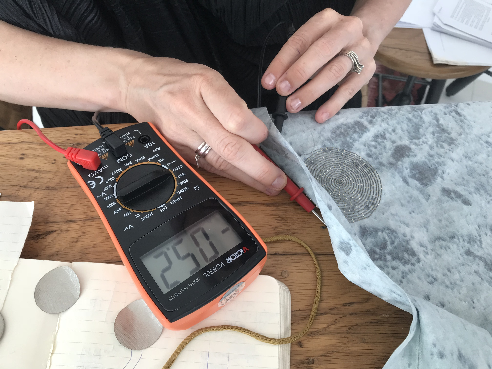

  
each of my speakers has 22ohms resistance. to give some indication of what i have created, a car speaker is generally 4ohms and requires at least 12V.  

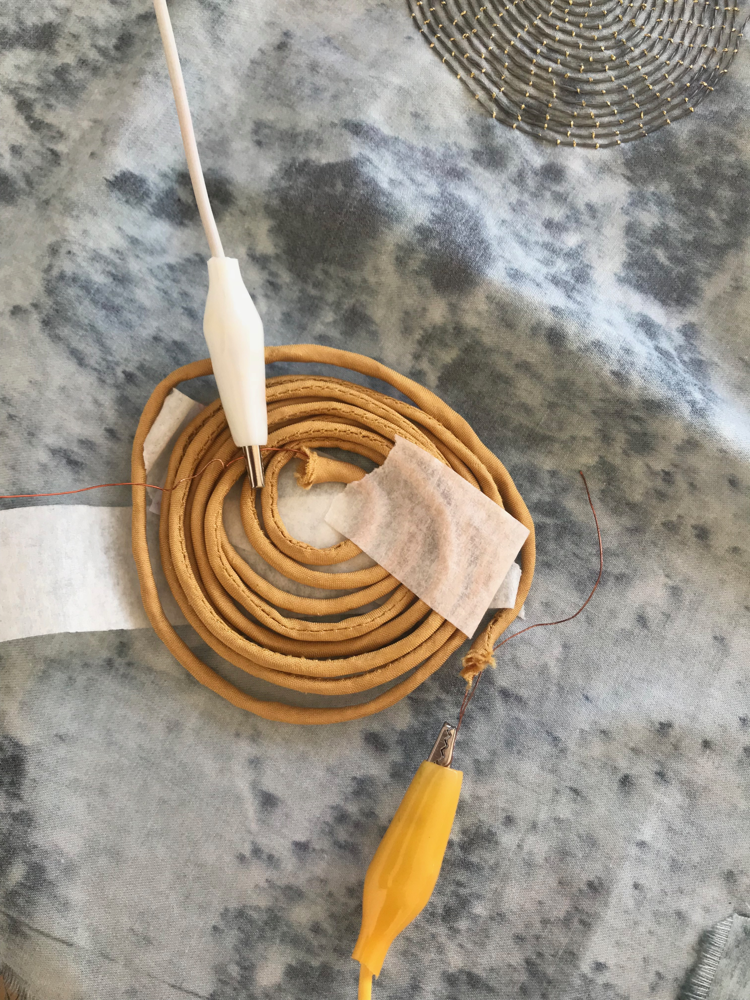


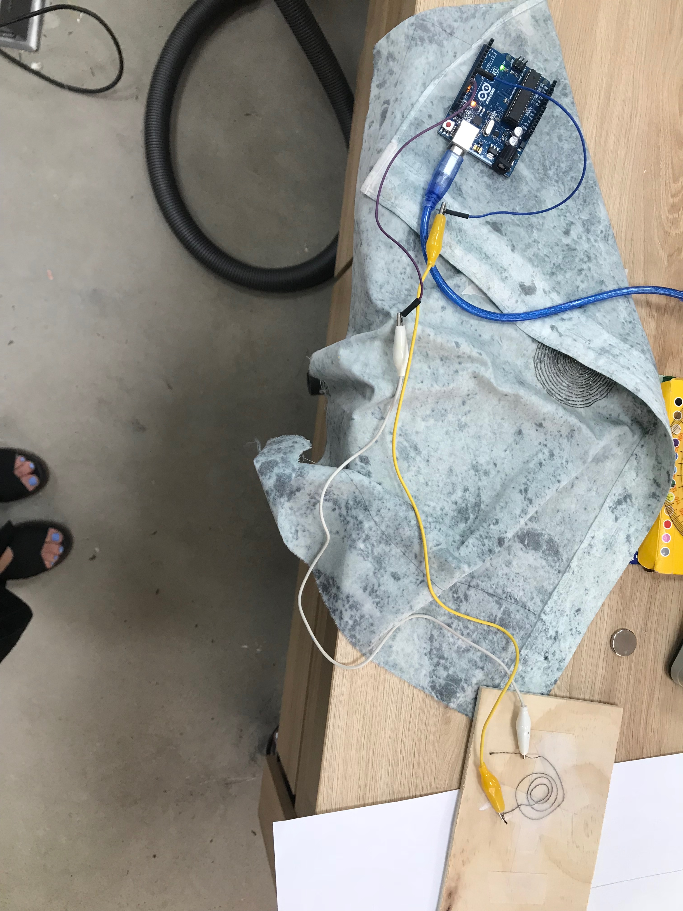


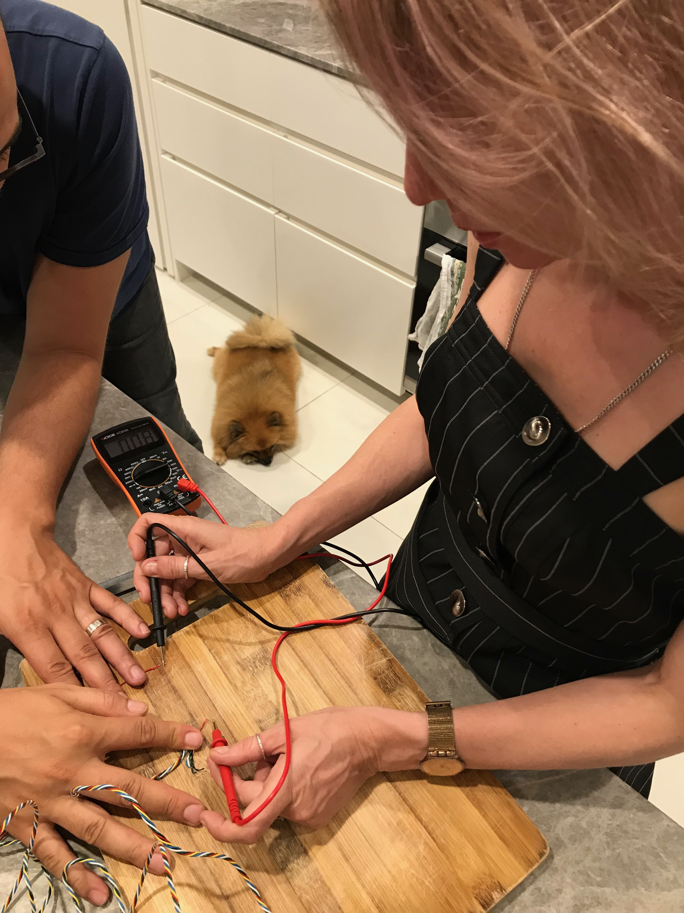

VOLUME CONTROL

soft, embedded volume slider based on leah buechley's [time sensing bracelet](https://www.instructables.com/id/Time-Sensing-Bracelet/) and kobakant's [embroidered potentiometers](http://www.kobakant.at/DIY/?p=2331). 

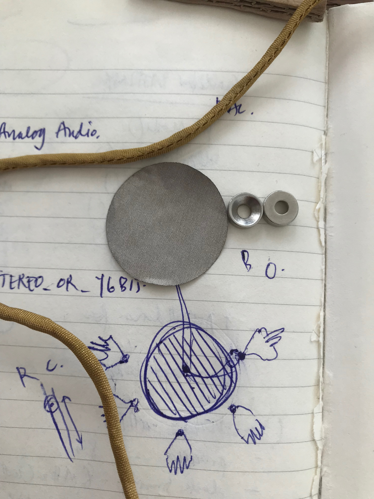

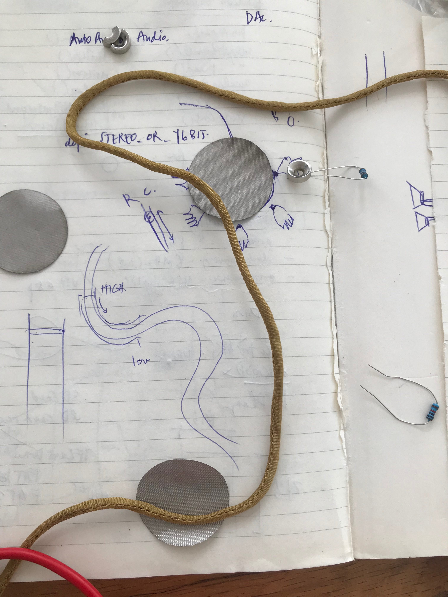

#### LINKS





















