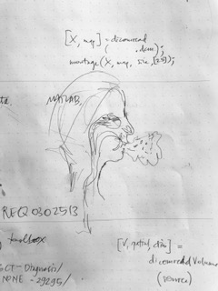

# digital bodies


## Cycles of Accumulation

> .. the cycle starts with sending out an explorer, in his ship fully loaded with equipments, bearing a mission of drawing a complete map of the remote land. The explorer arrives in a remote land, meets with native people, draws a map on notebooks and sketchbooks, leaves the remote land, and finally returns to the metropolitan center with a map in his hand. The next explorer is sent out, this time not only with ships and equipments but also with maps drawn from the previous expedition. He comes back with another, arguably better, map. A new map is added to the existing piles of maps. Science, of which cartography is one branch, is none other than these repeated cycles of accumulation"

this project proposed to translate what Latour terms inscriptions into representations. layers of inscriptions. good instruments and accurate measurements. the explorer, probing, stepping into unknown lands.  

> ..gentlemen in imperial metropolises believed that they could “‘divide’ and ‘hold’ land by means of representations of the place rather than by participation or engagement with it, by reliance on mimetic artifacts rather than local and dynamic methexis”. This is exactly what Latour meant when he explained how a random place, through repeated cycles of accumulation, grew to be the center by “acting at a distance” \(L: 222\). And this action at a distance is both corporeal and semiotic

 is science to reproduce and imitate nature or to dissect and analyze it?

by drawing a map on paper, you bring the remote land back to the center while you are not really taking the actual land with you, creating "immutable mobiles" 

### an im/mutable mobile

i began with an idea of a mobile - digitally embroidered lungs, diaphanous, permeable and floating. i wanted to capture the precision and detail of the digital though question the certainty of technically advanced mapping to represent an unknown territory. 




## acquiring a model 

in order to see inside the body, we need medical instruments. generally, to look at the lungs, either an x-ray or a computed tomography \(CT\) scan will be used, though magnetic resonance imaging \(MRI\) is [increasingly being adopted](https://bmccancer.biomedcentral.com/articles/10.1186/1471-2407-11-242) for various diagnostic purposes. to look all the way through the lungs, we need to look at a CT scan. CT scans of the lungs will usually only be taken in the axial plane. the medical imaging industry standard is digital imaging and communications in medicine \(DICOM\) ****image . dicom images have metadata attached, which includes patient information and often include multiple frames. a similar image type without the metadata is an .nrrd file. 


lungmap is a multi-stakeholder project looking into the early development of the lungs. it is possible to view direct volume rendering through their 3d [mmvr site.](https://www.lungmap.net/3d-mmvr) 


living in hcmc with its chronic air pollution makes the idea of cancer a constant source of anxiety for many, and a traumatic reality for some. trawling through images of people who had been given a number as their lungs were being attacked felt black and heavy. i found this difficult. there is an ocean of lung scans on this repository. 

to download a dicom image, you need a [TCIA downloader ](https://wiki.cancerimagingarchive.net/display/NBIA/Download+Manager+6.5)

various software can be used to open and work with dicom images, with varying success.

photoshop has recently enabled dicom viewing and updated 3d capacities. once you have loaded multiple files you can access the dicom images to create a 3d rendering, animate frames or edit and export as commercial image file types.  


photoshop did not retain the dicom image order, and when recomposing the images as a 3d form did so as a disorganised stack. upon trawling photoshop forums tagged \#dicom, it appears as if the dicom editing capacity could use further development and support. 


matlab is another application which can be used to open and process dicom images, and can also be used to generate alternative segments - for example to output sagittal slices from an axial source. 

matlab provides an[ example ](https://www.mathworks.com/help/images/exploring-slices-from-a-3-dimensional-mri-data-set.html#d120e14702)with sample data set for exploring slices of dicom images taken from a brain MRI.   


the output files are precise though extremely low resolution. this method would not be suitable for my immutable mobile.   


another application which can be used to open and work with dicom and nrrd files is [3d slicer](http://www.slicer.org/). 3d slicer is a platform for the analysis and visualisation of medical data, and also open source software. 

 


i considered and looked into several means of obtaining segments and exporting as a set of files which i could open to generate embroidery from.

* running matlab scripts in 3d slicer \(thus enabling the software to run script to output coronal slices to a local directory\)
* using the emsegmenter function
* using the volume resampling [function](https://www.slicer.org/wiki/Registration:Resampling#What_we_mean_by_Resampling) according to a spatial transform
* exporting screenshots generated within the app using segment editor
* change threshold values
* exporting dicom to mrml \(scene\)
* spline transform
* export to vtk file, load to automate segmentation at predefined intervals

i also looked into whether pixel interpolation might be possible with resampling, since the resolution of coronal slices is low. based on information on the 3dslicer forums, it appears high resolution image output is not something the medical community requires. 

i have not yet been able to resolve this issue. based on the limited understanding gained from exploration of 3dslicer software and its network, it would seem that exporting coronal slices, or resampling coronal slices according to a spatial transform, then automating pixel interpolation may be possible though may still not yield the kind of images i would require to work from to create an embroidered model. i would need more time and support to look into this further. 


### 

### spatial transform

> The [**Resample ResampleScalar/Vector/DWI Volume**](https://www.slicer.org/wiki/Documentation/4.1/Modules/ResampleScalarVectorDWIVolume) module is the method of choice to realign scalar, vector or diffusion weighted data along a given transform. It supports both linear and nonlinear transforms as well as deformation fields 
>
> source: [https://www.slicer.org/wiki/Documentation/4.1/Modules/Resampling](https://www.slicer.org/wiki/Documentation/4.1/Modules/Resampling)

further information about this strategy, which would involve reducing the number of images in the z plane, is found on the 3d slicer forum at [this page](https://discourse.slicer.org/t/resampling-a-3d-ct-image/618/12). part of this discussion includes a suggestion to use the crop volume module instead as:

> ..it allows cropping and adds many convenien\[t\]\(sic\) features around resampling. For example, you can preview the output image size in `Volume information` section.

another method could be to resample the dicom images. 

> ```text
> // ResampleDICOM resamples a DICOM series with user-specified
> // spacing. The program outputs a new DICOM series with a series
> // number set to 1001. All non-private DICOM tags are moved from the input
> // series to the output series. The Image Position Patient is adjusted
> // for each slice to reflect the z-spacing. The number of slices in
> // the output series may be larger or smaller due to changes in the
> // z-spacing. To retain the spacing for a given dimension, specify 0.
> //
> // The program progresses as follows:
> // 1) Read the input series
> // 2) Resample the series according to the user specified x-y-z
> //    spacing.
> // 3) Create a MetaDataDictionary for each slice.
> // 4) Shift data to undo the effect of a rescale intercept by the
> //    DICOM reader (only for ITK < 4.6)
> // 5) Write the new DICOM series
>
> ```

available at [https://itk.org/Wiki/ITK/Examples/DICOM/ResampleDICOM\#Download\_and\_Build\_ResampleDICOM](https://itk.org/Wiki/ITK/Examples/DICOM/ResampleDICOM#Download_and_Build_ResampleDICOM)

these and other resampling methods are discussed in the 3d slicer documentation on [this page](https://www.slicer.org/wiki/Documentation/4.1/Modules/Resampling). 

### output to 3d

3d slicer can also be used to generate stereolithography interface format \(.stl\) files. 


  
once an .stl file has been created in 3dslicer, it can be exported and cleaned up. i used blender.


3d models will not help me create the lung mobile representation as i envisaged since 3d renderings are in fact constructed as a hollow mesh, however they would be useful in generating outlines. 

### mutable mobile


since i had come to understand that it may not be possible to export coronal slices of the lung data i had, i began to reconsider the model so that it would instead work with axial slices. 

i decided to separate areas as in the labelmap function in 3d slicer so that, for example, bone would embroidered in cotton, lung tissue in silk. since cotton and silk are different fibre types with different properties, this can be exploited when dyeing the model as certain dye types will be taken up by certain fibres, while others will remain unchanged. i chose to work on poly organza remnants since this textile will not take natural dyes, is robust enough to withstand machine embroidery yet it has a diaphanous quality. 

silk is not commercially available or widely used for machine embroidery in hcmc. polyester is the standard and there are few exceptions. to get silk for machine embroidery i had to ask a weaver to wind some tussah silk onto industrial spools for me. the weight of the thread is about the same as cotton \(40-50tex\), so testing will need to be done. i have tested machine embroidery of organic cotton previously thus am confident it is possible. 

### creating embroidery from medical images

having previously exported .png files from 3d slicer according to manually input spatial transforms on the axial plane, elements from these files were redrawn to create vector images. 


automatically redrawing the images results in loss of detail, and creates large, complex areas of solid shapes. the redrawing process basically set up vector files for embroidery digitisation. 0.5 stroke lines can be converted to a run stitch - a digital approximation that conforms relatively closely to the reality of what can be stitched on an industrial embroidery machine using the materials chosen. the kind of redrawing strategy shown in the image above above would require at least 10 times the amount of stitches, would increase the weight of each sheet of the proposed model and would most likely involve much more thread breakage. since the proposed model includes silk embroidery, it in necessary to consider these factors. 

all redrawing and digitisation was done in illustrator, using a pulse micro plug in. run stitches with a maximum stitch length of 4px were applied. a border was added to the perimeter of each file in run stitches of 8px to enable centering of embroidery on the textile panels while stitching out at a factory. 


  
viewing the files in 3d prior to exporting was a way of previewing an approximation of how the files would stitch out - confirming that the embroidery was correctly centered within the bounding box and checking for errors.  


#### 


#### 


once the files had been previewed and checked for errors in 3d view, they were exported to .dst so they could be read by an industrial embroidery machine. 


## stitching out






#### 


#### 

#### 

#### 

#### LINKS

[https://public.cancerimagingarchive.net/ncia/login.jsf](https://public.cancerimagingarchive.net/ncia/login.jsf)

[http://www.slicer.org/](http://www.slicer.org/)



#### CITATIONS


[https://dspace.mit.edu/bitstream/handle/1721.1/103818/sts-310-fall-2005/contents/assignments/paper2.pdf](https://dspace.mit.edu/bitstream/handle/1721.1/103818/sts-310-fall-2005/contents/assignments/paper2.pdf)


