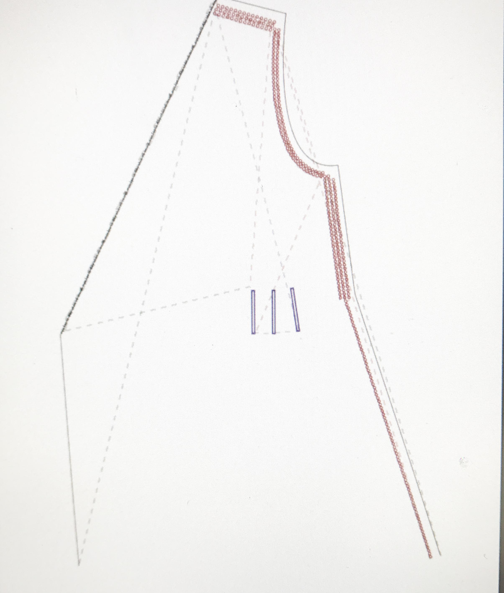

# open source circular fashion

## fashion: a homogeneity producing system

global fashion is a key contributor to culture with 'no running room'

> “we experience an almost seamless circuit of production and consumption”...a ‘hyper aesthetic scenario.. in which design is a fundamental agent of capitalism and globalisation” \[our\] reality \[is\] increasingly an aesthetic construct’ \(Mazanti, 2011, p70\)

the financialisation of fashion has transformed it from a niche field of applied art and a unique means to creative expression and individuation into a global industry characterised by extreme, chaotic excess. 

the superabundance of what Goldmith \(2014\) terms "faux-choix" sees that we acquire more and more of the same. we consume polyester of a single repeating cell and cotton of a single biological strand in shapes that reflect and conform to one another. It appears we cannot stop, continually duped by the changeless change of the fashion industry and the promise that we may be more than we are. 

> ‘The freedom of identity-seekers is akin to that of a bicycle rider; the penalty for ceasing to pedal is a fall, and one has to go on pedaling just to retain the upright posture. The necessity for keeping on toiling is a plight without choice since the alternative is too awesome to contemplate’ 
>
>  \(Bauman, Liquid Life, 2005, p33\)

## making alternatives - community of practice

various systems have been proposed in response to the profit driven mono-speed and meaningless excess of the global fashion system. many of these 'systems' arose not as intentional, strategically staged structures but rather _pauses_ that evolved into creative tangents, from which alternatives emerged. 

#### ALTERNATIVE WAYS OF CREATING FORM

alternatives have arisen from creative investigations into materials and making practices, asking how we might stage and frame new engagements with form, textile, technology and the body. the following are some key practice based examinations of alternatives:

* posing the question "how can we cut differently?" through creative practice based research led to what we now know as _zero waste pattern cutting_ \(ZWPC\) - key examples are in the practice based research of timo rissanen and holly mcquillan
* this exploration leads into a questioning of the role of the pattern and how it relates to the body. key research is that of rickard lindqvist in his doctoral thesis _kinetic garment construction_. lindqvist's open source patterns, available through 'atatac' shareware, democratise pattern cutting and place an otherwise complex practice in the hands of amateurs. 
* modular garment construction is an extension arising from consideration of the role of the pattern and an active stance in opposition to the industry's ubiquitous planned obsolesence. key practices are those of mcquillan for _make/use_, wei hung chen, katherine mavridis & quoi alexander. these innovative practices intentionally cultivate ambiguity around a widely accepted distinction between textile and garment construction, disrupting the very idea of a boundary between these modalities at all.
* design for cyclability is an approach put forward by the textile environmental design group as part of their TED's TEN, exemplified in the practice based research of kate goldsworthy. her phD research "laser line" expanded on the pioneering practice of janet stoyel to propose surface design strategies for circularity. laser cutting is a sustainable design strategy appropriate for synthetics, maintaining materials within what mcdonough & braungart term a 'technical metabolism' \(C2C\)

## re-linking

i began by looking at the lungs. 

initial inspiration : respiration - the lungs. epithelia as lace. intricacy.  chaos is an ocean of broken links. alternative networks help us to breathe, to re-link, re-form, recontextualise. 

 i looked at medical slides of human lung tissue under extreme magnification.

considering seamless joins in the context of garment construction, i drew inspiration from how epithelial tissue joins, in particular the type of joins called 'tight junctions'

> "a tight junction is a relatively impenetrable attachment between two epithelial cells formed by membrane proteins that interlock somewhat like a zipper"

### joins

by blending joins into the garment panels themselves, where seams take on a dual functional-decorative element, it is possible to begin to consider alternative making systems to the kind of pattern cutting and garment construction that characterises the global fashion industry. 

an initial test file was created in illustrator. stroke weight is set to .1mm  

a test file was cut from a polyester organza remnant. the laser cutter was set to 15% power and 50mm/s - this setting gave a clean cut. 

the joins hold though adjustments could be made to optimise the design. the seamless join detail was adjusted and adapted to garment panels. 

### zero waste draping

draping on the stand with a tussah silk remnant. 

marked CF, pinned to the stand, played with numerous forms and arrangements. pinned and marked CB, bust point, waist point and added shaping around the bust. 

the sketch came after the draping. the sketch was to visualise and work through considering how the piece would be constructed, rather than to propose form which is how garment sketches are traditionally used. the sketch is an aid in the draping process, more of an annotated description of territory than a predefined map. 

the information contained in the draped form was marked on the textile, traced to paper, digitised and converted to a flat 2d pattern in simple vector lines. i used a digitising table connected to a wacom cintiq II tablet running optitex pattern design software. the pattern was checked and finalised in illustrator. 

a wand enables the pattern to be digitised by communicating information about points on a pattern via coded numbers that are translated directly into vectors by the pattern making software. 

* 1 = start digitising a panel, also indicates the start of a line segment
* 2 = ends the digitisation of a panel
* 3 = indicates points on a curved line
* 5 = denotes notch point
* 7 = denotes a floating internal point

the process of digitising, exporting and reopening files can lead to some distortion. the pattern is checked against measurements from the initial paper pattern and adjustments made in the digital accordingly. 

#### open source digitisation process  

an alternative means of achieving the same objective without a digitising board and industry standard pattern software is to go through the same process of draping on the stand, drafting paper patterns, then photographing flat lays using a camera on a tripod. this is the process i used prior to acquiring a digitising board and optitex.  

these images can be composed to form a composite and redrawn in vector graphics editing software. 

i rely on illustrator for pattern drafting using a plug-in called vector scribe which allows for measurements to be added. the tutorial below explains the process with examples, though could easily be applied to open source software such as inkscape or similar.  

[https://www.tienchiu.com/how-tos/sewing/using-adobe-illustrator-for-flat-pattern-drafting/](https://www.tienchiu.com/how-tos/sewing/using-adobe-illustrator-for-flat-pattern-drafting/)

[https://inkscape.org/en/](https://inkscape.org/en/)

#### A SIDE NOTE ON DRAPING AND NEW DIGITAL TECHNOLOGIES

while it may be possible to design waste out of production, or at least minimise waste at the design stage, zero waste draping for upcycling is perhaps not a practice software such as clo3d was created for. such modalities convey information related to drape, textile construction and behaviour in an abstracted way, though advancements are being rapidly made. mcquillan has used this software with great success for her zero waste fashion practice though as she clearly states, hers is a hybridised practice with much development conducted outside of digital environments. time must be invested if the technology is to support material research. 

### functional/decorative - adding details

a seamless join was added to the garment panel based on an iteration of earlier tests. modular joins were added at CB as well as eyelets to close the bust shaping dart, and eyelets above and the bust and to the sides of the bust shaping to enable the panel to be laced to the body with the same piece of textile.

in addition to creating the modular elements, treated as both functional and decorative, purely decorative elements were added by tracing the 'epithelial lace' from a medical slide of lung tissue. the slide image was obtained from a digital research respository. leica imaging software was downloaded to view and export the 4GB+ size .svs files as tiffs. a portion of the image was chosen for its resemblance to lace and was manipulated to fit the draped neckline of the garment.

some aspects of the initial garment were problematic, these were adjusted in a second iteration. 

* additional eyelets were added to enable lacing across shoulders with less pull on the fabric between the eyelets
* the button element of the modular zipper was increased in size by 30%, the corresponding eyelets remained the same size, and the stem of the zipper detail was reduced by 50% making the zipper more stable. 
* the eyelet spacing for the darts was increased by 200% 
* a digital print was added prior to laser cutting
* laser cut lace was removed
* laser cut tapes were added

#### LINKS

#### [https://biologywise.com/tight-junctions-location-structure-function](https://biologywise.com/tight-junctions-location-structure-function)

#### [http://atacac.com/book/](http://atacac.com/book/)

#### [http://www.circulartransitions.org/](http://www.circulartransitions.org/)

#### [https://oscircularfashion.herokuapp.com/](https://oscircularfashion.herokuapp.com/)

#### [https://www.tienchiu.com/how-tos/sewing/using-adobe-illustrator-for-flat-pattern-drafting/](https://www.tienchiu.com/how-tos/sewing/using-adobe-illustrator-for-flat-pattern-drafting/)

#### [https://hollymcquillan.com/portfolio/hybrid-zero-waste-practice/](https://hollymcquillan.com/portfolio/hybrid-zero-waste-practice/)

#### 

#### 

#### 

#### CITATIONS

Carbonaro, S and Goldsmith, D. \(2013\) Fashion and The Design of Prosperity. In: Black S, et al. \(ed\) Fashion Studies Handbook. London: Berg.

Mazanti, L. 2011. ’Super-Objects: Craft as an Aesthetic Position’ in Buszek M.E \(ed\). 2011. Extra/ordinary craft and contemporary art. Durham, NC: Duke University Press.



